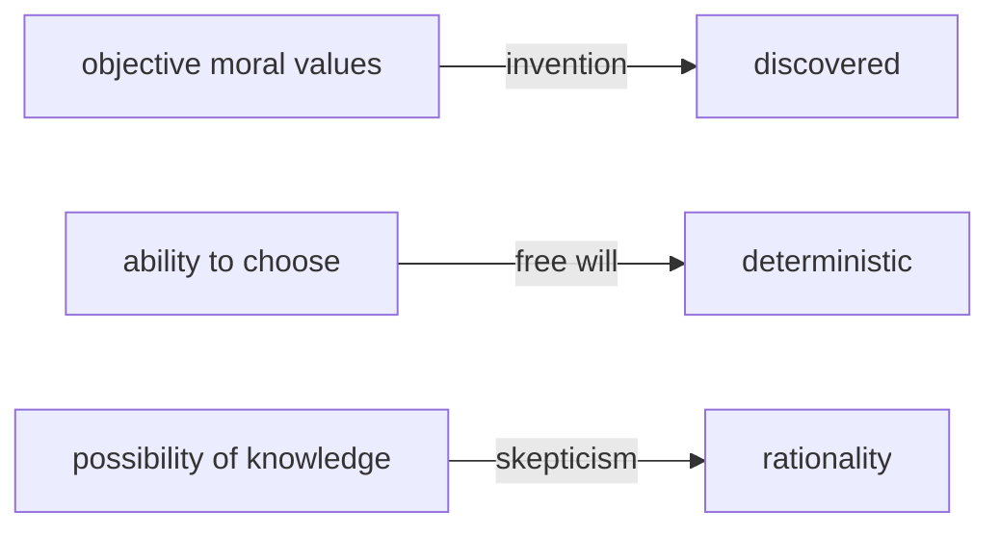

#### Freestyle

```mermaid
graph LR;
	a1["objective moral values"]--invention-->discovered;
	a2["ability to choose"]--free will-->deterministic;
	a3["possibility of knowledge"]--skepticism-->rationality;
```

- hermaphrodite state vs. maternal or paternal state