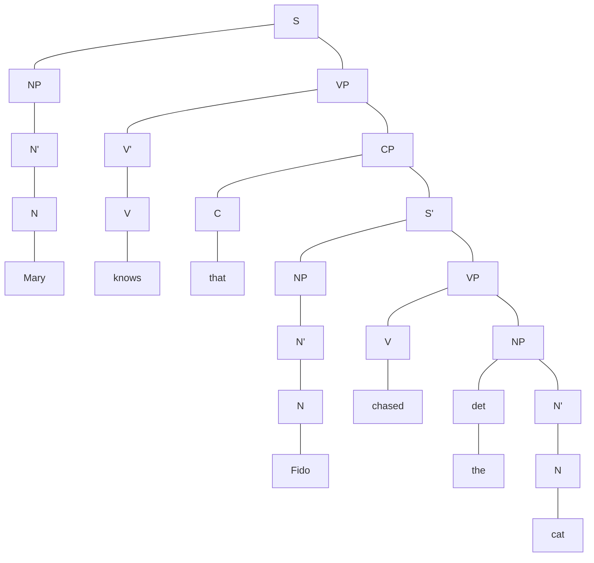

## Week 11

# Syntax at class

- English has a **rigid/fixed** word order (SVO), whereas Turkish has a **flexible** word order (SOV).
- *e.g.*, `[Mary knows that [Fido chased the cat].]`

```mermaid
graph TD;
	Mary;knows;that;Fido;chased;the;cat;
	S1["S"]---NP1["NP"]; NP1---N'1["N'"]; N'1---N1["N"]; N1---Mary;
	S1---VP1["VP"]; VP1---V'1["V'"]; VP1---CP1["CP"];
	V'1---V1["V"]; V1---knows;
	CP1---C1["C"]; C1---that;
	CP1---S'["S'"]; S'---NP2["NP"]; S'---VP2["VP"];
	NP2---N'2["N'"]; N'2---N2["N"]; N2---Fido;
	VP2---V2["V"]; V2---chased; VP2---NP3["NP"]; 
	NP3---det; NP3---N'3["N'"]; N'3---N3["N"]; N3---cat;
	det---the;
```

