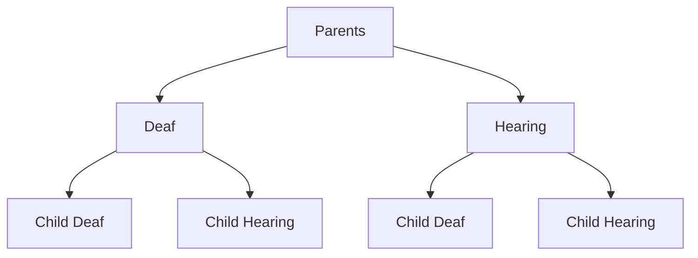

### Phonological Processes

#### Assimilation

- Assimilation rules in languages reflect **coarticulation**—the spreading of phonetic features either in the anticipation or in the perseveration of articulatory processes.—
- Assimilation is the process in which a sound become similar to a neighboring sound in terms of its phonetic features such as voicing, point of articulation or manner of articulation.
- **Voicing**: *clothe* /klɔθ/, *clothing* /klɔðɪŋ/
- **Devoicing**: *dogs* /dɔgz/, *cats* /kæts/
- **Nasalization**: *sing* /sɪ̃ŋ/
  - **Homorganic Nasal Assimilation**: *impossible* `/ɪmpasəbəl/`, *indefinite* `/ɪndefɪnɪt/`, *incredible* `/ɪŋkredɪbəl/`
- **Palatalization**: *hit you* /hɪt͡ʃjʊ/

#### **Dissimilation**: 

- Dissimilation is a phonological process whereby one segment becomes less like another segment in its environment.
- **Dissimilation Rule**: sixth* /sɪkst/ –after s (frc.) θ (frc.) becomes t (stp.)–

#### Feature Adding Rules

- A phonetic feature is added on the segment in certain environments.
- **Aspiration**: *pill* /pʰɪl/, *spill* /spɪl/

#### Sound Deletion

- A sound is deleted in a morpheme in certain environment.
- **Deletion Rule**: *sokak* /sokak/, *sokağa* /sokaːa/, *crumb* /krʌm/, *crumble* /krʌmbəl/

#### Sound Insertion (epenthesis)

- A process that inserts a sound segment into a particular environment.
- **Epenthesis Rule**: *athlete* /æθlit/ → /æθəlit/, grup /grup/ → /gurup/

#### Metathesis

- A process that reorders a sequence of sound segments.
- **Metathesis Rule**: *kibrit* /kibrit/ → /kirbit/, *asked* /æskt/ → /ækst/

------

------

------

### Historical Linguistics

- Historical linguistics is a sub-branch of linguistics that focuses on **language change through time**.  Its objectives are:

  - How and why languages change over time
  - How and why sound changes occur
  - What kinds of changes occur in morphology and syntax
  - What kinds of changes occur in lexicon
  - How linguists can reconstruct languages spoken in the past based on existing descendant languages

- An example of the nature of language change would be English:

  ```
  And	Seaxan Þa   sige    geslogan
  and Saxons the	victory	won
  «and the Saxons won the victory»
  
  Þa   sendan hi   ham  ærendraccan
  Then sent   they home a messenger
  «Then they sent home a messenger»
  ```

- All languages change and the change is regular and systematic. 

- The causes of language change are as following:

  - **Articulatory Simplification** (ease of articulation)
    - *e.g. fifths* /fɪfθs/ → /fifs/
  - **Spelling Pronunciation**
    - *e.g. often /ɔftən/ → /ɔfən/
  - **Analogy and Reanalysis**
    - *analogy e.g.* `ride : rode = dive : x` → `x = dove`
    - *reanalysis e.g.* *o.e. sarig* meant *sore, painful, sensitive* but under the influence of *o.e. sorh* mening *grief, regret* it gradually changed into *m.e. sorry*
    - *reanalysis e.g. hamburger* `hamburg-er` → `ham-burger`
  - **Language Contact**
    - Borrowing lexical items from languages in contact can lead to sound changes like word initial /v/ in borrowed words from French into English and in contact with other English dialects /f/ and /v/ have become distinct phonemes.
  - **Hypercorrection**
    - *e.g.* `John and I went to the store` → `He saw John and I`

------

------

------

### Morphological and Lexical Changes

#### Derivational Morphemes

- **Addition of affixes**
  - Through borrowing: *e.g. fr.* `commence+ment` → `accomplish+ment`
  - Through derivation: *e.g. OE* `hād` meaning *state, condition, rank* → *me suffix* `hood`

#### Inflectional Morphemes

- **Case Suffixes**

  - *e.g.* English has lost most of these case endings.

    ```
    CASE		OE sng.	OE plr.
    			stone	stones
    nominative	sta:n	sta:nas
    genitive	sta:nes	sta:na
    dative		sta:ne	sta:num
    accusative	sta:n	sta:nas
    ```

  - Only genitive is retained on nouns.

  - Pronouns *his* and *hers* were created after case endings were lost.

- **Agreement Suffixes** `þ = θ or ð`

  - *e.g. OE*

    ```
    ic singe		I sing			we singaþ	we sing
    þu singest		you sing		ge singaþ	you sing
    he/heo singeþ	he/she sings	hie singaþ	they sing
    ```

#### Lexical Changes

- Throughout its history English has not only borrowed words from other languages but has re-combined and recycled them to create new meanings, whilst losing some old words.
- **Borrowed Words**: *e.g.* `jungle, cheetah, shampoo, thug, bazaar, khaki, orangutan`
- **Word Coinage**: *e.g.* `Xerox, Tipex, Kleenex`
- **Words from Names**: *e.g.* `Sandwich, Jumbo, Robot, Paparazzi, Google, Frisbee`
- **Calques**: *e.g.* `flea market (marché aux puces), free verse (vers libre), long time no see (hǎo jiǔ bu jiàn)`
- **Blends**: *e.g.* `sitcom, brunch, chillax, motel`
- **Clipping**: *e.g.* `gym`nasium, `prof`essor, `ad`vertisement, `math`ematics
- **Acronyms**: *e.g.* `LASER, URL, GIF, SCUBA`

#### Semantic Changes

- **Broadening**: *e.g.* `holy day, picture, mouse, cookie, virus`
- **Narrowing**: *e.g.* `meat` meant *food*, `flesh` meant *meat*, `hund` meant *dog*
- **Meaning Shifts**: *e.g.* `lust` meant *pleasure*, `immoral` meant *not customary*, `silly` meant *happy* then *naive* now *foolish*, `nice` meant *ignorant*

#### Syntactic Change

- In English, the past tense of the verb *to go* is not *goed* or any other form based on the base *go*, but *went*, a borrowing from the past tense of the verb *to wend* (to traverse).

- **Word Order**: *e.g.* `Hēo hine laerde`, `she him advised` → `she advised him`

  ```
  Nu	loke euerich man toward	himsuelen.
  Now	look every	 man to		himself.
  Now it's for every man to look to himself.
  ```

- **Inversion**: *e.g.* `Speak they the truth?` → `Can they speak the truth?`

#### Borrowing of English

- English lexicon contains a large number of loan words (3/5 of 20k common words)

- **Major lenders**: Latin, Greek, French, Scandinavian

- **5th century**: 3 Germanic tribes move to Britain with their Germanic language which will become English.

- **9th-10th centuries**:  Some Scandinavian tribes raid Britain.

- **11th century**: Normans (French) invade England and French functions as the official, dominant language used in most commercial, cultural and social matters for 300 years.

  ```
  fr.		en.
  mutton	sheep
  pork	pig
  beef	cow
  veal	calf
  venison	deer
  ```

------

------

------

### Sound Changes Through Time

#### Phonological Changes

- Most sound changes begin as subtle alterations in the sound patterns of language in particular phonetic environments. The linguistic processes underlying such phonetically conditioned change are identical to the ones found in the phonology of currently spoken languages.
- **Assimilation**: 
  - **Homorganic Nasal Assimilation**: *early lt.* `inpossibilis` → *later lt.* `impossibilis`, *old sp.* `semda` → *modern sp.* `senda`
  - **Regressive Assimilation**: lt. `septem` → *it.* `sette`,
  - **Progressive Assimilation**: *early oe.* `slæpde` → *late oe.* `slæpte`
  - **Affrication**: *lt.* `kentum` → *it.* `tʃento`
  - **Palatalization**: *lt.* `gentem`  → *old fr.* `ʒent`
- **Dissimilation**:
  - **Adjacent Dissimilation**: *old lt.* `anima` → *lt.* `anma` → *sp.* `alma`
  - **Distance Dissimilation**: *lt.* `arbor` → *sp.* `arbol`
- **Epenthesis**: *old en.* `þunrian` → *en.*`thunder` (∅ → d / n__ ), *lt.* `scribere` → *sp.* `eskribir` (∅ → e / #__s)
- **Metathesis**: *early old en.* `þridda` → *late old en.* `þirdda`, *sp.* `arbol` → *it.* `albero`
- **Reduction & Deletion**: *old en.* `nama` → *middle en.* `namə` → *en.* `neːm`, *lt.* `matures` → *old sp.* `maduro` → *sp.* `maðuro` → *old fr.* `maðyr` → *fr.* `myʀ`

#### Consonants

- **Weakening**: *lt.* `mittere` → *sp.* `meter` → *fr.* mɛtʁ
- **Strengthening**: *lt.* `iuvenis [j]` → *it.* `giovanne [dʒ]`

#### Sound Shifts

- **Great Vowel Shift in English**:

  ```
  tiːd 		iː → aj 	tajd 		"tide"
  luːd 		uː → aw 	lawd 		"loud"
  geːs 		eː → iː 	giːs 		"geese"
  sɛː 		ɛː → iː 	siː 		"sea"
  goːs 		oː → uː 	guːs 		"goose"
  brɔːkən		ɔː → oː 	broːkən 	"broken"
  naːmə 		aː → eː 	neːm 		"name"
  ```

  

  |         | *ca. 1400* | *ca. 1500* | *ca. 1600* | *present* |
  | ------- | ---------- | ---------- | ---------- | --------- |
  | "bite"  | biːtə      | bəit       | bəit       | baɪt      |
  | "beet"  | beːt       | biːt       | biːt       | biːt      |
  | "beat"  | bɛːtə      | beːt       | beːt       | biːt      |
  | "abate" | abaːtə     | abaːt      | əbeːt      | əbeɪt     |
  | "boat"  | bɔːt       | boːt       | boːt       | bout      |
  | "boot"  | boːt       | buːt       | buːt       | buːt      |
  | "about" | abuːtə     | abəut      | əbəut      | əbaut     |

  - **Major Periods of English**

    ```
    English			Period			Significant Event
    Old English		up to 1100		1066 Norman Conquest
    Middle English	1100-1500		1476 Caxton's Printing Press
    Late English	1350-1500		Great Vowel Shift
    Modern English	1500-present	1564 Birth of Shakespeare
    ```

  - It affected only the long vowels of English.

  - It evolved in several steps although the exact timing and routes of the change are difficult to ascertain.

  - The reasons are not clear either.

- **Consonant Shifts**

  - *e.g.* A consonant shift took place between Proto Indo-European and Proto-German.

  - **Grimm's Law** describes this shift involving stops and fricatives.

  - **Werner's Law** explains exceptions to Grimm's Law. Proto-Germanic voiceless fricatives became voiced when occurring between voiced sounds if the immediate preceding vowel was not accented in Proto-Indo-European.

    ```
    bʰ →  b    dʰ →  d    gʰ →  g
    b  →  p    d  →  t    g  →  k
    p  →  f    t  →  θ    k  →  h
    ```

    ------

    - | *en.* | *fr.* |
      | ----- | ----- |
      | foot  | pied  |
      | three | trois |
      | heart | coeur |
      | tooth | dent  |

------

------

------

### Language Contact

#### Lingua Franca

- A common language that people who come from different language background use in communication with each other.
- Examples: English in Nigeria, Singapore, India
- English for International business, science, technology, aviation, and maritime.
- Lingua franca serves the referential function of the language. Because it is spoken for specific purposes.
- Referential is a measure of the amount of information being shared in a discourse. The use of facts, statistics, directions, etc. 
- Affective relates to the emotional content of communication and indicates how someone feels about the topic.

```
Referential vs. affective
Affective: Günaydın => "Gün" doesn't have to be "aydın".
```

#### Pidgin

- Pidgins tend to become Lingua francas because they develop in response to a need for an LF typically for economic purposes.
- Common features:
  - Pidgins are formed when features of at least two languages combine in such a way that:
    - the language of the more powerful group provides the lexicon -> lexifier / superstratum
    - The language of the less powerful group provides the rest **further info needen
- Pidgins are no one's first language. Their users are multilingual.
- Pidgins are language of business and trade, Not of home and family
- Pidgins begin typically with **a jargon phase**
- When they get more standard grammatical features with less individual variation they reach **stable pidgin phase**
- As they come to be used in more contexts, they reach the **extended pidgin phase**.

#### Creole

- A language varieties that develops out of a pidgin in a language contact situation.

- Spoken as a first language of some speakers.

- Used in an entire set of social settings.

- ```Tok Pisin (New Guinea)
  Gras	mousgras		gras bilong fes
  Tu buk	digyal place	buk bilong yu
  
  Baimbai	 	hed		bilongyu	i-arrait	gain
  by and by	head	belong you	be-allright	again
  'your head will soon get well again'
  
  di gyal place 'the girl's place'
  No possessive pronouns, instead 'bilong' is used
  ```

- With the passage of time, creaoles ed up co-existing with a variety of their lexifier language.

- In contrast to creolization process, now, the speakers who have greater contact with a standard variety of the language through *e.g. education, refrain from using creole*.

- Where education and greater social prestige are associated with a "higher" varieties, a number of speakers will tend to use fewer creole forms and structures -> decreolization

- Multiple levels of creole can develop -> **post-creole continuum**

  - **Basilect**: Most creole like variety "a fi mi buk dat"
  - **Mesolect**: Intermediate variety between basilect and acrolect "is mi buk"
  - **Acrolect**: the least creole like or most standard / prestigious variety "it's my book"

- **Linguistic repertoire**

#### Multilingualism

- The standard language

  - An idealized variety
  - Not associated with any particular region
  - Associated with education and broadcasting

- **Accent**: aspects of pronunciation that identify where a speaker is from regionally or socially.

- **Dialect**: features of grammar and vocabulary as well as phonological features. _i.e. American, Canadian, British, Australian English_

- **Language**: can be thought of as a collection of dialects that are usually linguistically similar, used by different social groups who choose to say that they are speakers of one language which functions to unite and represent them to other groups. 

  > A language is a dialect with an army and a navy. Max Weinreich

- **Dialectology**:

  - Mutual intelligibility is the criterion typically used to distinguish a dialect and a language.
  - Dialect surveys to identify consistent features of speech found in one geographical area compared to another.
  - [Informants](https://en.wikipedia.org/wiki/Informant_(linguistics)): NORMS (*non-mobile, old, rural, man speaker*)
    - Non-mobile speakers are good informants because they are more isolated in language. (old, local, rural)
    - Men are preferred to be informants.
  - Isogloss
    - 
    - Isoglosses overlap in their borders. 

##### Multilingual Societies

- Around the world, **Multilingualism** is the **norm** in the world, **monolingualism** is an exception. Multilingual growing up in communities where multilingualism is the norm are more likely to see the boundaries between languages as fluid. They may acquire bare functional competence in many additional languages or not really worry about what level of ability is required to be considered competent in a language.
- Research on multilingual societies lead to a reconceptualization of what it means to be native speaker.
- A person may learn several languages from birth but that person may associate with one language in some contexts of use and with other languages in other contexts of use.

###### Diaglossia

- A situation in which two distinct languages varieties co-exist in a speech community acting as social registers in which the high variety is used in formal situations and the low variety among friends.
- Diglossia is a characteristic of speech communities rather than individuals
- The choice of language is highly constrained by the social context of use **domain** and these constraints are fairly similar across diglossic situations.
- Ex. Messing (2007) Mexicano (Nahtual) - Spanish bilingualism in central Mexico.
  - Spanish is considered a public language, thus hight valued for use in public context such as public meetings and school.
  - Spanish is lowly valued in personal speech.

###### Domains of language use

- Ex. guarani and spanish in Paraguay

  | domain         | addressee | setting        | topic                     | language |
  | -------------- | --------- | -------------- | ------------------------- | -------- |
  | family         | parent    | home           | planning a party          | guarani  |
  | friendship     | friend    | cafe           | funny anectode            | guarani  |
  | religion       | priest    | church         | choosing liturgy          | spanish  |
  | education      | teacher   | primary school | telling a story           | guarani  |
  | education      | lecturer  | university     | solving a math problem    | spanish  |
  | administration | official  | office         | getting an import licence | spanish  |

  

#### Code Switching

- Two or more languages (or dialects) spoken interchangeably by the interactants in the same text whether spoken or written.
- Code-switching is an interactional resource in multilingual contexts that allows multilingual people to most readily build relationships and mutual understanding in interaction.
- **Situational code-switching**: domain based switch
- **Metaphorical code-switching**: used as a sociolinguistic resource
- **Difference between borrowing and code-switching**:
  - **Borrowing**: I love biscottis with my coffee. (biscotti is plural form of biscuit in Italian.)
  - **CD**: I love biscotti with my coffee.

------

------

------

### Language Maintenance and Shift

- Bilingualism is always a necessary precursor of language shift.
- However, as a stable diglossic communities demonstrate, it does not always lead to language shift.
- Demographic factors, urbanness effect the language shift process. In urban context, there is less resistance to language shift.
  - Rural & Urban
  - The size of the minority group (*e.g.* Spanish in the US) is an important factor. If the minority is big enough they preserve their bilingualism.
  - If intermarriage is common, a shift is expected to the dominant home domain language.

#### Language Shift in Migrant Communities

> Fatma migrated to Germany with her family when she was 5. She spoke Turkish at home with her family. She began to work in a bicycle shop when she was 16. some of the other workers there also spoke Turkish. So she was peaking Turkish at home and at work. Only at school, she spoke German. She was good at her job, so she was promoted to be the store manager. She began to use more German although she still uses Turkish with her former workmates. Now she works at the headquarters of a car rental company and uses German all the time.

- This is a typical experience for those using a minority language in predominantly monolingual society.
- The language shift gradually takes place in different domains and the dominant language replaces the minority language.
- School is typically the first domain in which children of migrant families meet the dominant language.
- The dominant language infiltrates the home through children.
- There is pressure from the society to conform. Being good at the dominant language is a sign of successful assimilation.
- Abandoning the minority language altogether takes usually three or four generations but language shift is completed in just two generations.

#### Language Shift in Non-Migrant Communities

- Political economic and social changes can lead to language shift in multilingual societies.
- *e.g.* Iran is a multi-ethnic society and all minority languages are protected by constitution. However, Farsi the official language is a threat to other minority languages because they are not taught in schools and used in government offices.Even the governor of East Azerbaijan code-switches to Persian frequently when addressing an Azeri audience.

#### Migrant Majorities

- When colonial powers invade another countries, they impose their language along with their rule.
- In many cases, multilingualism as normal was well established such as in India, New Guinea, and many African countries.
- In cases where monolingualism is the norm, the colonizer's language has turned into a threat. In New Zealand, Maori people have moved from monolingualism in Maori in 19th century, through bilingualism in Maori and English, to monolingualism in English in the second half of the 20th century.

#### Language Loss and Death

- When all the Turkish migrants in the US shift to English in a few generations, that means the loss of Turkish for them. But it's not the death of Turkish. It will still be spoken in Turkey.
- When Tevfik Esenç dies in 1992, however the Caucasian language Ubykh died with him. He was the last speaker of that language.
- Dozens of Aboriginal languages spoken in Australia are dead now because their speakers were massacred by the Europeans and died by diseases they brought.

#### Language Revival

- *e.g.* Hebrew was almost extinct (it existed only in religious scripture). Once state of Israel was found, the brought people around the world, only common denominator being the religious language Hebrew was reconstructed.
- Welsh, though not as impressive as Hebrew, was replaced by English and then through some revivalist efforts with political supports it was revived to used in road signs, shop signs etc.

#### Factors Effecting Language Maintenance

- A language is maintained longer:
  - If there are attitudes and values attached to language. (e.g. Hebrew).
  - If the language is the symbol of group identity.
  - If the members of the community has frequent contact with each other.
  - If there is frequent contact with the homeland.
  - If the language is used in schools and in places of worship.
  - If there is institutional support.

------

### Language Variation

#### Dialectology

- Regional Variation -> regional dialects
- Usually a result of settlement history and physical geography *e.g. Sicilian, Gullah* 
- **Isogloss** is an imaginary boundary or line drawn on a map that separates particular linguistic features.
- **Isogloss bundle** represents a major dialect boundary.

#### Sociolinguistics

- Social variation -> social dialects
- Most societies are divided into groups with different **status**.
- This status used to be called "class" as in social classes of Marx.
- Some linguistic functions are **variable** (*i.e.* They can be expressed in two or more different **variants**.)
  - *i.e.* Tiki dialect can be described as `nasalization of vowels`, `higher pitch`, `longer vowels`, and `lowering of word-final vowels`
- One of the variants becomes associated with higher status groups and acquires **prestige**.
- Another variant becomes associated with lower status groups and acquires **stigma**.

```Labov's New York Study
Labov's NYC Study

Variable: rhotic /r/     i.e. /park/ vs. /pa:k/

Method: rapid anonymous survey in three department stores representing three social categories (Saks Fifth Avenue, Macy's, Klein's)

Result: stratification of social class and prestige or standart forms. Also, lower and middle middle class tend to corrent themselves more tha any other.

Important notes:
	- hyper-correction was observable in LMC and MMC.
	- Mather (2012) repeated Labov's study with four department stores inNYC.
	- The results were essenitally the same.
	- In Labov's study, the older speakers pronounced /r/
	- But in Mathel's it was younger people who pronounced /r/.
```

Word List, Reading Phrases, Formal, Casual

```
Trudgill's Norwich Study

Variable: -ing, tune       i.e. /goɪŋ/ vs. /goɪn/, /tuːn/ vs. /tjʊn/
		  Pronounciation, Five Social Classes, Gender, and Formality

Method: He identified 5 social classes and contrasted gender and considered formality also. He gave wordlist to people to get them pronounce formally. He gave a short paragraph to people and then interviewed them. After, he had talked to them casually.

Result: 

In Gender Preferential Variation: 
```

#### Gender

- When people self-report:

  - women over-reported their use of standard forms. That shows us that they prefer standard form for prestige which is called **overt prestige**. 
  - men under-reported their use of standard forms. The prestige of standard form is not that great for men. So, the non-standard form has **covert prestige** for men speakers.

- Explanations of women's linguistics behavior

  - Linguistic insecurity

  - Social status explanation

    Women use more standard forms that men because they are more status conscious. As standard speech forms are typically associated with higher social status, women use them as a way of claiming status.

  - Women's role as guardian's of society's values

    Society expects better behavior from women than men.

  - Subordinate groups must be polite

  - Vernacular forms express machismo (covert prestige)

- Innovative vs. Conservative

  - If innovation has a bad connotation, then women are innovative

  - If conservation has a bad connotation, then women are conservative

  - Women tend to use hyperbole

    ```
    Lakoff - 1974 | Language and Women's Place
    Describes women's language has typical features like they tend to 
     - use more hedging, 
     - use empty adjectives (awfully beautiful), 
     - use more precise color terms, 
     - use rising intonation in statements (uptalk, as if it is a question), 
     - speak more
    ```

    - **Dominance Approach**: Because men dominate women, women tend to speak as it is written up there. If a woman is not dominated in a situation, she doesn't speak in that fashion. Or, if a man is dominated in a situation, he tends to speak in that fashion.
    - **Difference Approach**: Men and women might speak differently. But that doesn't mean that one is better than the other. They learn to use language differently because of their backgrounds.

#### Context

- **Register** is another variation of language based on subject matter or social context (social roles and situations). *e.g. motherese or baby talk, elderese:question:, Legalese*
- **Jargon** is a variation of language based on occupational varieties, typically specific terminology.
- **Slang** is a variety used by a restricted part of the population, often young and "less respectable." **It ages very fast.**
- **Face** is the negotiated public image, mutually granted each other by participants in a communicative event. (like in *tr. yüz vermek, yüzü olmak*) 
  - **Positive face** is involvement. The person's right and need to be considered normal contributing member of society.
  - **Negative face** is independence. The person's right of not to be imposed, dominated by group or social values.
  - **Face threatening acts (FTA)**
    - We are talking about speech acts such as request, advice, compliment, and criticism. Such speed acts threated the positive or negative face needs of the speaker and addressee.
    - We use linguistic devices to mitigate the face threat caused by these acts.
    - These linguistic devices can range from choosing a language or dialect to using passive voice.
  - For more: [Politeness Theory](https://www.ello.uos.de/field.php/Pragmatics/PragmaticsPolitenessTheory) by Brown and Levinson (1987). When we face with an FTA, we have the following choices:
    - Don't do the FTA.
    - Do the FTA and go bald on record. (off the record​ :question:)
    - Do the FTA but do it with redress.
  - The way we perform an FTA depends on the following dimensions.
    - Social distance / solidarity :arrow_right: intimate - distant, positive politeness, negative politeness
    - Status / power :arrow_right: superior - subordinate
    - Weight of imposition :arrow_right: *e.g.* asking for a pen vs. for a phone

### Speech Act Theory

- You can use language to do things. You can use language to make promises, lay bets, issue warnings, christen boats, place names in nominations, offer congratulations, or swear testimony. The theory of **speech acts** describes how this is done. 
- By saying *I warn you that there is a sheepdog in the closet*, you not only say something, you warn someone. Verbs like *bet, promise, warn*, and so on are **performative verbs**. Using them in sentences produce **performative sentences**.
- Speech is a form of action. **Saying is doing.** Any utterance; 
  - conveys a meaning: **locution** is the basic act of utterance, of producing a meaningful linguistic expression. Well-formed utterances usually have a purpose.
  - possesses a force: **illocution** is produced with some function in mind, thus it has a so-called communicative force.
  - elicits an effect as response: **perlocution** is the effect on the listener. E.g. I've just made some cookies. If the listener interprets the utterance as a statement he could react by appreciating the smell. The listener could also interpret the utterance as an offer and feel invited to try one.
- **Felicity conditions** are contextual:
  - **Prepositional content condition** requires the participants to understand language, not to act like actors or to lie permanently, *e.g. a promise or warning must be about the future.*
  - **Preparatory condition** requires that the speech act is embedded in a context that is conventionally recognized, thus, just by uttering a promise, the event will not happen by itself. 
  - **Sincerity condition** requires that the speaker is sincere in uttering the declaration, *e.g. a promise is only effective when the speaker really intends to carry it out.*
  - **Essential condition** requires that involved parties all intend the result, *e.g. a promise changes state of speaker from obligation to non-obligation.*

#### Direct Speech Acts

- Structures: **declarative**, **interrogative**, **imperative**
- Functions (speech acts): **assertion**, **question**, **order / request**, **promise**, **advice**

| Speech Act             | Structure                        | Function        |
| ---------------------- | -------------------------------- | --------------- |
| Did you eat the pizza? | yes / no question, interrogative | question        |
| Eat the pizza.         | imperative                       | order / request |
| You ate the pizza.     | declarative                      | statement       |

#### Indirect Speech Acts

- 

| Speech Act                               | Structure     | Function        |
| ---------------------------------------- | ------------- | --------------- |
| Why don't you leave?                     | interrogative | order / request |
| Is ice cold? (sarcastically)             | interrogative | assertion       |
| I would like for you to wash the dishes. | declarative   | request         |

#### Types of Speech Acts

- **Representatives** commit a speaker to the truth of an expressed proposition.
  - Paradigm cases: asserting, stating, concluding, boasting, describing, suggesting.
    - I am a great singer.
    - Bill was an accountant.
- **Directives** are used by a speaker who attempts to get the addressee to carry out an action.
  - Paradigm cases: requesting, advising, commanding, challenging, inviting, daring, entreating.
    - You'd better tidy up that mess.
    - Sit down.
- **Commisives** commit a speaker to some future action.
  - Paradigm cases: **promising**, pledging, threatening, vowing, offering.
    - I am going to leave you.
    - I'll call you tonight.
- **Expressives** express some sort of psychological state.
  - Paradigm cases: **feelings**, greeting, thanking, apologizing, complaining, congratulating.
    - *This beer is disgusting*.
    - *I'm sorry to hear that*.
- **Declaratives** affect an immediate change of affairs. **Performatives**.
  - Paradigm cases: declaring, baptising, resigning, firing from employment, hiring, arresting.
    - We find the defendant guilty.
    - I resign.

### Pragmatics, meaning in context

- **Deixis** example would be: *You have to bring it back because she is not here today.* This sentence is really vague. You need context to make sense of this sentence. These *you, it, back, she, here,* and *today* are **deictic expressions**. They depend on the context to get their meaning.
  - Person deixis :arrow_right: it, him, they, these boxes
  - Spatial deixis :arrow_right: here, there, near
  - Temporal deixis :arrow_right: now, then, last week
- Tu / Vous (*fr.* for sen / siz) is a cultural phenomenon.
- **Reference** is an act by which a speaker (or writer) uses language to enable a listener or reader to identify something.
  - Words don't refer, speakers refer. *Mary always wanted to buy **a red sports car**, but she bought **a metallic gray minivan***. The ones in bold are grammatically very similar but the former lacks reference, whereas the latter has the reference. The minivan is the one became the reality.
  - *The present king of France* makes **sense** but there is **no reference**. There's no king anymore.
- **Inference** is the listener's ability to recognize what we mean, rather that their dictionary knowledge of a word we use. *Can I look at your Chomsky?* **Chomsky** can be inferred as **a book by Chomsky**.
- **Anaphora** is the subsequent mentions of a referent. *We saw a funny video about **a boy** (antecedent) washing **a puppy** (antecedent) in a small bath. **The puppy** (anaphora) started struggling and shaking and **the boy** (anaphora) got really wet. When **he** (anaphora) let go, **it** (anaphora) jumped out of the bath and ran away.*

#### **Cooperative Principle (Grice)** 

- It is an overarching assumption underlying conversational interaction:

  - Make your contribution appropriate to the conversation as it is required at the stage at which it occurs, by the accepted purpose or direction of the talk.

  - Shared interpretive conventions.

  - This overarching principle includes four maxims called **conversational maxims**. The serve as a guidance by which interlocutors...

    - Maxim of Quantity :arrow_right: make your contribution as informative as required

      > Speaker A: How are you?
      >
      > Speaker B: Well, I'm bad, because my cat got sick, also I have a bad back, which is the result of my carrying heavy furniture, because I had to move out again, and...

    - Maxim of Quality :arrow_right: do not say what you believe to be false, do not say something for which you lack adequate evidence

    - Maxim of Relevance :arrow_right: be relevant to the current topic of conversation

    - Maxim of Manner :arrow_right: avoid obscurity of expression, avoid ambiguity, be brief and orderly

#### Conversational Implicatures

- Speakers may be flouting a maxim and thus generates conversational implicatures. A speaker may be suspected of intending to imply something conversationally when what he says blatantly violates one of maxims but the hearer assumes that the cooperative principle is being observed.

  > Lara: Are you coming to the party tonight?
  >
  > Rita: I've got an exam tomorrow.
  >
  > ------
  >
  > Child: What's that?
  >
  > Mother: We can't buy up the whole store. (Mother violates manner of relevance and quantity)
  >
  > Grandpa: He's a good boy. He just wanted to know.
  >
  > (Blum-Kulka, 1989)

### Conversation

#### Conversation Analysis

- **The interaction / conversation is structurally organized.**
- It is usually when the communication breaks down, that we notice the complex choreography we perform in conversation.
- We have ways of organizing conversation so that more than one person has a chance to speak, that turn-taking is done in an orderly fashion, and that there are formulaic signals marking the beginning and ending of a conversation.
- There are some culture specific variation. Turkish don't have overlapping sentences and doesn't prefer silence, whereas in Italian there can be overlapping conversations.
- CA focuses on details of actual events, they record conversations that occur without researcher prompting. They produce transcriptions that attempt to reproduce what is said in detail (including linguistic and nonlinguistic details). They avoid positing generalizations about what participants know; the focus is on the specific events actions that occur during the conversation.

#### Turns & Sequences

- The basic unit of analysis is **turn**

  > A-	The phone's ringing.	Request
  >
  > B-	I'm in the bathroom.	Refusal
  >
  > A-	I'll get it.		 	     Acceptance

##### **Turn Construction Units (TCU)**

| Words      | Phrases                   | Clauses       |
| ---------- | ------------------------- | ------------- |
| A-    Hi:: | A-    nerde gördün onları | A-    got it? |
| B-    Hi   | B-    akmerkezde          | B-    yeah    |

##### **Turn Transition Relevance Points (TRP)**

How do we signal that we are going to

- take the turn

- end the turn

- choose the next speaker?

  > A-	Uh, you been down here before [haven't you]	After `before`, there is a **TRP**.
  >
  > B-								      [yeah.

keywords: prosody?

##### Adjacency Pairs

It is basic unit of order / **sequence**. Two turns happening in a specific order. Question :arrow_right: Answer.

- A pair of speaking turns that are i) adjacent, ii) ordered and iii) appropriately matched.

  > A-	Where is the milk?
  > B-	In the fridge.
  >
  > ------
  >
  > A-	It's not break time yet.
  >
  > B-	I finished my box, so shut up.
  >
  > ------
  >
  > A-	Wanna grab a sandwich?
  >
  > B-	Sure.

##### Expanded Pairs

- Side sequences

  > A-	where is the book?
  >
  > B-	which book?
  >
  > A-	the one I brought yesterday.
  >
  > B-	I don't know.

- Pre-Sequences*

  > A-	guess what
  >
  > B-	what?
  >
  > A-	I met with the new director.
  >
  > B-	really?

##### The Notion of Preference

- Preferred vs. dispreferred responses:

  > Daphne:	 I was thinking we could have fish?
  >
  > Julie:		fine
  >
  > Anita:	      well actually (.) I've stopped eating fish 
  > 			now because of you know the damage it
  > 			does to the ocean

------

- Interaction involved more than just semantic and grammatic sentence making.

  - Contextualization: every speech act is meaningful in its context. Contextualization cues? 

  - Prosody is concerned with those elements of speech that are not individual phonetic segments (vowels and consonants) but are properties of syllables and larger units of speech.

    > **Ee**, naptın? / **Ee**, yeter be!

  - Discourse markers is a word or a phrase that plays a role in managing the flow and structure of discourse.

    > You know, like, I mean / hani, yani, işte

  - Situated inferences?

### Language Acquisition

- It starts at around twentieth weeks in mother's womb.

#### Why is it significant?

- Young children acquire the language(s) very easily without instruction.
- Children acquire language(s) in a very short period of time.
- Children go through same stages at about the same time regardless of the language or their personal circumstances.

#### Theories about language acquisition

##### Behaviorism

- The mind is a blank state.

- Learning is imitation and habit formation.

- Children learn because their actions are **reinforced** with praise  or successful communication.

- **but** :arrow_right: Children learn a complete language in about 5 years. This is much faster than what can be reasonably expected given the input they receive.

  - **Poverty of Stimulus Argument**
    Children are exposed to false starts, incomplete sentences, and odd constructions. Their use of language regarding politeness and so on may be corrected but their grammar is seldom directly corrected.
    Yet children emerge with a more or less perfectly formed language. They are able to produce new sentences they couldn't possibly have heard.
    **This is not possible by imitation.**

    > CH–  	My teacher **holded** the baby rabbits and we patted them
    > MO– 	did you say the teacher **held** the rabbits?
    > CH–	  yes
    > MO–	 What did you say she did?
    > CH–	  She **holded** the baby rabbits and we patted them.
    > MO–	 Did you say she **held** them tightly?
    > CH–	  No she **holded** them loosely.

##### Innatism / Nativism

- Nativism suggests than humans are genetically programmed to acquire language. (Language Acquisition Device, Universal Grammar)
- In addition to "**poverty of stimulus**" argument, another important piece of evidence comes from "**critical period hypothesis**"
  - **Critical Period Hypothesis**
    [Genie Example](https://en.wikipedia.org/wiki/Genie_(feral_child))

##### Interactionism

- **Interaction** is central to the acquisition of first language.
- **Child Directed Speech** is much more regular, cleaner than "poverty of stimulus" argument assumes.

It is characterized by a slower rate of speech, a higher pitch, quite varied intonation, more pauses, shorter and simpler sentences, and a focus on here and now. It is an effort to communicate with the child. It is fine-tuned accordance with the development of the child.

------

#### Stages of Acquisition

We should keep in mind that there is a large amount of individual variation.

| Time (aprx.)    | Action                             | Description                                                  |
| --------------- | ---------------------------------- | ------------------------------------------------------------ |
| 0-4 months      | Cooing                             | Cooing is basically crying. They are vegetative sounds.      |
| 4-6 months      | Prolonged vowel or consonant sound | [m:], [a:], [o:]                                             |
| 6-12 months     | Reduplicated Babbling              | [mɑmɑ], [bɑba]                                               |
| 12-18 months    | One-word stage                     | Using single words for everything. [bɑbɑ] can mean "let's go", "I'm hungry" etc. |
| 18-20 months    | Two-word stage                     | First signs of syntax usage. "anne gitti", "mama ye", "ye mama"* |
| 2-2.5 years old | Telegraphic Speech                 | …                                                            |

##### Preverbal Stage

- Children are primed to learn language.
- Their hearing is as good as adults. (cf. Their sight becomes adult-like only around 6 months)
- As early as three days old, infants can recognize their mother's voice.
- Early on children prefer human beings to objects, both visually and auditorily.
- Since they focus on sounds like voices and things like faces both of which can serve as input for acquisition, we can say that they are ready to learn language.
- How do we know they pay attention to voices and faces? *By turning head*, *by high amplitude sucking*.

##### Acquisition of Phonology

- Infants are sensitive to all speech sounds used in all languages. Then at about 3 months, they begin to distinguish the phonemes in the language they are exposed to.
  - First vowels: [a, i, u]
  - First consonants: [+stop], [+fricative +labial], [+fricative +alveolar] > [+fricative +velar]
  - First syllables: CV

##### Acquisition of Morphology

- The first inflectional suffixes appear at age 2. Before that children use words like "gitti, attı", however these are not productive usages, they're memorized.

- In English, the first verbal inflectional suffixes are progressives "going, doing", the first nominal is plural `-s`. In the irregular plurals, we see children making typical mistakes such as "foots", for some time there is combined usage of "foots" and "feet" or even "feetses". This is **overgeneralization**. This is a product of **rule-forming**. Then comes the possessive `-'s` *mommy's car*. Then comes the third person agreement `s` *mommy waits*. The first requires an `N` , the second requires an `N-bar`, whereas the third requires `T-bar`.

  | phrase      | requirements |
  | ----------- | ------------ |
  | mommy's car | N + `'s`     |
  | mommy waits | N' + `'s`    |
  | daddy goes  | T' - v-s     |

- In Turkish, children words suc|h as "geler, olar", overgeneralization can be observed.

##### Acquisition of Lexicon

- For a while, every bearded man is "grampa", every round object is a "cookie", and etc. This is called **overextension**. 

  > Overextension is an error in early word use in which a child uses a single word to label multiple different things in a manner that is inconsistent with adult usage.

- **Underextension**, which is roughly the opposite of overextension, occurs when a child acquires a word for a particular thing and fails to extend it to other objects in the same category, using the word in a highly restricted and individualistic way.

##### Acquisition of Syntax

###### Acquisition of Questions

- Questions involve movement in English. The order of acquisitions of questions:
  1. Only intonation. *Mommy gone?* *Daddy going?*
  2. `+ Wh-q` starts later. *Where Daddy going?*
  3. `+ aux` *Where Daddy is going?*
  4. `+ mov` *Where is Daddy going?*

###### Acquisition of Negation

- They appear around two-years of age. First they acquire the semantics of it, but the structure (regular syntactic negation) comes later.

------

### Review

**Declaration**:  *You are hereby bla bla.*

**Directives**: *Please return this file to your boss.*

**Expressive**: *I think bla bla*.

**Representatives**: *The capital of Australia is Canberra.*

**Commissives**: *I promise I will bla bla.*

---

----

---

#### Bilingualism

- Learning two languages to the extent that one can use it in different situations and social domains
- A bilingual is not two monolinguals living in one body. Each language influences the other.

#### Atypical Language Development

- Bilingual, deaf, down syndrome, autistic spectrum disorder are examples of atypical language development.

##### Bilingual Acquisition

- **Bilinguals** are people who can use two languages in different situations. They are two monolingual speakers living in the same body. Both languages affect each other; via code-switching etc.
- There are different types of bilingualism:
  - **Balanced Bilinguals** are ones who can function in both languages, more or less in same level. *i.e.* Kurdish-Turkish bilingual who is able to read and write both in Kurdish and Turkish. A second generation Hispanic person in USA in cities with Hispanic population.
  - **Early Bilinguals** would be those who acquired the second language right before they start school around 5-6 years of age. *i.e.* A Kurmanji speaking child would learn Turkish in school or on TV.
  - **Late Bilinguals** are people who learned second language around high school or university.
- How much a language is used depends on the environment's dominant language. *i.e.* A Turkish bilingual studying in USA would use English more and more.
- There are other types of bilingualism where one language is less the proficient level:
  - **Receptive bilinguals** would be those who say that they understand but cannot speak a language. Typically observed in 3rd generation migrates or oppressed languages.
  - **Heritage language learners** are the ones who don't have complete command of ancestor language. They may be speaking it but not be able to write it. They may know how to speak casual but not formal. *i.e.* Half-Turkish students studying in Turkish courses, who are not able to speak formally but perfectly casually or not able to write essays.
- There are no strict boundaries between these types. They're all relative to the context. There are no comprehensive accurate descriptions. However:
  - Advantages:
    - Code switching is common among bilinguals but it is not a deficit; it's a linguistic strategy.
    - They may have smaller vocabulary in each language at first but the total number uqals monolinguals.
    - We know that people who are bilinguals are cognitively in advantageous position. They are:
      - **Better metalinguistic awareness**:
      - **Higher control over attentional processes**:
      - **Stronger abstract reasoning skills**
      - **Capable of divergent thinking**
  - Disadvantages: 
    - Bilinguals know less words then monolinguals. But actually, they know pretty much same number of words in different languages.

##### Deaf Language Acquisition

- Sign language is only differs in modality from speech languages. Former is vision, latter is sound.
- Since it is a natural language, its acquisition is similar:
  - In order to grow up as a signer; you need interaction too.
  - There are two schools of though: Pro-sign, pro-lipreading.

##### Children with Cognitive Disorders and the Acquisition of Langauge

- There are different categories such as:
  - **Down Syndrome**: We still don't know the exact biology of down syndrome. It consists of physical and linguistics disabilities. Late emergence of language, and the fact they don't grow up to be compenent language speakers are issues. 
  - **William's Syndrome**: They don't develop cognitively, however their language is intact, with no problem. Although there are serious problems with other cognitive functions. This shows us that language has its own separate part in the brain.
  - **ASD** has a whole spectrum;
    - **Autism** has delayed onset of speech, lack of communication, not responding to their names, not making eye contact
    - **Asperger's Syndrome** is a typically a communication problem. They have difficulty in maintaining a meaningful conversation. Lack of empathy. 
    - **Rett Syndrome** is found in women. It can be found in men as well but mainly they're miscarried or stillborn. What happens here is until 6 month- 1.5 years these children develop normally. First stages of language acquisition are in place, but then they lose it. It's accompanied by hand gestures such as clapping.
    - **Common problems** are shared attention (eye-contact), symbol use (abstraction), theory of mind (understanding other people's thinking, feelings, etc.)

#### Aspects of Sign Language Acquisition

- There is phonology is Sign Language
- Children produce phonological errors
- Aspects of Motherese in a SL
- Manual babbling
- Bimodal-Bilingualism

##### Phonology

- Sign Languages have a sub-lexical structure
  - a structural level that is smaller than a lexical item, which can be characterized as phonology
- You can think of this as
  - "the smalles-meaningless-unit-science" of linguistics
- How do we know there is phonology in SLs?
- Minimal pairs, American Sing Language; **Handshape, Location, Movement, Orientation**
- **Acquisition Errors**
  - Movement and location found to be stronger parts of a sign; resistant to errors
  - Handshape is most error prone part.
  - Sympathy error: trying to coordinate movement
  - No crossing; no crossing gesture
- **Infant Directed language Motherese**
  - **Speech**: elevated pitch, expanded pitch range, frequent repetition
  - **Sign**: large and slower movements, frequent repetition, sign in the child's field of vision, place signs on the infants body
  - **Infant directed signing is attractive to all kids.**

##### Babbling

- Meaningless; but reflects syllabic organization, helps kids figure out the phonological system of their language around 7-10 months.
- Deaf kids are said to babble in speech but this disappears because there is no input from speech.
- Manual babbling consists of frequent handshapes, variety of locations, more constrained space, repetitive.

##### Parents and their Children



- Hearing children of deaf parents can **code-blend**.

### Language Processing and the Human Brain

Up until now, we talked about language in diachronic perspective.  Now we are coming out of the societility and looking inside the brain.

#### The Human Brain

- The brain is the most complex organ of the body, composed of 100 billion nerve cells (neurons).
- **Cortex**: the surface of the brain which receives messages from the sensory organs, initiates actions, and stores our memories and our knowledge of grammar.
- **Cerebral hemispheres**: the left and right hemispheres of the brain function contralaterally. 
  - The right hemisphere typically controls the spatial abilities, face recognition, visual imagery, and music.
  - The left hemisphere typically controls language, math, and logic.
- **Corpus callosum**: a network of 200 million fibers that join the two hemispheres and allow the left and right hemispheres to communicate with each other.

##### The Localization of Language in the Brain

- In the early 19th century, Franz Joseph Gall proposed the idea of **localization**, which is the idea that different cognitive abilities are localized in specific parts of the brain. *i.e. lateralization, contralateralization*.

  - **Phineas Cage**, after the accident doesn't lose his speech skills.
  - **Paul Broca** concludes after an autopsy of a patient who was able to understand but not speak, finds out that specific part is responsible for speaking. *i.e. Broca's area*

- He also proposed the theory of **phrenology**, which is the practice of examining the "bumps" on the skull in order to determine personality traits and intellectual capacity.

  - Phrenology is no longer followed as a scientific theory, but the idea of localization remains.

- In 95% of the right-handers, the left side of the brain is dominant for language. Even in 60-70% of left handers, the left side of brain is used for languages.

- In the 1860s and 1870s, Paul Broca and Karl Wernicke observed that people with damage to a particular area on the left side of the brain has speech and language problems, but people with damage to these specific areas on the right side usually did not. The  two language areas of the brain that are important for language now bear their names: *Broca's Area* and *Wernicke's Area*.

  - Damage to *Broca's Area* is called **Broca's Aphasia** or **agrammatism**.

    - prevents a person from producing (proper) speech.
    - appears not to affect understanding. 

    ```
    The cat was chased by the dog. difficult to understand
    The car was chased by the dog. easier to understand
    ```

  - Damage to *Wernicke's Area* is called **Wernicke's Aphasia**.

    - Primarily characterized by poor speech comprehension and meaningless speech

### Language and Brain

#### Brain Structure

- **Cerebral Cortex**: found only in mammals, humans have the greatest proportion of the cortex.
- **Contralateralizetion**
  - **Right Hemisphere**: supervises left side of the body.
  - **Left Hemisphere**: supervises right side of the body.
- **Corpus Callosum**: joins the hemispheres. It's composed of network of two million fibers. It allows the two hemispheres to communicate.

#### Modularity of the Brain

The brain is divided into distinct anatomical faculties that are directly responsible for specific cognitive function. **Left hemisphere** is superior for language, rhythmic perception, temporal-order judgments, and mathematical thinking skills. **Right hemisphere** does better in pattern-matching tasks, recognizing face, and spatial orientation.

#### Localization / Lateralization

- **Localization**: different human cognitive abilities and behaviors are localized in specific parts of the brain.

  ```
  Evidence: Aphasia
  Aphasia: any language disorder due to brain damage caused by disease of trauma
  Many aphasics are selectively language impaired.
  Aphasics do not (necessarily) have cognitive or intellectual impairments.
  ```

- **Lateralization**: any cognitive function that is localized primarily in one side of the brain. *i.e.* Language to mostly left-side.

  ```
  Evidence: Split-brain patients
  In the past, some cases of severe epilepsy were treated by cutting the coprus callosum, severing the connection between the two hemispheres.
  - Messages sent to the hemispheres cause different responses in split-brain patiens.
  - Object places in the left hand (right hemisphere): Object can bu used but not named.
  - Object places in the right hand (left hemisphere): Object can be named and described immediately.
  ```

  ##### Broca's Aphasia & Wernicke's Aphasia

| Broca's Aphasia                                   | Wernicke's Aphasia               |
| ------------------------------------------------- | -------------------------------- |
| - Language production is impaired                 | + Fluent Speech                  |
| - Trouble with function words, inflectional morp. | + Good intonation                |
| + Intelligence is not affected.                   | - Lexical Errors, Nonsense Words |
| + Understanding is not affected.                  | - Comprehension is impaired.     |

##### Brain Lesions

- Language usually does not develop normally in children with early left-hemisphere brain lesions.
- Babbling, vocabulary-learning delayed in children with right-hemispheres brain lesions.

##### Hemispheroctomy

In adult hemispherectomy patients:

- If left cerebral hemisphere is removed. 
  - Lose most but not all of their linguistic competence
  - Lose the ability to speak and process complex syntactic patterns
  - Retain some language comprehension ability
- If right cerebral hemisphere is removed
  - Difficulty in understanding jokes and metaphors
  - Cannot use loudness and intonation as cues to whether a speaker is angry, excited, or merely joking

##### Plasticity

To some extent, the brain may reassign functions to different areas of the brain. This is due to the *plasticity* of thebrain.

- Left hemisphere is predisposed t olearn language.
- During language development, the right hemisphere can take over many language functions if necessary
- Child hemispherectomy patients …
- …
- …

##### Language faculty

Children with **SLI** (*specific language impairment*):

- have difficulties in acquiring language, but
- do not have brain lesions responsible for language difficulties
- have no other cognitive deficits

**Language ability != general cognition**

```
Examples: Christopher (IQ 60-70) but can learn languages very easily.
```

#### Critical Age Hypothesis

Even though language is mostly located in left hemisphere, the right parts of the brain can take over if there is a lesion on the left side. This is an example of plasticity of the brain. If the damage happens in the adulthood, the language is lost, and the right part can not take over the language.

Under normal conditions, each child is primed to learn language if exposed to language. Children acquire their language (at least one as native), if only they are exposed to language before puberty which is the window of opportunity. *i.e.*  She learned quite a large vocabulary, however she was not able to use syntax although her intelligence level was normal. With the brain imaging techniques, it could be seen that she was using right hemisphere using the right hemisphere (like learning a new melody instead of a language). 

#### Language Disorders

##### Stuttering

It is more about speech production (**speech disorder**) and it is very common. Approx. 20% of children have some form of stuttering (mostly boys). The children with stuttering usually get better. It might be something biological, psychological, psychosocial etc. with no consensus. Stuttering might cause some social distress, but it doesn't have much of a negative effect.

##### Dyslexia

It is basically a **reading disorder**. Some examples can be: saying `dill` instead of `pill`. Typically changing the phones of words. It is related to how and where one stores the words and retrieve them. There are three types of dyslexia:

1. Phonological Dyslexia: Changing the order.  `dokuz buçuk` to `dozuk bukuç`. 
2. Deep Dyslexia: Changing the word relating to semantics. `forest` to `trees`, `flower` to `blom`
3. Surface Dyslexia: …

##### Slips of the Tongue

It is about retrieval, during which we tend to think ahead or perform slight misplacements.

`You missed all of my history lectures` to `You hissed all my mystery lectures`

### Natural Language Processing

Computational linguistics consists of:

- Speech recognition
  - is not understanding of language. Understanding language requires contextual information.
  - is based on probabilistic meanings.
- Speech production

It has problems:

- "fruit flies like a banana" can be `NP`, `NP` + `VP` 

One use would be "Corpus Linguistics":

- Through it, we are able to see the patterns that provide a lot of insight.
- In which, we look at frequency, collocations and cooccurence.

------

------

------

**Basic concepts expected to know:**

- Phonological processes
  - Assimilation (making two sounds more similar), metathesis (changing the order of sounds), dissimilation (making two sounds less similar)
  - Both synchronically and dichronically same changes happen, therefore it is not random, it is rule-governed and systematic. 
- Historical Linguistics: language change through time
  - in terms of sounds / phonology, morphology, word order, semantic, and lexicon
    - Great Vowel Shift: it's the change of the whole sound system.
    - Relation between case morphology and word order. If a language has an elaborate case system, then those language are likely to have a flexible word order. Because of theta roles.
  - Use of genetically related languages to reconstruct loss languages with application of plausibility, majority to cognates such as numbers, family member names (father, mother) *There will be reconstruction question in final. Predicting sound change.*
- Language Contact: lingua franca, pidgins, creoles
  - Language Shift: language loses it's domains one by one to be completely lost to dominant language. *There will be question about that, I think*
  - Language Death: It happens when the last speaker of a language dies. 
- Multilingualism: How speakers have command on more than one language. The factors in effect?
  - Dioglosia: Using different languages in different contexts, situations, and domains.
  - Code-Switching: Changing the language without being ungrammatical.
- Language Change in social perspective:
  - in terms of ethnicity, income, gender, age, or class or simply SES (socio-economical status)
  - Some of the variants has more prestige and considered to be the standard form. It's the language of the powerful group.
    - This is not the case all the time. Sometimes non-standard form can gain prestige (covert prestige)
    - They can be lexical items, phonemes, syntactic variations.
    - *What is prestige? What is stigma?  What is linguistic variable? How do we work on them?*
  - Hypercorrection, cross-over effect are quite related, we have seen them in many projects, upper-middle class, lower-middle are the most mobile groups in terms of social mobility, they do more hypercorrection.
  - Regarding gender, binary of women's and men's language, dominance approach, difference approach, and some basic findings of researched in that area.
- Face: is our temporary social identity in conversation. Our intorlocutors have the same. *How does the concept of face work? How do we do that face work? Politeness strategies?*
  - In terms of speech acts.
  - Deixis, anaphora
  - Social aspect of language use
- Biological: language acquisition
  - Development of language: three diffrent approaches
    - Behaviourism :crossed_swords: Poverty of stimulus
    - Innatism :crossed_swords: Child Directed Speech
    - Behaviorism
  - The Brain: how do we observe speech?
    - Broca's and Wernicke's area
    - Disorders: are important because they tell us what is going on inside the brain
  - Typical acquisition of language and atypical one
- Computational Linguistics: how computers imitate our brains