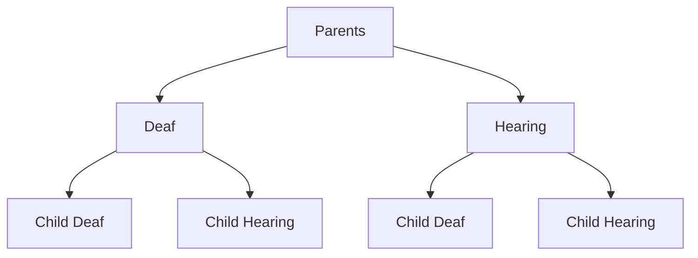

#### Atypical Language Development

- Bilingual, deaf, down syndrome, autistic spectrum disorder are examples of atypical language development.

##### Bilingual Acquisition

- **Bilinguals** are people who can use two languages in different situations. They are two monolingual speakers living in the same body. Both languages affect each other; via code-switching etc.
- There are different types of bilingualism:
  - **Balanced Bilinguals** are ones who can function in both languages, more or less in same level. *i.e.* Kurdish-Turkish bilingual who is able to read and write both in Kurdish and Turkish. A second generation Hispanic person in USA in cities with Hispanic population.
  - **Early Bilinguals** would be those who acquired the second language right before they start school around 5-6 years of age. *i.e.* A Kurmanji speaking child would learn Turkish in school or on TV.
  - **Late Bilinguals** are people who learned second language around high school or university.
- How much a language is used depends on the environment's dominant language. *i.e.* A Turkish bilingual studying in USA would use English more and more.
- There are other types of bilingualism where one language is less the proficient level:
  - **Receptive bilinguals** would be those who say that they understand but cannot speak a language. Typically observed in 3rd generation migrates or oppressed languages.
  - **Heritage language learners** are the ones who don't have complete command of ancestor language. They may be speaking it but not be able to write it. They may know how to speak casual but not formal. *i.e.* Half-Turkish students studying in Turkish courses, who are not able to speak formally but perfectly casually or not able to write essays.
- There are no strict boundaries between these types. They're all relative to the context. There are no comprehensive accurate descriptions. However:
  - Disadvantages: 
    - Bilinguals know less words then monolinguals. But actually, they know pretty much same number of words in different languages.
    - Code-switching is not a deficit. It is a linguistic strategy.
  - We know that people who are bilinguals are cognitively in advantageous position. They are:
    - **Better metalinguistic awareness**:
    - **Higher control over attentional processes**:
    - **Stronger abstract reasoning skills**
    - **Capable of divergent thinking**

##### Deaf Language Acquisition

- Sign language is only differs in modality from speech languages. Former is vision, latter is sound.
- Since it is a natural language, its acquisition is similar:
  - In order to grow up as a signer; you need interaction too.
  - There are two schools of though: Pro-sign, pro-lipreading.

##### Children with Cognitive Disorders and the Acquisition of Langauge

- There are different categories such as:

  - **Down Syndrome**: We still don't know the exact biology of down syndrome. It consists of physical and linguistics disabilities. Late emergence of language, and the fact they don't grow up to be compenent language speakers are issues. 
  - **William's Syndrome**: They don't develop cognitively, however their language is intact, with no problem. Although there are serious problems with other cognitive functions. This shows us that language has its own separate part in the brain.

  - **ASD** has a whole spectrum;
    - **Autism** has delayed onset of speech, lack of communication, not responding to their names, not making eye contact
    - **Asperger's Syndrome** is a typically a communication problem. They have difficulty in maintaining a meaningful conversation. Lack of empathy. 
    - **Rett Syndrome** is found in women. It can be found in men as well but mainly they're miscarried or stillborn. What happens here is until 6 month- 1.5 years these children develop normally. First stages of language acquisition are in place, but then they lose it. It's accompanied by hand gestures such as clapping.
    - **Common problems** are shared attention (eye-contact), symbol use (abstraction), theory of mind (understanding other people's thinking, feelings, etc.)

#### Aspects of Sign Language Acquisition

- There is phonology is Sign Language
- Children produce phonological errors
- Aspects of Motherese in a SL
- Manual babbling
- Bimodal-Bilingualism

##### Phonology

- Sign Languages have a sub-lexical structure
  - a structural level that is smaller than a lexical item, which can be characterized as phonology
- You can think of this as
  - "the smalles-meaningless-unit-science" of linguistics
- How do we know there is phonology in SLs?
- Minimal pairs, American Sing Language; **Handshape, Location, Movement, Orientation**
- **Acquisition Errors**
  - Movement and location found to be stronger parts of a sign; resistant to errors
  - Handshape is most error prone part.
  - Sympathy error: trying to coordinate movement
  - No crossing; no crossing gesture
- **Infant Directed language Motherese**
  - **Speech**: elevated pitch, expanded pitch range, frequent repetition
  - **Sign**: large and slower movements, frequent repetition, sign in the child's field of vision, place signs on the infants body
  - **Infant directed signing is attractive to all kids.**

##### Babbling

- Meaningless; but reflects syllabic organization, helps kids figure out the phonological system of their language around 7-10 months.
- Deaf kids are said to babble in speech but this disappears because there is no input from speech.
- Manual babbling consists of frequent handshapes, variety of locations, more constrained space, repetitive.

##### Parents and their Children



- Hearing children of deaf parents can **code-blend**.


### Language Processing and the Human Brain

Up until now, we talked about language in diachronic perspective.  Now we are coming out of the societility and looking inside the brain.

#### The Human Brain

- The brain is the most complex organ of the body, composed of 100 billion nerve cells (neurons).
- **Cortex**: the surface of the brain which receives messages from the sensory organs, initiates actions, and stores our memories and our knowledge of grammar.
- **Cerebral hemispheres**: the left and right hemispheres of the brain function contralaterally. 
  - The right hemisphere typically controls the spatial abilities, face recognition, visual imagery, and music.
  - The left hemisphere typically controls language, math, and logic.
- **Corpus callosum**: a network of 200 million fibers that join the two hemispheres and allow the left and right hemispheres to communicate with each other.

##### The Localization of Language in the Brain

- In the early 19th century, Franz Joseph Gall proposed the idea of **localization**, which is the idea that different cognitive abilities are localized in specific parts of the brain. *i.e. lateralization, contralateralization*.
  - **Phineas Cage**, after the accident doesn't lose his speech skills.
  - **Paul Broca** concludes after an autopsy of a patient who was able to understand but not speak, finds out that specific part is responsible for speaking. *i.e. Broca's area*
- He also proposed the theory of **phrenology**, which is the practice of examining the "bumps" on the skull in order to determine personality traits and intellectual capacity.
  
  - Phrenology is no longer followed as a scientific theory, but the idea of localization remains.
- In 95% of the right-handers, the left side of the brain is dominant for language. Even in 60-70% of left handers, the left side of brain is used for languages.

- In the 1860s and 1870s, Paul Broca and Karl Wernicke observed that people with damage to a particular area on the left side of the brain has speech and language problems, but people with damage to these specific areas on the right side usually did not. The  two language areas of the brain that are important for language now bear their names: *Broca's Area* and *Wernicke's Area*.

  - Damage to *Broca's Area* is called **Broca's Aphasia** or **agrammatism**.

    - prevents a person from producing (proper) speech.
    - appears not to affect understanding. 

    ```
    The cat was chased by the dog. difficult to understand
    The car was chased by the dog. easier to understand
    ```

  - Damage to *Wernicke's Area* is called **Wernicke's Aphasia**.

    - Primarily characterized by poor speech comprehension and meaningless speech

### Language and Brain

#### Brain Structure

- **Cerebral Cortex**: found only in mammals, humans have the greatest proportion of the cortex.
- **Contralateralizetion**
  - **Right Hemisphere**: supervises left side of the body.
  - **Left Hemisphere**: supervises right side of the body.
- **Corpus Callosum**: joins the hemispheres. It's composed of network of two million fibers. It allows the two hemispheres to communicate.

#### Modularity of the Brain

The brain is divided into distinct anatomical faculties that are directly responsible for specific cognitive function. **Left hemisphere** is superior for language, rhythmic perception, temporal-order judgments, and mathematical thinking skills. **Right hemisphere** does better in pattern-matching tasks, recognizing face, and spatial orientation.

#### Localization / Lateralization

- **Localization**: different human cognitive abilities and behaviors are localized in specific parts of the brain.

  ```
  Evidence: Aphasia
  Aphasia: any language disorder due to brain damage caused by disease of trauma
  Many aphasics are selectively language impaired.
  Aphasics do not (necessarily) have cognitive or intellectual impairments.
  ```

- **Lateralization**: any cognitive function that is localized primarily in one side of the brain. *i.e.* Language to mostly left-side.

  ```
  Evidence: Split-brain patients
  In the past, some cases of severe epilepsy were treated by cutting the coprus callosum, severing the connection between the two hemispheres.
  - Messages sent to the hemispheres cause different responses in split-brain patiens.
  - Object places in the left hand (right hemisphere): Object can bu used but not named.
  - Object places in the right hand (left hemisphere): Object can be named and described immediately.
  ```

  ##### 	Broca's Aphasia & Wernicke's Aphasia

| Broca's Aphasia                                   | Wernicke's Aphasia               |
| ------------------------------------------------- | -------------------------------- |
| - Language production is impaired                 | + Fluent Speech                  |
| - Trouble with function words, inflectional morp. | + Good intonation                |
| + Intelligence is not affected.                   | - Lexical Errors, Nonsense Words |
| + Understanding is not affected.                  | - Comprehension is impaired.     |

##### Brain Lesions

- Language usually does not develop normally in children with early left-hemisphere brain lesions.
- Babbling, vocabulary-learning delayed in children with right-hemispheres brain lesions.

##### Hemispheroctomy

In adult hemispherectomy patients:

- If left cerebral hemisphere is removed. 
  - Lose most but not all of their linguistic competence
  - Lose the ability to speak and process complex syntactic patterns
  - Retain some language comprehension ability

- If right cerebral hemisphere is removed
  - Difficulty in understanding jokes and metaphors
  - Cannot use loudness and intonation as cues to whether a speaker is angry, excited, or merely joking

##### Plasticity

To some extent, the brain may reassign functions to different areas of the brain. This is due to the *plasticity* of thebrain.

- Left hemisphere is predisposed t olearn language.
- During language development, the right hemisphere can take over many language functions if necessary
- Child hemispherectomy patients …
- …
- …

##### Language faculty

Children with **SLI** (*specific language impairment*):

- have difficulties in acquiring language, but
- do not have brain lesions responsible for language difficulties
- have no other cognitive deficits

**Language ability != general cognition**

```
Examples: Christopher (IQ 60-70) but can learn languages very easily.
```

#### Critical Age Hypothesis

Even though language is mostly located in left hemisphere, the right parts of the brain can take over if there is a lesion on the left side. This is an example of plasticity of the brain. If the damage happens in the adulthood, the language is lost, and the right part can not take over the language.

Under normal conditions, each child is primed to learn language if exposed to language. Children acquire their language (at least one as native), if only they are exposed to language before puberty which is the window of opportunity. *i.e.*  She learned quite a large vocabulary, however she was not able to use syntax although her intelligence level was normal. With the brain imaging techniques, it could be seen that she was using right hemisphere using the right hemisphere (like learning a new melody instead of a language). 

#### Language Disorders

##### Stuttering

It is more about speech production (**speech disorder**) and it is very common. Approx. 20% of children have some form of stuttering (mostly boys). The children with stuttering usually get better. It might be something biological, psychological, psychosocial etc. with no consensus. Stuttering might cause some social distress, but it doesn't have much of a negative effect.

##### Dyslexia

It is basically a **reading disorder**. Some examples can be: saying `dill` instead of `pill`. Typically changing the phones of words. It is related to how and where one stores the words and retrieve them. There are three types of dyslexia:

1. Phonological Dyslexia: Changing the order.  `dokuz buçuk` to `dozuk bukuç`. 
2. Deep Dyslexia: Changing the word relating to semantics. `forest` to `trees`, `flower` to `blom`
3. Surface Dyslexia: …

##### Slips of the Tongue

It is about retrieval, during which we tend to think ahead or perform slight misplacements.

`You missed all of my history lectures` to `You hissed all my mystery lectures`

### Natural Language Processing

Computational linguistics consists of:

- Speech recognition
  - is not understanding of language. Understanding language requires contextual information.
  - is based on probabilistic meanings.
- Speech production

It has problems:

- "fruit flies like a banana" can be `NP`, `NP` + `VP` 

One use would be "Corpus Linguistics":

- Through it, we are able to see the patterns that provide a lot of insight.
- In which, we look at frequency, collocations and cooccurence.

---

----

----

**Basic concepts expected to know:**

- Phonological processes
  - Assimilation (making two sounds more similar), metathesis (changing the order of sounds), dissimilation (making two sounds less similar)
  - Both synchronically and dichronically same changes happen, therefore it is not random, it is rule-governed and systematic. 
- Historical Linguistics: language change through time
  - in terms of sounds / phonology, morphology, word order, semantic, and lexicon
    - Great Vowel Shift: it's the change of the whole sound system.
    - Relation between case morphology and word order. If a language has an elaborate case system, then those language are likely to have a flexible word order. Because of theta roles.
  - Use of genetically related languages to reconstruct loss languages with application of plausibility, majority to cognates such as numbers, family member names (father, mother) *There will be reconstruction question in final. Predicting sound change.*

- Language Contact: lingua franca, pidgins, creoles
  - Language Shift: language loses it's domains one by one to be completely lost to dominant language. *There will be question about that, I think*
  - Language Death: It happens when the last speaker of a language dies. 
- Multilingualism: How speakers have command on more than one language. The factors in effect?
  - Dioglosia: Using different languages in different contexts, situations, and domains.
  - Code-Switching: Changing the language without being ungrammatical.

- Language Change in social perspective:

  - in terms of ethnicity, income, gender, age, or class or simply SES (socio-economical status)
  - Some of the variants has more prestige and considered to be the standard form. It's the language of the powerful group.
    - This is not the case all the time. Sometimes non-standard form can gain prestige (covert prestige)
    - They can be lexical items, phonemes, syntactic variations.
    - *What is prestige? What is stigma?  What is linguistic variable? How do we work on them?*

  - Hypercorrection, cross-over effect are quite related, we have seen them in many projects, upper-middle class, lower-middle are the most mobile groups in terms of social mobility, they do more hypercorrection.
  - Regarding gender, binary of women's and men's language, dominance approach, difference approach, and some basic findings of researched in that area.

- Face: is our temporary social identity in conversation. Our intorlocutors have the same. *How does the concept of face work? How do we do that face work? Politeness strategies?*

  - In terms of speech acts.
  - Deixis, anaphora
  - Social aspect of language use

- Biological: language acquisition

  - Development of language: three diffrent approaches
    - Behaviourism :crossed_swords: Poverty of stimulus
    - Innatism :crossed_swords: Child Directed Speech
    - Behaviorism
  - The Brain: how do we observe speech?
    - Broca's and Wernicke's area
    - Disorders: are important because they tell us what is going on inside the brain
  - Typical acquisition of language and atypical one

- Computational Linguistics: how computers imitate our brains