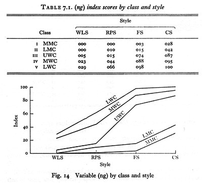

### Language Maintenance and Shift

- Bilingualism is always a necessary precursor of language shift.
- However, as a stable diglossic communities demonstrate, it does not always lead to language shift.
- Demographic factors, urbanness effect the language shift process. In urban context, there is less resistance to language shift.
  - Rural & Urban
  - The size of the minority group (*e.g.* Spanish in the US) is an important factor. If the minority is big enough they preserve their bilingualism.
  - If intermarriage is common, a shift is expected to the dominant home domain language.

#### Language Shift in Migrant Communities

> Fatma migrated to Germany with her family when she was 5. She spoke Turkish at home with her family. She began to work in a bicycle shop when she was 16. some of the other workers there also spoke Turkish. So she was peaking Turkish at home and at work. Only at school, she spoke German. She was good at her job, so she was promoted to be the store manager. She began to use more German although she still uses Turkish with her former workmates. Now she works at the headquarters of a car rental company and uses German all the time.

- This is a typical experience for those using a minority language in predominantly monolingual society.
- The language shift gradually takes place in different domains and the dominant language replaces the minority language.
- School is typically the first domain in which children of migrant families meet the dominant language.
- The dominant language infiltrates the home through children.
- There is pressure from the society to conform. Being good at the dominant language is a sign of successful assimilation.
- Abandoning the minority language altogether takes usually three or four generations but language shift is completed in just two generations.

#### Language Shift in Non-Migrant Communities

- Political economic and social changes can lead to language shift in multilingual societies.
- *e.g.* Iran is a multi-ethnic society and all minority languages are protected by constitution. However, Farsi the official language is a threat to other minority languages because they are not taught in schools and used in government offices.Even the governor of East Azerbaijan code-switches to Persian frequently when addressing an Azeri audience.

#### Migrant Majorities

- When colonial powers invade another countries, they impose their language along with their rule.
- In many cases, multilingualism as normal was well established such as in India, New Guinea, and many African countries.
- In cases where monolingualism is the norm, the colonizer's language has turned into a threat. In New Zealand, Maori people have moved from monolingualism in Maori in 19th century, through bilingualism in Maori and English, to monolingualism in English in the second half of the 20th century.

#### Language Loss and Death

- When all the Turkish migrants in the US shift to English in a few generations, that means the loss of Turkish for them. But it's not the death of Turkish.It will still be spoken in Turkey.
- When Tevfik Esenç dies in 1992, however the Caucasian language Ubykh died with him. He was the last speaker of that language.
- Dozens of Aboriginal languages spoken in Australia are dead now because their speakers were massacred by the Europeans and died by diseases they brought.

#### Language Revival

- *e.g.* Hebrew was almost extinct (it existed only in religious scripture). Once state of Israel was found, the brought people around the world, only common denominator being the religious language Hebrew was reconstructed.
- Welsh, though not as impressive as Hebrew, was replaced by English and then through some revivalist efforts with political supports it was revived to used in road signs, shop signs etc.

#### Factors Effecting Language Maintenance

- A language is maintained longer:
  - If there are attitudes and values attached to language. (e.g. Hebrew).
  - If the language is the symbol of group identity.
  - If the members of the community has frequent contact with each other.
  - If there is frequent contact with the homeland.
  - If the language is used in schools and in places of worship.
  - If there is institutional support.

---

### Language Variation

#### Dialectology

- Regional Variation -> regional dialects
- Usually a result of settlement history and physical geography *e.g. Sicilian, Gullah* 
- **Isogloss** is an imaginary boundary or line drawn on a map that separates particular linguistic features.
- **Isogloss bundle** represents a major dialect boundary.

#### Sociolinguistics

- Social variation -> social dialects
- Most societies are divided into groups with different **status**.
- This status used to be called "class" as in social classes of Marx.
- Some linguistic functions are **variable** (*i.e.* They can be expressed in two or more different **variants**.)
  - *i.e.* Tiki dialect can be described as `nasalization of vowels`, `higher pitch`, `longer vowels`, and `lowering of word-final vowels`
- One of the variants becomes associated with higher status groups and acquires **prestige**.

- Another variant becomes associated with lower status groups and acquires **stigma**.

```Labov&#39;s New York Study
Labov's NYC Study

Variable: rhotic /r/     i.e. /park/ vs. /pa:k/

Method: rapid anonymous survey in three department stores representing three social categories (Saks Fifth Avenue, Macy's, Klein's)

Result: stratification of social class and prestige or standart forms. Also, lower and middle middle class tend to corrent themselves more tha any other.

Important notes:
	- hyper-correction was observable in LMC and MMC.
	- Mather (2012) repeated Labov's study with four department stores inNYC.
	- The results were essenitally the same.
	- In Labov's study, the older speakers pronounced /r/
	- But in Mathel's it was younger people who pronounced /r/.
```

Word List, Reading Phrases, Formal, Casual

```
Trudgill's Norwich Study

Variable: -ing, tune       i.e. /goɪŋ/ vs. /goɪn/, /tuːn/ vs. /tjʊn/
		  Pronounciation, Five Social Classes, Gender, and Formality

Method: He identified 5 social classes and contrasted gender and considered formality also. He gave wordlist to people to get them pronounce formally. He gave a short paragraph to people and then interviewed them. After, he had talked to them casually.

Result: 

In Gender Preferential Variation: 
```

#### Gender

- When people self-report:
  - women over-reported their use of standard forms. That shows us that they prefer standard form for prestige. 
  - men under-reported their use of standard forms. The prestige of standard form is not that great for men. So, the non-standard form has **covert prestige** for men speakers.

- Explanations of women's linguistics behavior
  - Linguistic insecurity

  - Social status explanation

    Women use more standard forms that men because they are more status conscious. As standard speech forms are typically associated with higher social status, women use them as a way of claiming status.

  - Women's role as guardian's of society's values

    Society expects better behavior from women than men.

  - Subordinate groups must be polite

  - Vernacular forms express machismo (covert prestige)

- Innovative vs. Conservative

  - If innovation has a bad connotation, then women are innovative

  - If conservation has a bad connotation, then women are conservative

  - Women tend to use hyperbole

    ```
    Lakoff - 1974 | Language and Women's Place
    Describes women's language has typical features like they tend to 
     - use more hedging, 
     - use empty adjectives (awfully beautiful), 
     - use more precise color terms, 
     - use rising intonation in statements (uptalk, as if it is a question), 
     - speak more
    ```

    - **Dominance Approach**: Because men dominate women, women tend to speak as it is written up there. If a woman is not dominated in a situation, she doesn't speak in that fashion. Or, if a man is dominated in a situation, he tends to speak in that fashion.
    - **Difference Approach**: Men and women might speak differently. But that doesn't mean that one is better than the other. They learn to use language differently because of their backgrounds.

#### Context

- **Register** is another variation of language based on subject matter or social context (social roles and situations). *e.g. motherese or baby talk, elderese:question:, Legalese*

- **Jargon** is a variation of language based on occupational varieties, typically specific terminology.

- **Slang** is a variety used by a restricted part of the population, often young and "less respectable." **It ages very fast.**

- **Face** is the negotiated public image, mutually granted each other by participants in a communicative event. (like in *tr. yüz vermek, yüzü olmak*) 

  - **Positive face** is involvement. The person's right and need to be considered normal contributing member of society.
  - **Negative face** is independence. The person's right of not to be imposed, dominated by group or social values.

  - **Face threatening acts (FTA)**
    - We are talking about speech acts such as request, advice, compliment, and criticism. Such speed acts threated the positive or negative face needs of the speaker and addressee.
    - We use linguistic devices to mitigate the face threat caused by these acts.
    - These linguistic devices can range from choosing a language or dialect to using passive voice.
  - For more: [Politeness Theory](https://www.ello.uos.de/field.php/Pragmatics/PragmaticsPolitenessTheory) by Brown and Levinson (1987). When we face with an FTA, we have the following choices:
    - Don't do the FTA.
    - Do the FTA and go bald on record. (off the record​ :question:)
    - Do the FTA but do it with redress.
  - The way we perform an FTA depends on the following dimensions.
    - Social distance / solidarity :arrow_right: intimate - distant, positive politeness, negative politeness
    - Status / power :arrow_right: superior - subordinate
    - Weight of imposition :arrow_right: *e.g.* asking for a pen vs. for a phone

### Speech Act Theory

- You can use language to do things. You can use language to make promises, lay bets, issue warnings, christen boats, place names in nominations, offer congratulations, or swear testimony. The theory of **speech acts** describes how this is done. 
- By saying *I warn you that there is a sheepdog in the closet*, you not only say something, you warn someone. Verbs like *bet, promise, warn*, and so on are **performative verbs**. Using them in sentences produce **performative sentences**.
- Speech is a form of action. **Saying is doing.** Any utterance; 
  - conveys a meaning: **locution** is the basic act of utterance, of producing a meaningful linguistic expression. Well-formed utterances usually have a purpose.
  - possesses a force: **illocution** is produced with some function in mind, thus it has a so-called communicative force.
  - elicits an effect as response: **perlocution** is the effect on the listener. E.g. I've just made some cookies. If the listener interprets the utterance as a statement he could react by appreciating the smell. The listener could also interpret the utterance as an offer and feel invited to try one.
- **Felicity conditions** are contextual:
  - **Prepositional content condition** requires the participants to understand language, not to act like actors or to lie permanently, *e.g. a promise or warning must be about the future.*
  - **Preparatory condition** requires that the speech act is embedded in a context that is conventionally recognized, thus, just by uttering a promise, the event will not happen by itself. 
  - **Sincerity condition** requires that the speaker is sincere in uttering the declaration, *e.g. a promise is only effective when the speaker really intends to carry it out.*
  - **Essential condition** requires that involved parties all intend the result, *e.g. a promise changes state of speaker from obligation to non-obligation.*

#### Direct Speech Acts

- Structures: **declarative**, **interrogative**, **imperative**
- Functions (speech acts): **assertion**, **question**, **order / request**, **promise**, **advice**

| Speech Act             | Structure                        | Function        |
| ---------------------- | -------------------------------- | --------------- |
| Did you eat the pizza? | yes / no question, interrogative | question        |
| Eat the pizza.         | imperative                       | order / request |
| You ate the pizza.     | declarative                      | statement       |

#### Indirect Speech Acts

- 

| Speech Act                               | Structure     | Function        |
| ---------------------------------------- | ------------- | --------------- |
| Why don't you leave?                     | interrogative | order / request |
| Is ice cold? (sarcastically)             | interrogative | assertion       |
| I would like for you to wash the dishes. | declarative   | request         |

#### Types of Speech Acts

- **Representatives** commit a speaker to the truth of an expressed proposition.
  - Paradigm cases: asserting, stating, concluding, boasting, describing, suggesting.
    - I am a great singer.
    - Bill was an accountant.
- **Directives** are used by a speaker who attempts to get the addressee to carry out an action.
  - Paradigm cases: requesting, advising, commanding, challenging, inviting, daring, entreating.
    - You'd better tidy up that mess.
    - Sit down.
- **Commisives** commit a speaker to some future action.
  - Paradigm cases: **promising**, pledging, threatening, vowing, offering.
    - I am going to leave you.
    - I'll call you tonight.
- **Expressives** express some sort of psychological state.
  - Paradigm cases: **feelings**, greeting, thanking, apologizing, complaining, congratulating.
    - *This beer is disgusting*.
    - *I'm sorry to hear that*.
- **Declaratives** affect an immediate change of affairs. **Performatives**.
  - Paradigm cases: declaring, baptising, resigning, firing from employment, hiring, arresting.
    - We find the defendant guilty.
    - I resign.

### Pragmatics, meaning in context

- **Deixis** example would be: *You have to bring it back because she is not here today.* This sentence is really vague. You need context to make sense of this sentence. These *you, it, back, she, here,* and *today* are **deictic expressions**. They depend on the context to get their meaning.
  - Person deixis :arrow_right: it, him, they, these boxes
  - Spatial deixis :arrow_right: here, there, near
  - Temporal deixis :arrow_right: now, then, last week
- Tu / Vous (*fr.* for sen / siz) is a cultural phenomenon.
- **Reference** is an act by which a speaker (or writer) uses language to enable a listener or reader to identify something.

  - Words don't refer, speakers refer. *Mary always wanted to buy **a red sports car**, but she bought **a metallic gray minivan***. The ones in bold are grammatically very similar but the former lacks reference, whereas the latter has the reference. The minivan is the one became the reality.
  - *The present king of France* makes **sense** but there is **no reference**. There's no king anymore.
- **Inference** is the listener's ability to recognize what we mean, rather that their dictionary knowledge of a word we use. *Can I look at your Chomsky?* **Chomsky** can be inferred as **a book by Chomsky**.
- **Anaphora** is the subsequent mentions of a referent. *We saw a funny video about **a boy** (antecedent) washing **a puppy** (antecedent) in a small bath. **The puppy** (anaphora) started struggling and shaking and **the boy** (anaphora) got really wet. When **he** (anaphora) let go, **it** (anaphora) jumped out of the bath and ran away.*

#### **Cooperative Principle (Grice)** 

- It is an overarching assumption underlying conversational interaction:

  - Make your contribution appropriate to the conversation as it is required at the stage at which it occurs, by the accepted purpose or direction of the talk.

  - Shared interpretive conventions.

  - This overarching principle includes four maxims called **conversational maxims**. The serve as a guidance by which interlocutors...

    - Maxim of Quantity :arrow_right: make your contribution as informative as required

      > Speaker A: How are you?
      >
      > Speaker B: Well, I'm bad, because my cat got sick, also I have a bad back, which is the result of my carrying heavy furniture, because I had to move out again, and...

    - Maxim of Quality :arrow_right: do not say what you believe to be false, do not say something for which you lack adequate evidence

    - Maxim of Relevance :arrow_right: be relevant to the current topic of conversation

    - Maxim of Manner :arrow_right: avoid obscurity of expression, avoid ambiguity, be brief and orderly

#### Conversational Implicatures

- Speakers may be flouting a maxim and thus generates conversational implicatures. A speaker may be suspected of intending to imply something conversationally when what he says blatantly violates one of maxims but the hearer assumes that the cooperative principle is being observed.

  > Lara: Are you coming to the party tonight?
  >
  > Rita: I've got an exam tomorrow.
  >
  > ---
  >
  > Child: What's that?
  >
  > Mother: We can't buy up the whole store. (Mother violates manner of relevance and quantity)
  >
  > Grandpa: He's a good boy. He just wanted to know.
  >
  > (Blum-Kulka, 1989)

### Conversation

#### Conversation Analysis

- **The interaction / conversation is structurally organized.**
- It is usually when the communication breaks down, that we notice the complex choreography we perform in conversation.
- We have ways of organizing conversation so that more than one person has a chance to speak, that turn-taking is done in an orderly fashion, and that there are formulaic signals marking the beginning and ending of a conversation.
- There are some culture specific variation. Turkish don't have overlapping sentences and doesn't prefer silence, whereas in Italian there can be overlapping conversations.
- CA focuses on details of actual events, they record conversations that occur without researcher prompting. They produce transcriptions that attempt to reproduce what is said in detail (including linguistic and nonlinguistic details). They avoid positing generalizations about what participants know; the focus is on the specific events actions that occur during the conversation.

#### Turns & Sequences

- The basic unit of analysis is **turn**

  > A-	The phone's ringing.	Request
  >
  > B-	I'm in the bathroom.	Refusal
  >
  > A-	I'll get it.		 	     Acceptance

##### **Turn Construction Units (TCU)**

| Words      | Phrases                   | Clauses       |
| ---------- | ------------------------- | ------------- |
| A-    Hi:: | A-    nerde gördün onları | A-    got it? |
| B-    Hi   | B-    akmerkezde          | B-    yeah    |

##### **Turn Transition Relevance Points (TRP)**

How do we signal that we are going to

- take the turn

- end the turn

- choose the next speaker?

  > A-	Uh, you been down here before [haven't you]	After `before`, there is a **TRP**.
  >
  > B-								      [yeah.

keywords: prosody?

##### Adjacency Pairs

It is basic unit of order / **sequence**. Two turns happening in a specific order. Question :arrow_right: Answer.

- A pair of speaking turns that are i) adjacent, ii) ordered and iii) appropriately matched.

  > A-	Where is the milk?
  > B-	In the fridge.
  >
  > ---
  >
  > A-	It's not break time yet.
  >
  > B-	I finished my box, so shut up.
  >
  > ---
  >
  > A-	Wanna grab a sandwich?
  >
  > B-	Sure.

##### Expanded Pairs

- Side sequences

  > A-	where is the book?
  >
  > B-	which book?
  >
  > A-	the one I brought yesterday.
  >
  > B-	I don't know.

- Pre-Sequences*

  > A-	guess what
  >
  > B-	what?
  >
  > A-	I met with the new director.
  >
  > B-	really?

##### The Notion of Preference

- Preferred vs. dispreferred responses:

  > Daphne:	 I was thinking we could have fish?
  >
  > Julie:		fine
  >
  > Anita:	      well actually (.) I've stopped eating fish 
  > 			now because of you know the damage it
  > 			does to the ocean

---

- Interaction involved more than just semantic and grammatic sentence making.

  - Contextualization: every speech act is meaningful in its context. Contextualization cues? 

  - Prosody is concerned with those elements of speech that are not individual phonetic segments (vowels and consonants) but are properties of syllables and larger units of speech.

    > **Ee**, naptın? / **Ee**, yeter be!

  - Discourse markers is a word or a phrase that plays a role in managing the flow and structure of discourse.

    > You know, like, I mean / hani, yani, işte

  - Situated inferences?

### Language Acquisition

- It starts at around twentieth weeks in mother's womb.

#### Why is it significant?

- Young children acquire the language(s) very easily without instruction.
- Children acquire language(s) in a very short period of time.
- Children go through same stages at about the same time regardless of the language or their personal circumstances.

#### Theories about language acquisition

##### Behaviorism

- The mind is a blank state.

- Learning is imitation and habit formation.

- Children learn because their actions are **reinforced** with praise  or successful communication.

- **but** :arrow_right: Children learn a complete language in about 5 years. This is much faster than what can be reasonably expected given the input they receive.

  - **Poverty of Stimulus Argument**
    Children are exposed to false starts, incomplete sentences, and odd constructions. Their use of language regarding politeness and so on may be corrected but their grammar is seldom directly corrected.
    Yet children emerge with a more or less perfectly formed language. They are able to produce new sentences they couldn't possibly have heard.
    **This is not possible by imitation.**

    > CH–  	My teacher **holded** the baby rabbits and we patted them
    > MO– 	did you say the teacher **held** the rabbits?
    > CH–	  yes
    > MO–	 What did you say she did?
    > CH–	  She **holded** the baby rabbits and we patted them.
    > MO–	 Did you say she **held** them tightly?
    > CH–	  No she **holded** them loosely.

##### Innatism / Nativism

- Nativism suggests than humans are genetically programmed to acquire language. (Language Acquisition Device, Universal Grammar)
- In addition to "**poverty of stimulus**" argument, another important piece of evidence comes from "**critical period hypothesis**"
  - **Critical Period Hypothesis**
    [Genie Example](https://en.wikipedia.org/wiki/Genie_(feral_child))

##### Interactionism

- **Interaction** is central to the acquisition of first language.
- **Child Directed Speech** is much more regular, cleaner than "poverty of stimulus" argument assumes.

It is characterized by a slower rate of speech, a higher pitch, quite varied intonation, more pauses, shorter and simpler sentences, and a focus on here and now. It is an effort to communicate with the child. It is fine-tuned accordance with the development of the child.

---

#### Stages of Acquisition

We should keep in mind that there is a large amount of individual variation.

| Time (aprx.)    | Action                             | Description                                                  |
| --------------- | ---------------------------------- | ------------------------------------------------------------ |
| 0-4 months      | Cooing                             | Cooing is basically crying. They are vegetative sounds.      |
| 4-6 months      | Prolonged vowel or consonant sound | [m:], [a:], [o:]                                             |
| 6-12 months     | Reduplicated Babbling              | [mɑmɑ], [bɑba]                                               |
| 12-18 months    | One-word stage                     | Using single words for everything. [bɑbɑ] can mean "let's go", "I'm hungry" etc. |
| 18-20 months    | Two-word stage                     | First signs of syntax usage. "anne gitti", "mama ye", "ye mama"* |
| 2-2.5 years old | Telegraphic Speech                 | …                                                            |

##### Preverbal Stage

- Children are primed to learn language.
- Their hearing is as good as adults. (cf. Their sight becomes adult-like only around 6 months)
- As early as three days old, infants can recognize their mother's voice.
- Early on children prefer human beings to objects, both visually and auditorily.
- Since they focus on sounds like voices and things like faces both of which can serve as input for acquisition, we can say that they are ready to learn language.
- How do we know they pay attention to voices and faces? *By turning head*, *by high amplitude sucking*.

##### Acquisition of Phonology

- Infants are sensitive to all speech sounds used in all languages. Then at about 3 months, they begin to distinguish the phonemes in the language they are exposed to.
  - First vowels: [a, i, u]
  - First consonants: [+stop], [+fricative +labial], [+fricative +alveolar] > [+fricative +velar]
  - First syllables: CV

##### Acquisition of Morphology

- The first inflectional suffixes appear at age 2. Before that children use words like "gitti, attı", however these are not productive usages, they're memorized.

- In English, the first verbal inflectional suffixes are progressives "going, doing", the first nominal is plural `-s`. In the irregular plurals, we see children making typical mistakes such as "foots", for some time there is combined usage of "foots" and "feet" or even "feetses". This is **overgeneralization**. This is a product of **rule-forming**. Then comes the possessive `-'s` *mommy's car*. Then comes the third person agreement `s` *mommy waits*. The first requires an `N` , the second requires an `N-bar`, whereas the third requires `T-bar`.

  | phrase      | requirements |
  | ----------- | ------------ |
  | mommy's car | N + `'s`     |
  | mommy waits | N' + `'s`    |
  | daddy goes  | T' - v-s     |

- In Turkish, children words suc|h as "geler, olar", overgeneralization can be observed.

##### Acquisition of Lexicon

- For a while, every bearded man is "grampa", every round object is a "cookie", and etc. This is called **overextension**. 

  > Overextension is an error in early word use in which a child uses a single word to label multiple different things in a manner that is inconsistent with adult usage.

- **Underextension**, which is roughly the opposite of overextension, occurs when a child acquires a word for a particular thing and fails to extend it to other objects in the same category, using the word in a highly restricted and individualistic way.

##### Acquisition of Syntax

###### Acquisition of Questions

- Questions involve movement in English. The order of acquisitions of questions:
  1. Only intonation. *Mommy gone?* *Daddy going?*
  2. `+ Wh-q` starts later. *Where Daddy going?*
  3. `+ aux` *Where Daddy is going?*
  4. `+ mov` *Where is Daddy going?*

###### Acquisition of Negation

- They appear around two-years of age. First they acquire the semantics of it, but the structure (regular syntactic negation) comes later.

---

### Review

**Declaration**:  *You are hereby bla bla.*

**Directives**: *Please return this file to your boss.*

**Expressive**: *I think bla bla*.

**Representatives**: *The capital of Australia is Canberra.*

**Commissives**: *I promise I will bla bla.*