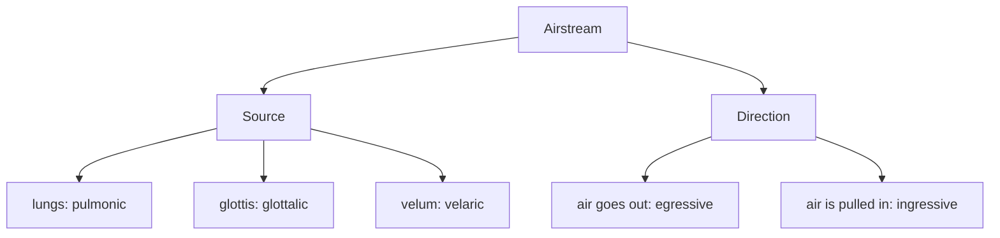

#### Accent Differences / Lexical Sets

- Number of vowels

  - British [ɑ], both [ɔ] and [ɑ] becomes [ɒ]

- Distribution: in between distinct phonemes

  | AE     | BE     |
  | ------ | ------ |
  | [glæs] | [glɑs] |
  | [fɑðɚ] | [fɑðə] |

- Quality: where the elements are not distinct phonemes

  - Midwest: [par] - Texas: [paː] which is in contrast with [pɑː]

```
Homework 2:  Compare Standard AE variety with 
				a) southern AE
				b) scottish
			 You need to find 3 differences for each
			 - provide example words
```

### Stress

- Stress is more prominent in function words.
- Stress differentiates between verb and noun in English. :arrow_right: `an 'insult` vs. `to in'sult`
- Stress differentiates the meaning. :arrow_right: `'hot dog` vs. `'hot 'dog`

- Stress **contrasts**. :arrow_right: The correction of `Bob or Mary` would be `Bod 'and Mary`

- English word stress alterations:

  | '__ _ __  | __ '__ __ __ | __ _ '__ _  |
  | --------- | ------------ | ----------- |
  | ˈdɪpləmæt | dɪˈploʊməsi  | dɪpləˈmæɾɪk |

### Tones

```
H high tone | L low tone
```

- Tones are **targets**; you don't have a set pitch. you hear them in a relative way.

  *accent, stress: either a H or a L tone can bear accent

**Tonic / Sentential / Nuclear Accent / Stress**

- The most prominent syllable in a sentence.

**Phrase Accents**

- **H-** , **L-** : not really about prominence; these mark end of a phrase together with a boundary tone.
- **H%** , **L% **: Boundary tones at the end of an intonational phrase.

**Complex Tones**

- **L + H** : A low then a high tone.
- **H + L** : A high then a low tone.

**Downstep**

- **!H** : Each step down from a **H** tone.

---

### Airstream Mechanisms



```
						Source of airstream.
   _
  | |		_
  | |	   | |       _     ^ eggressive 
  |_|      |_|      |_|	   v ingressive
   |        |        |
 lungs   glottis   velum
 
 _____________________________
 pulmonic-egressive: plosives |  ɑbɑ ɑpɑ
 pulmonic-ingressive		  |   -   -
 _____________________________|___
 glottalic-eggressive: ejectives  |   -   ɑpʼɑ
 glottalic-ingressive: implosives |  ɑɓɑ   -1111111111
 _________________________________|
```

| Ingressive..şiişşüü | Both                                   | Eggressive             |
| ------------------- | -------------------------------------- | ---------------------- |
| Velaric => `clicks` | Glottalic => `ejectives`, `implosives` | Pulmonic => `plosives` |

- Pulmonic

  - Egressive: "normal"
  - Ingressive: "Scandinavian style"

- Glottallic

  - Egressive: [pʼ tʼ kʼ]
    - oo9oo9
  - Ingressive: [ɓ ɗ ɠ]

  