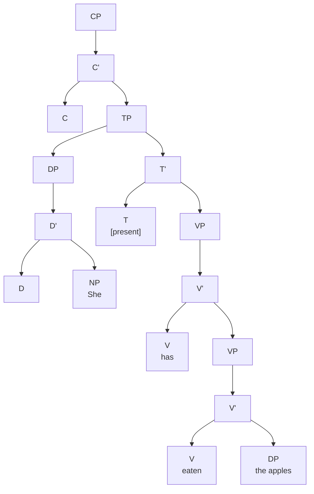

## Auxiliaries and Functional Categories

### Tense, Aspect, Mood/Modality (& Voice)

**Perfectives** … Ex. *He ran*

Habitual is presented as *perfective*.

**Perfect** need a reference time along with event time and speech time.

`...continuing`

**Aspect** is different than **tense**. It is about how does a speaker present the event.

**Auxiliaries** vs. **participles**

> He *is* <u>running</u>	/	It *is* <u>biting</u> He *has* <u>run</u>		/	It *has* <u>bitten</u>  	 <small>{tense}</small> <small>{aspect}</small>			 <small>{aspect}</small> 	 <small>{person}</small>
>
> *it.* Aux  (lexically deficient) <u>ul.</u> participles  (inflected verbs that are lexical )
>
> He *runs*	/ 	He *bites*		<small>{present} {imperfective} {person}</small>
>
> Participles can function as adjectives makers and passive makers

#### Modals vs. Auxiliaries

> The have broken the silence twice.
>
> The criminal had been being interrogated for 3 hours when the phone rang.

**Perfect / Passive Participle** = V3

**Modals**: *can, may, might, etc.* Modals don’t get inflected as same as the other. *You should see a doctor* doesn’t really mean that *should* is past. They are nor inflected for person. Modals require a bare form of a verb.

**Auxiliaries**: They require a participle form from the verb. 

|      |       |         |       |            |
| ---- | ----- | ------- | ----- | ---------- |
| I    |       | often   | eat   | apples     |
| Je   | mange | souvent |       | des pommes |
|      |       |         |       |            |
| I    | have  | often   | eaten | apples     |
| J’   | ai    | souvent | mangé | des pommes |

Deep Structure :arrow_forward: Transformational Rules Apply :arrow_forward: Surface Structure

## Head-to-Head Movement

## DP Movement

## Raising, Control & Empty Categories

## Polysynthesis, Incorporation, and Non-Configurationality

