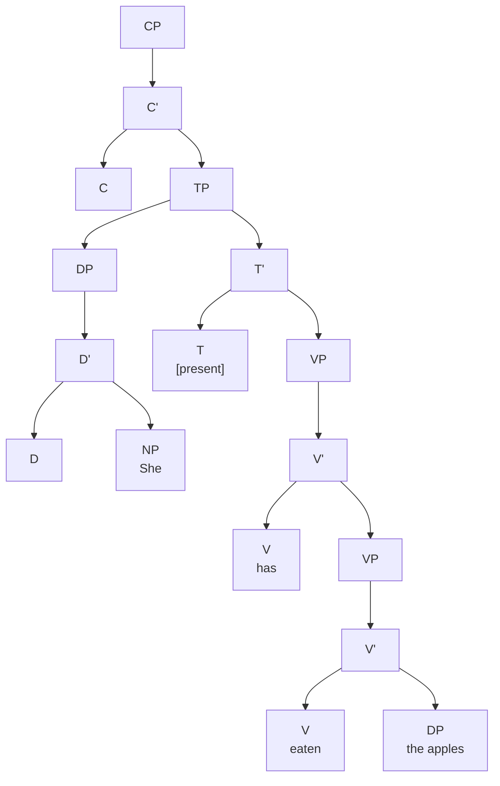
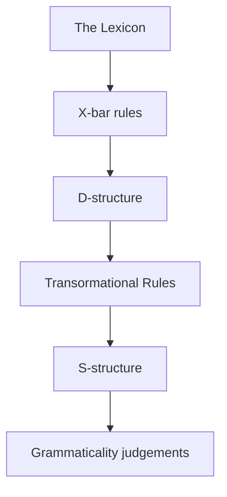
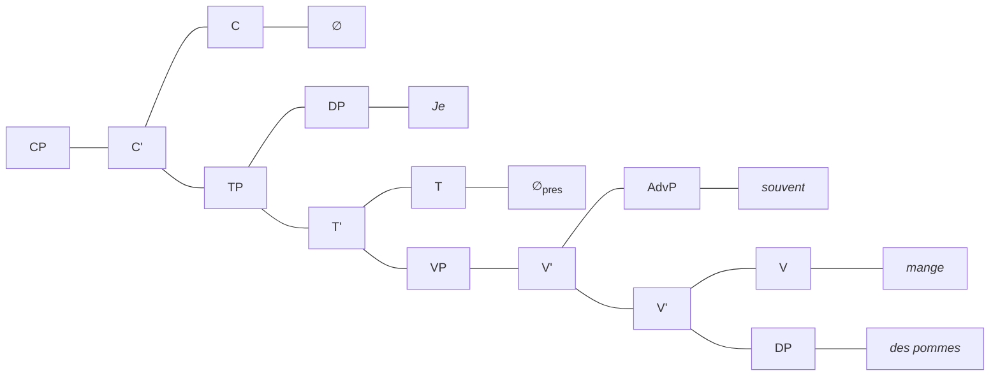
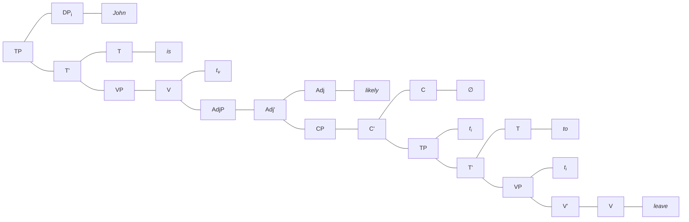

## Auxiliaries and Functional Categories

### Tense, Aspect, Mood/Modality (& Voice)

**Perfectives** … Ex. *He ran*

Habitual is presented as *perfective*.

**Perfect** need a reference time along with event time and speech time.

`...continuing`

**Aspect** is different than **tense**. It is about how does a speaker present the event.

**Auxiliaries** vs. **participles**

> He *is* <u>running</u>	/	It *is* <u>biting</u> He *has* <u>run</u>		/	It *has* <u>bitten</u>  	 <small>{tense}</small> <small>{aspect}</small>			 <small>{aspect}</small> 	 <small>{person}</small>
>
> *it.* Aux  (lexically deficient) <u>ul.</u> participles  (inflected verbs that are lexical )
>
> He *runs*	/ 	He *bites*		<small>{present} {imperfective} {person}</small>
>
> Participles can function as adjectives makers and passive makers

#### Modals vs. Auxiliaries

> The have broken the silence twice.
>
> The criminal had been being interrogated for 3 hours when the phone rang.

**Perfect / Passive Participle** = V3

**Modals**: *can, may, might, etc.* Modals don’t get inflected as same as the other. *You should see a doctor* doesn’t really mean that *should* is past. They are nor inflected for person. Modals require a bare form of a verb.

**Auxiliaries**: They require a participle form from the verb. 

|      |       |         |       |            |
| ---- | ----- | ------- | ----- | ---------- |
| I    |       | often   | eat   | apples     |
| Je   | mange | souvent |       | des pommes |
|      |       |         |       |            |
| I    | have  | often   | eaten | apples     |
| J’   | ai    | souvent | mangé | des pommes |

Deep Structure :arrow_forward: Transformational Rules Apply :arrow_forward: Surface Structure

## Auxiliaries and Functional Categories

### Complementizers

Some verbs like *think* require their complements to be finite.

> I think that Art likes his beer. 	<small>complementizer: that</small>
> I think Art likes his beer. 			<small>lacks an overt complementizer</small>
> *I think  Art to like his beer.		<small><i>think</i> does not allow non-finite clauses</small>
> *I think if Art likes his beer.		<small><i>think</i> does not allow questions</small>

On the other hand, some other verbs like *order* can allow both non-finite and finite complement phrases.

> I ordered that Art drink his beer. 	<small><i>order</i> with an overt complement</small>
> I ordered Art drink his beer.			<small>without overt complement</small>
> I ordered Art to drink his beer.		<small>with finite complement</small>
> *I ordered if Art drink his beer.		<small><i>order</i> also does not allow question</small>

Some other verbs can only take the interrogative *if*.

> *I inquired that Art likes his beer.		<small><i>inquire</i> does not allow finite overt complements</small>
> *I inquired Art likes his beer.				<small>nor non-overt complements</small>
> *I inquired (for) Art to like his beer.     <small>nor non-finite overt or non-overt complements</small>
> I inquired if Art likes his beer.				<small>but it allows questions</small>

There are subcategories of verbs that are sensitive to the kinds of CP (finiteness, overtness etc.) that they take as arguments. This parallels the various subcategories of verb that were sensitive to the theta roles of DPs. Like the verb *is likely* has a "proposition” (as a theta role) as argument, there are thera roles such as *interrogatives* etc.

<small>**WARNING**</small>: There are two types of *if*: one is *if-clause* like *I think if Art likes his beer, he’ll order some more*, the other is the one that generates embedded question.

Finally, the theta roles of verbs that require a CP for argument are show in this way.

	

        <i>think</i>
    

    

        

            <u>Agent</u> DP
        

        

    

    

        

            CP [-Q, +<small>FINITE</small>]
        

        

    

	

        <i>order</i>
    

    

        

            <u>Agent</u> DP
        

        

    

    

        

            CP [-Q]
        

        

    

Apart from that, there are also *selection by Complementizers*, that is different kinds of complementizers such as *think* can take a TP under its CP (C head is *that*) as long as the TP is not *to*. In that case;

	

        <i>that</i>
    

    

        

            TP [-<small>INFINITIVE</small>]
        

        

    

---

#### Determiners

Determiners do also select certain kinds of complements; for instance, the most commons *the* and *a*, former can select both plural and singular, whereas latter can only select singular:

    

        

            <i>a/an</i>
        

        

            

                NP [-<small>PLURAL</small>, -<small>PROPER</small>, -<small>PRONOUN</small>]
            

            

        

	

    

        

            <i>the</i>
        

        

            

                NP [-<small>PRONOUN</small>, -<small>PROPER</small>]
            

            

        

	

There can also be null determiners such as:

    

        

            <i>∅[+PROPER]</i>
        

        

            

                NP [+<small>PROPER</small>, -<small>PRONOUN</small>]
            

            

        

    

    

        

            <i>∅[+PRONOUN]</i>
        

        

            

                NP [-<small>PROPER</small>, +<small>PRONOUN</small>]
            

            

        

    

    

        

            <i>∅[+PLURAL]</i>
        

        

            

                NP [+<small>PLURAL</small>, -<small>PROPER</small>, -<small>PRONOUN</small>]
            

            

        

    

Count feature:

    

        

            <i>many</i>
        

        

            

                NP [+<small>COUNT</small>, +<small>PLURAL</small>, -<small>PROPER</small>, -<small>PRONOUN</small>]
            

            

        

    

    

        

            <i>much</i>
        

        

            

                NP [-<small>COUNT</small>, -<small>PLURAL</small>, -<small>PROPER</small>, -<small>PRONOUN</small>]
            

            

        

    

What about a determiner phrase like *all the boys*?

    

        

            <i>all</i>
        

        

            

                DP
            

            

            	<i>the boys</i>
            

        

	

    

        

            <i>the</i>
        

        

            

                NP [-<small>PRONOUN</small>, -<small>PROPER</small>]
            

            

            	<i>boys</i>
            

        

	

---

#### Understanding Tense, Aspect, Voice, and Mood

##### Tense

***Tense*** refers to the time of an event relative to the time at which the sentence is either spoken or written. For instance, the sentence *John left* entails that the act of John’s leaving —***the event time***— happened before the speakers uttered this sentence —***the assertion time***—. There are three tenses:

1. *past tense*: event time is before assertion time
2. *present tense*: the event time is the same as the assertion time
3. *future tense*: the event time is after the assertion time

In English, the past tense is typically marked with *-ed* suffix. The form of a past tense verb whether it ends in an *-ed* or has a special form is called the ***preterite***.  Weirdly, English doesn’t have a regular future tense inflection. This issue is solved by the usage of modals such as *will* or *going to*. Other way to solve it is using the present forms to indicate future such as *I’m leaving tomorrow* in which present tense auxilarry *am* is used to mark the future as ***futurate***.

##### Perfect Aspect

Aspects are defined by making reference to some other point, typically other than the speech time. For instance, *John had eaten before I arrived.* In this example, the assertion time is both before the event time and before the speaker arrived. This is called ***perfect*** in which the time of the event occurs before the reference time. In English, *perfect aspect* require a special for of a verb that is called ***participle*** like *went, gone, slept* etc.

> I had eaten the deep-fried muffins. 		*past* + *perfect*
> I have eaten the beef muffings.				*present* + *perfect*
> I will have eaten the beef waffles.			*future* + *perfect*

##### Progressive Aspect

The progressive aspect indicated an event that is ongoing in relation the the refence time.

> Jeff was dancing with Sylvia while Amy sat angrily at their table. *past* + *progressive* 

Note that the *-ing* suffix is named ***gerund*** and not *present participle*

##### Voice

***Voice*** refers to a phenomenon that changes the number of arguments and positions of arguments that a verb uses. For example, there’s a passive voice in which the agent is omitted and the theme is put in subject position.

> Calvinagent ate the beef wafflestheme.
> The beef wafflestheme were eaten.

In English, passive voice is marked with a *be* auxiliary and the participle form of the verb. The formula of it is <small>BE</small>+<small>PARTICIPLE</small>.

##### Combined Tense, Aspect, and Voice

|                 | *Auxiliary verb* | *Following verb form* |
| --------------- | ---------------- | --------------------- |
| *Perfect*       | have             | participle (-en)      |
| *Progressive*   | be               | gerund (-ing)         |
| *Passive voice* | be               | participle (-en)      |

Consider this example:

> <small>PERFECT</small>: i	<small>PASSIVE</small>: k	<small>PROGRESSIVE</small>: p
> The soup hadi bep + eni bek + ingp eat + enk

Altough the pattern is complex, it is regular as it can be.

##### Mood

***Mood*** refers to the speaker’s perspective on the event —whether it is describes as a possibility, a probability, a necessity, or an obligation—. They’re typically expressed through modal auxiliary verbs (*must, can*), untypically through use of adjectives (*it’s possible that*). The distributional properties of these modals are:

1. They always precede all other auxiliaries.
2. They must precede negation.
3. They can never take agreement inflection.

> Jeff must have eaten the deep-fried muffin.
> *Jeff has must eaten the deep-fried muffin.
> *Jeff not must have eated the deep-fried muffin.
> *Jeff musts have eaten the deep-fried muffin.

#### Auxiliaries

##### Main Verb vs. Auxiliary Verb Uses of "be”, "have”, and "do”

Since *be, have,* and *do* have main uses indicating copular *be*, possession, and *accomplishment*. They need to be differentiated.

| Name                  | Meaning                        | Subcategory |
| --------------------- | ------------------------------ | ----------- |
| *becop*    | Copula (identity/property)     | Main verb   |
| *beprog*   | Progressive                    | Auxiliary   |
| *bepass*   | Passive                        | Auxiliary   |
| *haveposs* | Possession                     | Main verb   |
| *haveperf* | Perfect                        | Auxiliary   |
| *domain*   | Accomplishment / performance   | Main verb   |
| *doaux*    | Supports tense before negation | Auxiliary   |

Considering the fact that auxiliaries can undergo subject-auxiliary inversion, and main verbs can not, take a look at these examples:

> Has Pangur eaten his tuna?
> Is Pangur eating his tune?
> Did Pangur eat his dinner?
> *Ate Pangur his dinner?

And now look at these:

> *Has Calvin a bowl?
> Does Calvin have a bowl?
> *Did Calvin his homework?
> Did Calvin do his homework?
> *Did Calvin not his homework?
> Did Calvin not do his homework?

##### Modals vs. Auxiliaries

Differences between them:

1. Auxiliaries like *be* and *have* take inflectional suffixes just like verbs. (negation, tense, etc.) Modals do not.

   > Jeff has eaten. 		*has* is the third person form of *have*
   > *Jeff musts eat.

2. Modals do not follow other modals, but auxiliaries can follow modals.

   > I should not eat plums.
   > *I must can eat plums.

3. Modal verbs (like *will*) are in complementary distribution with tense elements and the they place in the category of T. They also block any tense or aggreement inflection.

   > Calvin will not eat the beef waffles.
   > *Calvin not will eat the beef waffles.
   > I ate deep-fried muffins.
   > *I might ate deep-fried muffins.

| [<small>FORM</small> *bare*] | [<small>FORM</small> *participle*] | [<small>FORM</small> *gerund*] | [<small>FORM</small> *preterite*] | [<small>FORM</small> *present*] |
| ---------------------------- | ---------------------------------- | ------------------------------ | --------------------------------- | ------------------------------- |
| eat                          | eaten                              | eating                         | ate                               | eat / eats                      |
| dance                        | danced                             | dancing                        | danced                            | dance / dances                  |
| bite                         | bitten                             | biting                         | bit                               | bite / bites                    |
| take                         | taken                              | taking                         | took                              | take / takes                    |

    

        

            <i>should</i>
        

        

            

                VP </b>[<small>FORM <i>bare</i></small>]
            

            

            

        

	

    

        

            <i>be<i>pass</i></i>
        

        

            

                VP [<small>FORM <i>participle</i></small>]
            

            

            

        

	

    

        

            <i>be<i>prog</i></i>
        

        

            

                VP [<small>FORM <i>gerund</i></small>]
            

            

            

        

	

##### Past and Present Tense Marking in English

The use of the <small>FORM</small> features really comes in handy with these markings.

> Calvin ∅past ate the beef waffles. Calvin can	eat the beef waffles.

Because this:

    

        <i>∅<i>past</i></i>
    

    

        

            VP [<small>FORM <i>preterite</i></small>]
        

        

        

    

##### Perfects

Consider these:

> Sylvia	will		be		here. 
> Sylvia	could	be		here. Sylvia	∅past	 was	 here. Sylvia	∅pres	 is		 here.

Note that what follows these T nodes is an auxiliary in every case. So, auxiliaries has to be of category V because T always selects for a VP.

> The cat	∅past	had		eaten. The cat	∅past	hadperf   beenprog	eating.
> The tuna  ∅past   hadperf   beenpass	eaten.
> *The cat   ∅past   hadperf   haven<small>perf</small>  eaten.
> *The cat	∅past  had<small>perf</small>   musten	 eat.

According to these examples, *haveperf* must have this following theta grid:

    

        <i>have<i>perf</i></i>
    

    

        

            VP [-<small>PERFECT, FORM <i>participle</i></small>]
        

        

        

    

##### Progressive Auxiliaries

This one has a more restricted syntactic distribution than the perfect.

> The cat		∅past	wasprog	leaving.
> The tuna	 ∅past	wasprog	beingpass	eaten.
> *The cat	  ∅past	wasprog	beingprog	eating.
> *The cat	  ∅past	wasprog	havingperf   eaten.
> *The cat	  ∅past	wasprog	musting	  eat.

In this case, it can be presented in the following theta grid:

    

        <i>be<i>prog</i></i>
    

    

        

            VP [-<small>PERFECT,</small> -<small>PROGRESSIVE, FORM <i>gerund</i></small>]
        

        

        

    

##### Passive Auxiliaries

These are even more restricted. Consider the following examples:

> The cake	  ∅past    waspass	eaten.
> *The cake	∅past	waspass	beenpass	eaten.
> *The cake	∅past	waspass	beenprog	eating.
> *The cake	∅past	waspass	haveperf	  eaten.
> *The case	∅past	waspass	musten	  eat.

In this case, it can be presented in the following theta grid:

    

        <i>be<i>pass</i></i>
    

    

        

            VP [-<small>PERFECT,</small> -<small>PROGRESSIVE</small> -<small>PASSIVE, FORM <i>participle</i></small>]
        

        

        

    

##### Do-*support* (*first pass*)

It is peculiar property of English that in ceratin circumstances, present and past tense inflection on a verb is replaced by the auxiliary *do* and its *variants*:

> Reggie	 ∅past	chased the ball.
> Reggie 	∅past	didemph chase the ball.		*emph* stands for emphatic
> Reggie	 ∅past    didneg not chase the ball.	*neg* stands for negation

Emphatic *do* requires the verb in <small>FORM <i>bare</i></small> and negating *do* required the negation *not*. Also the negation *not* requires the verb in <small>FORM <i>bare</i></small>.

    

        

            <i>doemph</i>
        

        

            

                VP [<small>FORM <i>bare</i></small>]
            

            

            

        

	

    

        

            <i>doneg</i>
        

        

            

                NegP
            

            

            

        

	

    

        

            <i>not</i>
        

        

            

                VP [<small>FORM <i>bare</i></small>]
            

            

            

        

	

---

## Movement

### Head-to-Head Movement

Consider these sentences in which a subject or an adverb intervenes between the verb and the object:

> Phog		Maire	an	lucharachan. Kissed	  Mary	 the  leprechaun. "Mary kissed the leprechaun.”
>
> Je	mange	souvent	des	pommes.
> I	  eat		   often		 of.the apples.
> "I often eat apples.”

Also, consider that we said a participle is a complement to an auxiliary, yet we still see:

> He hasaux not eatenpart.

In order to solve this issue that cannot be explained by X-bar theory (yet), we need to come up with rules called ***transformatinal rules.*** Transformations take the output of X-bar rules and change them into different trees.

X-bar theory and the lexicon conspire together to generate trees. This conspiracy is called ***the base***. Theresult of this tree generation is a we call ***D-structure***. ***D-structure*** is never pronounced. They’re subject to the ***transformational rules*** that move words around in the sentence and in return outputs the ***S-structure***. S-structure is then filtered by EPP (extended projection principle) which ensures that sentence has a subject.

#### Verb Movement (V ​to​ T)

Consider the French example about apples.

| DP   | T                 | Adv     | V                    | DP         |
| ---- | ----------------- | ------- | -------------------- | ---------- |
| I    | ∅pres  | often   | eat                  | apples     |
| Je   | mangei | souvent | <i>ti</i> | des pommes |
| I    | have              | often   | eaten                | apples     |
| J’   | ai                | souvent | mangé                | des pommes |

Notice the this tree is not grammatical in French yet. It becomes grammatical when V *mange* gets moved to the T position.

> D-structure: [TP [DP Je] [T’ [T ∅] [VP [V’ [AdvP souvent] [V’ [V mange] [DP des pommes]]]]]]
> S-structure: [TP [DP Je] [T’ [T mangei] [VP [V’ [AdvP souvent] [V’ [V <i>ti</i>] [DP des pommes]]]]]]

Also, the same behaviour is observable in negated sentences.

|      |       |      |       |            |
| ---- | ----- | ---- | ----- | ---------- |
| I    | do    | not  | eat   | apples     |
| Je   | mange | pas  |       | des pommes |
| I    | have  | not  | eaten | apples     |
| Je   | n’ai  | pas  | mangé | de pommes  |

As it can be understood from the table, in English where T position is filled by an auxiliary, the surface seems similar to French, whereas when there is no auxiliary to fill the position, the lack of V to T movement make English behave differently then French in surface forms.

This is called *verb movement parameter*: all verbs raise in French and only auxiliaries raise in English.

This is not limited to French, a lot of languages have the same behavior. For instance in *Vata*:

> A		la		saka	li.
> we	 have   rice	 eaten.
> "We have eaten rice.”
>
> A		li		saka.
> we	 eat	 rice
> "We eat rice.”

When T position is filled with the auxiliary *la (have)* the verb head *li (eat)* is in final position. When we get rid of the auxiliary, then the verb moves to T position.

Let’s consider the Irish sentence about Marry kissing the leprechaun again. X-bar theory does not explain this sentence yet. Before we move on further with this, consider these example in Irish:

> Ta	Maire	ag-pogail	an	lucharachan.
> Is	 Mary	  ing-kiss	  the   leprchaun
> "Mary is kissing the leprechaun.”	

We can move around all the Ts and the Vs but we cannot explain this behaviour. So, we need a new idea which is called ***VP-internal subject hypothesis***. This one says that all the subjects of a VP is generated under the very same VP and then is moved to the TP specifier position. So, in this case;

> D-structure: [TP [T’ [T ∅] [VP [DP Maire] [V’ [V Phog] [DP an lucharachan]]]]]
> S-structure: [TP [T’ [T Phogi] [VP [DP Maire] [V’ [V *ti*] [DP an lucharachan]]]]]

It’s working with Irish, but let’s check with French now:

> D-structure:	[TP spec [T’ [T ∅] [VP [DP Je] [V’ [V mange] [DP des pommes]]]]]
> S-structure:	[TP [DP Je]i [T’ [T mangek] [VP *ti* [V’ [V *tk*] [DP des pommes]]]]]

#### T-movement (T to C)

This one is also called subject-auxiliary inversiton. For instance, in English, *yes/no* questions make use of this feature.

> You *have* squeezed the toilet paper.
> *Have* you squeezed the toilet paper?

This is happening because English doesn’t have an overt question complementizer. In CP head d-structure, if an English sentence has ∅[+Q] whatever is in the T position gets moved to CP head position. This is supported by the fact subject-aux inversion is in strict complementary distribution with overt question complementizers as seen in the following embedded clauses:

> I asked *have* you squeezed the toilet paper. I asked whether you *have* squeezed the toiled paper. *I asked whether *have* you squeezed the toiled paper.

Both subject-aux inversion and V to T movements are instances of the same basic operation: ***head-to-head movement***.

Since in English, only auxiliaries can be found in T position, only auxiliaries can undergo T to C movement. On the other hand, in French, main verbs can occupy T position and therefore they can undego T to C movement. Consider the following examples:

> Have you eaten apples? *Eat you apples? Avez vous mangé des pommes?
> Mangez-vous des pommes?

#### Do-*support*

In English, an interesting effect emerges when we try to form questions in sentences where T position is left empty.

> You eat apples.
> *Do* you eat apples.
> *∅[+Q] you eat apples?

Do-*support*: When there is no other option for supporting inflectional affixes, insert the dummy verb *do* into T.

This rule applies only in the case that there is nothing else you can do. They are operations of ***last resort***.

### DP Movement

So far, all the movement we covered were head-to-head movements. Consider these examples:

> *[I want Bradleyi [that left]]
> *Johni thinks that left.

When we try to assign the theta roles to a DP that is outside the clause, we get ungrammaticality. Therefore, we must say that there is a *locality constraint on thera roles assignment*. Theta roles are assigned within the clause containing the predicate that introduces them. But consider this:

> [Johni likely [to leave]].

*John* here is the agent of *leaving*, but the DP *John* appears in the main clause, far away from its predicate. Even more surprising is the fact that there seems to be no subject of the embedded clause. This is in direct violation of *the locality constraint*. Although, the solution is simple: there is a ftransformation that takes the DP *John* and moves it from the lower clause to the higher clause. For instance, the theta grid for *is likely* includes only one argument: the embedded clause.

> [[That John will leave]i is likely].
> It is likely [that John will leave]i.

    

        

            <i>is likely</i>
        

        

            

                CP [-Q, +<small>FINITE</small>]
            

            

                <i>i</i>
            

        

	

So, *John* is not receiving its theta role from *is likely* but from *leave*. So in this case:

> D-str: [TP [T’ [T isv] [VP [V’ [V <i>tv</i>] [AdjP [Adj *likely*] [CP [C’ [C ∅] [TP [ T’ [T *to*] [VP [DP *John*] [V’ [V *leave*]]]]]]]]]]]]]

Take a look at the highermost TP spec position. It’s empty and it’s where *John* is moved to. This is called DP movement: Move a DP to a specifier position.

> [That John will leave] is likely.
> It is likely [that John will leave].	by EPP
> John is likely to leave

It can be said that *John* is moved to TPs because of the lack of subject.

#### Passives

> The policeman kissed the puppy.
> The puppy was kissed by the policemen.

These two sentences don’t exactly mean the same thing. For starters, the topic is the policement in the former, the puppy in the latter. However, they describe the same event with same participants. But there is a diffence in the thera requirements:

> The puppy was kissed.

The agent theta role is omitted and became optional in the passive form. Here we have the idea that verbs are connected more intensely to their themes rather than their agents. For instance, *kill an audience* means entertaining the audience, *kill a bug* means literally killing a bug. Whether Alex or Mary killed an audience or killed a bug doesn’t really change verbs meaning but if Alex *kills a bottle* when understand that he is drank up a whole bottle of something.

    

        

            <i>kiss</i>
        

        

            

                Theme DP
            

            

                <i></i>
            

        

	

    

        

            <i>∅ active</i>
        

        

            

                <u>Agent</u> DP
            

            

            

        

        

            

                VP [-<small>PASSIVE,</small> -<small>PERFECT,</small> -<small>PROGRESSIVE</small>]
            

            

            

        

	

Continued…

#### Case

There are some issues yet to be explained. Consider the sentence:

> *It is likely John to leave.

Why only the subject of embedded clause can satisfy the EPP and not dummy *it*.

> *Bill i is likely John to hit *ti*. 
> *It was kissed the puppy.

The explanation for this lies under cases, primarily ***nominative*** and ***accusative*** case.

> Jennifer swatted Steve. Steve swatted Jennifer.

Here, form don’t tell much about the case of *Jennefer* and *Steve*, but if we say:

> She swatted him. He swatted her.

Just like there null tense affixes, there are null case affixes in English.

> SteveNOM swatted JenneferACC

> NOMinative Case		Spec of finite T
> ACCusative Case		 Sister to transitive V
> PREPositional Case	 Assigned by a preposition

Think of cases as licences to surface. It’s called ***the Case Filter***: All DPs must be marked with a Case. If a DP doesn’t get Case the derivation will crash. 

One standard way of implementing the Case filter is by using a mechanism known as ***feature checking***. For instance:

    

        

            <i>he</i>
        

        

            masculine 3rd person singular nominative
        

	

    

        

            <i>T(∅pres)</i>
        

        

            present nominative
        

	

In this case a present tense T-head would allow *he* to be used.

#### Raising

Consider these sentences:

> It is likely that Patrick left.
> That Patrick left is likely.
> *Patrick is likely that *ti* left.		DP-movement is not allowed.
> *It is likely Patrick to leave.		Non-finite DP-movement with EPP insertion is not allowed.
> *Patrick to leave is likely.			Non-finite DP-movement is not allowed.
> Patrick is likely *ti* to *ti* leave.

The first 3 sentences involve a tensed (finite) embedded clause. They allow EPP-insertion of *it*, but doesn’t allow DP-movement to highermost T-spec. The other 3 sentences, on the other hand, are non-finite and disallow EPP-insertion. Also they disallow moving the whole CP to subject position too.  That’s because **spec of finite T assigns nominative case to the DP**. The the lass three sentences are non-finite in their embedded clause, they don’t assing Case to *Patrick*, and they violate the *Case filter*.

##### Ergative / Absolutive Langauges

There are a huge class of languages that do not use nominative/accusative case pattern, but use ergative/absolutive case pattern.

|                    | NOM     | ACC    |
| ------------------ | ------- | ------ |
| ***Trans***        | Subject | Object |
| ***Intransitive*** | Subject |        |

|               | ERG     | ABS     |
| ------------- | ------- | ------- |
| ***Trans***   | Subject | Object  |
| ***Intrans*** |         | Subject |

#### Passives

By the explanation of Cases, passives can be updated to “only active transitive verbs can assign accusative Case”.

> He kissed her.
> She was kissed.
> *She was kissed him.	  Violates theta
> *It was kissed her.			No EPP insertion

A predicate that has no external theta role cannot assign accusative Case. So, what’s happening here is that when we insert *bepass*, it uses its [-<small>ACC</small>] property on the verb *kiss*, therefore rendering the verb unable to assign case to the DP *she*. The DP who is now in dire need of some Case, jumps all the way back to TP spec where it can get Case and <small>NOMNOMNOM</small> it because T-head is finite.

##### Unaccusatives

These are inherently passive verbs, meaning that they only have an internal argument. They’re also called ***ergative verbs***:

> Stacy danced at the palace. (unergative / regular intransitive)
> Stacy arrived at the palace. (ergative) *stacy* originates from the object position of the verb.
> Stacy danced a jig.
> *Stacy arrived a letter.
> *There danced three men at the palace.
> There arrived three men at the palace.

### Raising, Control & Empty Categories

The following two sentences look remarkably alike:

> Jean is likely to leave.
> Jean is reluctant to leave.

But, structurally they’re very different. Former is a ***raising sentence***, whereas the latter is a ***control sentence***, meaning it does not involve any DP movement. Instead of movement, there is a special type of null DP in the subject position of the embedded clause called ***DP PRO***, which stands for "null pronoun”.

> Jeani is likely [*ti* to leave].				*subject-to-subject raising*
> Jean is reluctant [<small>PRO</small> to leave].	 (subject) control

But why, you might ask? The evidence comes from the thematic properties of the various predicates involved. Consider the following:

> Jean wants Briani [*ti* to leave].			*subject-to-object raising*
> Jean persuaded Brian [<small>PRO</small> to leave].	*object control*

In the first sentence, *want* has arguments *Jean* and the preposition CP *Brian to leave*. Whereas, *persuade* has arguments *Jean* and *Brian*.

##### Raising vs. Control

For instance, the predicate *is likely* only takes one argument: a proposition.

> [That Jean left] is likely.			*clausal subject*
> It is likely [that Jean left].		 *extraposition*

    

        

            <i>is likely</i>
        

        

            

                Proposition CP
            

            

                <i></i>
            

        

	

This is working because *is likely* have only one argument and it assigns <small>NOM</small> Case in these examples.

Let’s contrast it with *is reluctant*. This one takes two arguments:

    

        

            <i>is reluctant</i>
        

        

            

                <u>Experiencer</u> DP
            

            

            

        

        

            

                Preposition CP
            

            

            

        

	

So, *is likely* assigns a theta role to its subject, therefore both clausal and extraposition construction are imposssible.

> *[That Jean leaves] is reluctant.		  *clausal subject*
> *It is reluctant [that Jean leaves].	*extrapostion*

These sentences miss the external experiencer role: the person who is reluctant.

> Jean is reluctant to leave.

Do we get to say *Jean* is the experiencer here? What about *leave* in the same sentence? It also requires an agent role. But we know that theta criterion only allows one theta role per DP. Instead of destroying theta criterion which is quite good apart from these examples, we say that there is an extra DP which DP <small>PRO</small> that gets assigned the agent role of *leave*. ***It only appears in the subject position of non-finite clauses***.

> Jeani is reluctant [<small>PRO</small>v to leave]k. 

 

    

        

            <i>is reluctant</i>
        

        

            

                <u>Experiencer</u> DP
            

            

                <i>i</i>
            

        

        

            

                Preposition CP
            

            

                <i>k</i>
            

        

     

	

        

            <i>leave</i>
        

        

            

                <u>Agent</u> DP
            

            

                <i>v</i>
            

        

     

Notice that <small>PRO</small> appears in a position where no Case can be assigned.

> [ ____ is likely to [Jean leave]].		*raising*
> [Jean is reluctant to [<small>PRO</small> leave]].   *control*

The most reliable way to distinguish raising from control is to work out the theta grids associated with the matrix predicates.

> Jean is likely to dance.			What is *likely* is Jane’s dancing.		*raising*
> Jean is reluctant to dance.	 What is *reluctant* is Jane herself.	 *control*

Apart from that, idioms are also helpful:

> The cat is likely to be out of the bag.			*idiomatic meaning*
> The cat is reluctant to be out of the bag.	 *non-idiomatic meaning*

Another test will be inserting the expletive *it* because expletives are only allowed in non-thematic positions:

> It is likely that Jean will dance.
> *It is reluctant that Jean will dance.

##### Two Kinds of Control

Consider the following:

> Jeani is likely [*ti* to leave].							 *subject-to-subject raising*
> Jeani is reluctant [<small>PRO</small>i to leave].					*subject control*
> Jeanv wants Roberti [*ti* to leave]k.					*subject-to-object raising*
> Jean persuaded Roberti [<small>PRO</small>i to leave].		*object control*

> Jeani wants Robertj  [*tj* to leave]k.

 

	

        

            <i>leave</i>
        

        

            

                <u>Agent</u> DP
            

            

                <i>j</i>
            

        

     

    

        

            <i>want</i>
        

        

            

                <u>Experiencer</u> DP
            

            

                <i>i</i>
            

        

        

            

                Preposition CP
            

            

                <i>k</i>
            

        

     

*Robert* is the agent of *leave*, but it is not an argument of *want*. Compare it with *persuade*:

> Jeani persuaded Robertm [<small>PRO</small>j to leave]k.

 

	

        

            <i>leave</i>
        

        

            

                <u>Agent</u> DP
            

            

                <i>j</i>
            

        

     

    

        

            <i>persuade</i>
        

        

            

                <u>Agent</u> DP
            

            

                <i>i</i>
            

        

        

            

                Theme DP
            

            

                <i>m</i>
            

        

        

            

                Preposition CP
            

            

                <i>k</i>
            

        

     

#### Control Theory

We developed noun types before: anaphors, pronouns, and R-expressions. What type is DP <small>PRO</small>? This is complicated:

1. If a <small>PRO</small> gets its meaning from another DP, the <small>PRO</small> is called ***controlled.*** The DP is called ***controller***.

2. If a <small>PRO</small> is not controlled, meaning that it means *anyone*, then it is called ***arbitrary <small>PRO</small>***, <small>PRO</small>*arb*.

   > [<small>PROarb</small> to find a new mate], go to a dating service.

3. ***Non-arbitrary <small>PRO</small>*** also comes in two variaties:

   1. ***Obligatory <small>PRO</small>***: <small>PRO</small> **must** refer to something.

      > Jeani tried <small>PRO</small>i to behave. 		*it cannot be arbitrary*

   2. ***Optional <small>PRO</small>***: <small>PRO</small> does not have to be controlled, but can be controlled.

      > Roberti knows that it is essetial [<small>PRO</small>i to be good on hisi birthday].
      > Roberti knows that it is essetial [<small>PRO</small>j to be good on one’sj birthday].

4. It is clear that it is not an ***R-expression*** because it can be bound. It can not be an ***anaphor*** because it can be free. It can also be bound in its own domain, therefore it cannot be a ***pronoun*** either.

5. Distribution of <small>PRO</small> does not lend itself to the binding theory. It lends itself to the ***control theory*** (the least elegant part of syntactic theory).

   > [Jeani's father]j is reluctant <small>PRO</small>j/*i  to leave.

   As it cannot be boudn to *Jean* but his father, being c-commanded by the controllers is required for it to be bound.

   > Roberti is reluctant [<small>PRO</small>i to behave].			*subject control*
   > Susanj ordered Roberti [<small>PRO</small>i/*j to behave]	*object control*

   In both these sentences <small>PRO</small> must be controlled by *Robert*. It seems that the closest DP that is available to be the controller controls the <small>PRO</small>. 

   > Jeani promised Susani [<small>PRO</small>i/*j to behave].			*subject control*

   Closest DP sometimes don’t work too. There are some other hypotheses that claim that the controller is in the verb’s theta grid but that doesn’t work as well.

   It can be argued that control is not entirely syntactic or thematic, but may also rely on our knowledge of the way the world works, meaning ***pragmatic*** knowledge.