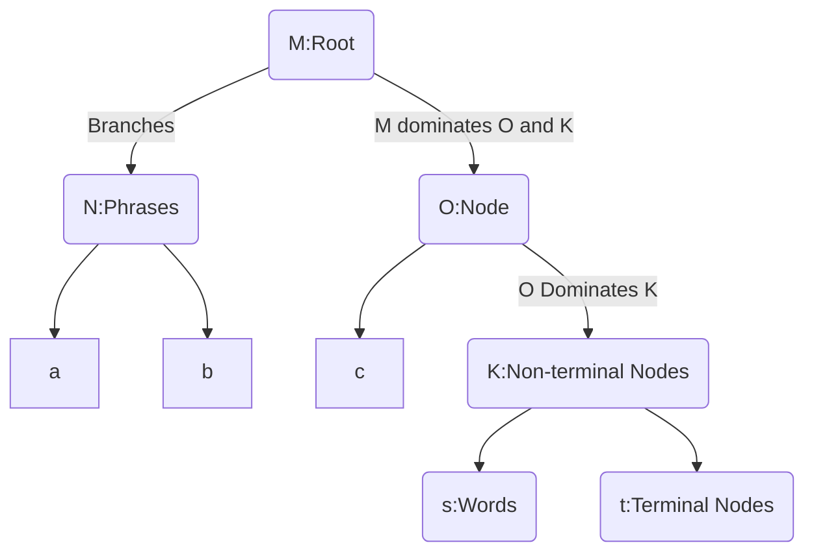
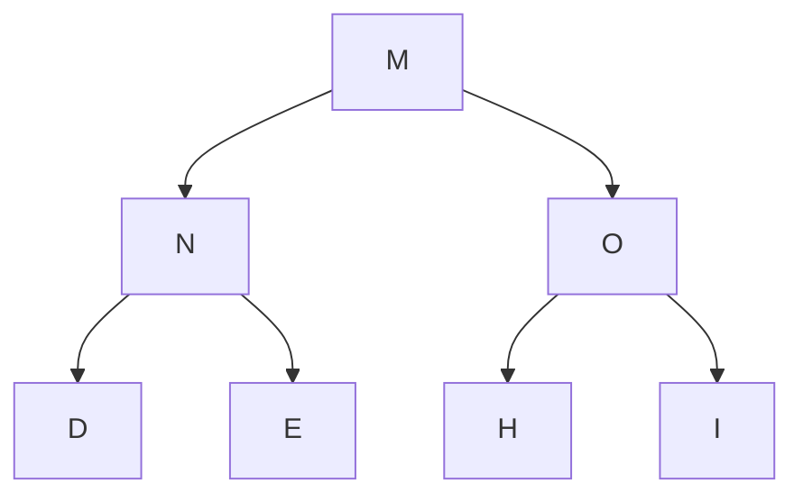
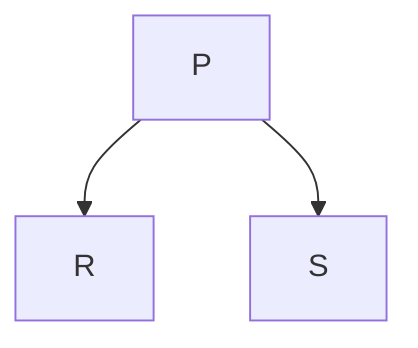
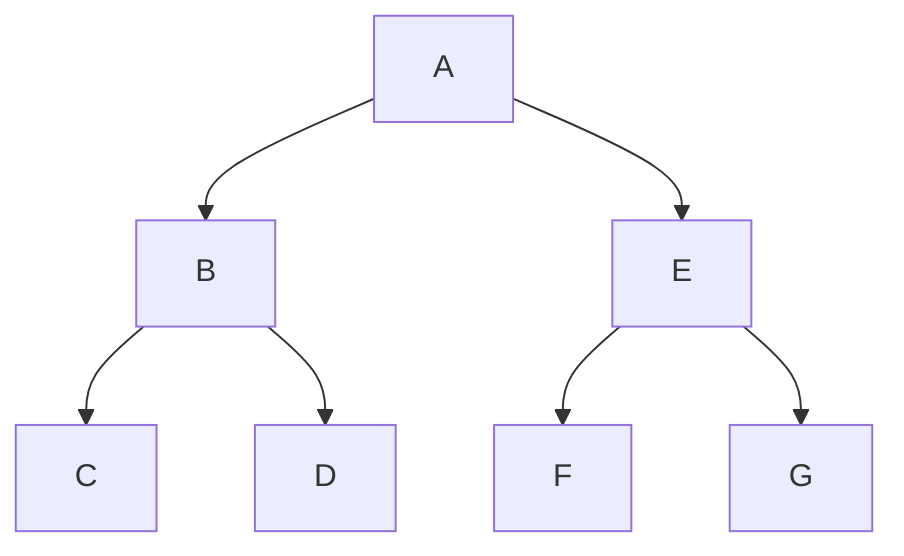
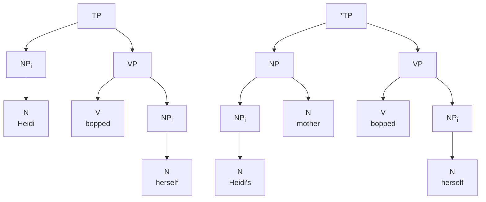

# LING 203 - Syntax

## Overview of the Course & Introduction

- There some sort of representation of grammar in our mind that generated language. We don’t know what that system looks like. Theoretical linguistics deal with that. We look at the output of the system and make guesses about the system that produces it. Those guesses usually end up as theory and they are modified through decades.

> 1950’s “Syntactic Structures” (1957)
> Artificial Intelligence
> Aim at developing a model of the way the language is represented in the mind. This model should be able to generate the sentences that are possible (grammatical) and not generate those that are not possible.

- **Transformational Grammar (TG)** is the idea that the different sentence types are the transformations of each other. Active / passive. Question / declarative.
- **Transformational Generative Grammar**
- **Standard Theory**
- **Extended Standard Theory**
- **Government & Binding (GB) - Principles & Parameters (P&P)**
- **Minimalist Program (MP)**
- **Lexical Functional Grammar (LFG)**
- **Head Driver Phrase Structure Grammar (HPSG)**

## Generative Grammar

- The underlying thesis of *generative grammar* is that sentences are generated by a **subconscious set of procedures** (like computer programs). These procedures are part of our minds (or of our cognitive abilities). The goal of **syntactic theory** is to model these procedures. In other words, we are trying to figure out what we *subconsciously* know about the syntax of our language.

- Science is the method that involves observing some data, making some generalizations about patterns in the data, developing hypotheses that account for these generalizations, and testing the hypotheses against more data. Finally, the hypotheses are revsed to account for any new data and then tested again.

- There are two types of ***data***:

  1. **Corpus / Corpora**: written or spoken
  2. **Native Speaker Judgements**: through ***grammaticality judgement tasks***

- To apply scientific method to syntax, it is important to consider the sources of data. One obvious source is in the collections of either spoken or written texts. Such data are called ***corpora*** (singular: ***corpus***). In the early parts ofthe last century, gathering data and compiling corpus was the primary occupation of linguists, and it is proudly carried on today by many researchers.

- The psychological experiment used to the get the subconscious kind of knowledge is called ***grammaticality judgement task***. The judgement task involves asking a native speaker to read a sentence, and judge whether it is well-formed (grammatical), marginally well-formed, or ill-formed (unacceptable or ungrammatical).

- Which rules, principles, and constraints are found in all languages? Which of these are applied to a specific language? **Universal Grammar** focuses on these.

- **Performance** refers to the kinds of language that are actually produces and heard. **Competence**, by contrast, refers to what we know about our language; it is unimpeded by factors that might muddy the waters of performance.

- Conscious knowledge is **learned**. Subconscious knowledge, like how to speak or the ability to visually identify discrete objects, is **acquired**. This explains whybeing immersed in an environment where you can subconsciously acquire a language is much more effective in learning a language.Some facts about Language seem to be built into our brains, or **innate**.

- **Knowledge of syntax**: unconscious / “tacit”. Linguists try to model this internal grammar.

- Many parts of Language are built in, or ***innate***. Much of Language is an ability hard-wired into our brains by our genes. There are good reasons to believe that a human facility for Language (perhaps in the form of a “Language organ” in the brain) is innate. We call this facility ***Universal Grammar*** (or ***UG***).

  ```
  Premise (i)  : Syntax is a productive, recursive, and infinite system.
  Premise (ii) : Role-governed infinite systems are unlearnable.
  Conclusion   : Therefore syntax is an unlearnable system. Since we have it, it follows
  			   that at least parts of syntax are innate.
  ```

- Productive systems are (possibly) unlearnable, beacuse you never have enough input to be sure you have all the relevant facts. This is called ***the logical problem of language acquisiton***.

- The evidence of ***UG*** doesn’t rely on the logical problem alone, however. There are many other arguments that support the hypothesis that at least a certain amount of language is built in.

  - For instance, most parent could swear that they correcting their children’s speect all the time. But it is mostly focuses on content, rather than the structure. When a parent does try to correct a child’s sentence structure, it is more often than not ignored by the child:

    ```
    Child:	Want other one spoon, Daddy.
    Adult:	You mean, you want the other spoon.
    C:		Yes, I want other one spoon, please, Daddy.
    A:		Can you say "the other spoon"?
    C:		Other ... one ... spoon.
    A:		Say "other".
    C:		Other.
    A:		"Spoon".
    C:		Spoon.
    A:		"Other ... spoon".
    C:		Other ... spoon. Now give me other one spoon?
    ```

  - There are also typological arguments for the existence of an innate language faculty. All the languages of the world share ceratin properties (for example they *all* have subjects and predicates). These properties are called ***universals*** of Language. In addition to sharing many similar characteristics, recent research into Language acquisition has begun to show that there is a certain amount of consistency cross-linguistically in the way children acquire Language. For example, children seem to go through the same stages and make the same kinds of mistakes when acquiring their language, no matter what their cultural background.

  - The fact that an inborn system should allow variation is not a surprise. For example, languages have their various word orders like SVO, VSO, or SOV. These differences in the grammars of languages can be boiled down to the setting of certain innate ***parameters*** (or switches) that select among possible variants.

  - How good syntax theories are can be evaluated using what are called the ***levels of adequacy***. If a theory only accounts for the data in a corpus and nothing more, it is said to be an ***observationally adequate grammar***. But in order to account  what kinds of sentences are ill-formed, a theory can make use of both corpora and native speaker judgements. In this case, it is called ***descriptively adequate grammar***. In order to get one step better, a theory can make use of how children acquire their language. In this case, it is called ***explanatorily adequate grammar***. 
  
    ---
  
    ## Parts of Speech

### Words and Why They Matter to Syntax

- ***Parts of speech*** is also known as ***syntactic category*** or ***word class***. The most common parts of speech are ***nouns, verbs, adjectives, adverbs*** and ***prepositions***. Notice that we can substitute words that are of the same type, but not of different type.

  ```
  a) The man loved the peanut butter cookies.
  b) The puppy loved the peanut butter cookies.
  c) *The green loved the peanut butter cookies.
  ```

### Determining Parts of Speech

- Type of a part of speech is not solely based on its semantic definition. For example, although *sincerity* is semantically an attribute (property that is usually associated with adjectives), yet in the example it is a noun.

  ```
  Sincerity is an important quality.
  ```

- The part of speech of a word is determined by its place in the sentence and by its morphology, *not* by its meaning which is called a word’s ***distribution***. 
  - ***Morphological distribution*** refers to the kinds of affixes and other morphology that appear on a word.
    - ***Derivational morphemes*** are the affixes that make words out of other words. They usually result in a different part of speech from the word they attach to.
    - ***Inflectional morphemes***, on the other hand, instead of making words a particular category, they only attach tocertain categories. They can serve as a test for determining a part of speech category.
  - ***Syntactic distribution*** refers to what other words appear near the word. For example, nouns typically appear after determiners (articles) such as *the*, although they need not do so to be nouns. We can thus take appearance after *the* to be a test for noun-hood.

---

### The Major Parts of Speech: N, V, Adj, and Adv

#### Nouns

**Derivational Suffixes**: In English, nouns often end in derivational endings such as ***-ment, -ness, -ity, -ty, -(t)ion, -ation, -ist, -ant, -ery, -ee, -ship, -aire, -acy, -let, -ling, -hood, -ism, -ing***.

**Inflectional Suffixes**: Nouns in English don’t show much inflection, but hwn pluralized can take suffixes such as: ***-s, -es, -en, -ren, -i, -a***.

**Syntactic Distribution**: Nouns often appear after determines such as ***the, those, these***, and can appear after adjectives. Nouns can also follow prepositions such as ***in, at***. All of these conditions can happen together. Nouns can appear as the subject of the sentence, or as the direct object.

#### Verbs

**Derivational Suffixes**: Verbs often end in derivational endings such as ***-ate*** and ***-ize/-ise***.

**Inflectional Suffixes**: In the past tense, verbs usually take an ***-ed*** or ***-t*** ending. In the present tense, third person singular (***he, she, it***), they usually take the ***-s*** ending. Verbs can also take an *-ing* endingin some aspectual constructions, and most take either an *-en* or an *-ed* suffix whey they are passivized.

**Syntactic Distribution**: Verbs can follow auxiliaries and modals such as ***will, have, having, had, has, am, be, been, being, is, are, were, was, would, can, could, shall, should, may must***, and the special non-finite marker *to*. Verbs follow subjects, and can follow adverbs such as ***often*** and ***frequently***. Verbs can be negated with *not*.

#### Adjectives

**Derivational Suffixes**: Adjectives often end in derivational endings such as ***-ing, -ive, -able, -al, -ate, -ish, -some, -(i)an, -ful, -less***, and ***-ly***.

**Inflectional Suffixes**: Adjectives can be inflected into a comparative form using *-er*. They can also be inflected into their superlative form using ***-est***. Adjectives are typically negated using the prefix ***un-***.

**Syntactic Distribution**: Adjectives can appear between determiners and nouns. They also can follow the auxiliary ***am, is, are, was, were, be, been, being***. Frequently, adjectives can be modified by the adverb *very*.

---

#### Adverbs

**Derivational Suffixes**: Many adverbs end in ***-ly***.

**Inflectional Suffixes**: Adverbs generally don’t take any inflectional suffixes. However, on rare occasions they can be used comparatively and follow the word *more*. Adverbs typically don’t take the prefix ***un-*** unless the adjective they are derived from does first.

**Syntactic Distribution**: The syntactic distribution of adverbs is most easily described by stating where they can’t appear. Adverbs can’t appear between a determiner and a noun or after the verb ***is*** and its variants. They can really appear pretty much anywhere esle in the sentence, although typically they appear at either the beginning or the end of the caluse/sentence. Frequently, like adjectives, they can be modified by the adverb ***very***.

---

### Open vs. Closed; Lexical vs. Functional

Parts of speech that allow new members are said to be ***open class***. Those that don’t are ***closed class***. This is similar to ***lexical/functional*** distinction in which the former provided the “content” of the sentence, whereas the latter provides the “grammatical” information. Functional categories include *determiners*, *prepositions*, *complementizers*, *conjunctions*, *negation* *auxiliaries*, and *modals*.

---

#### Some Functional (Closed) Categories of English

- *Prepositions*: ***to, from, under, over, with, by, at, above, before, after, through, near, on, off, for, in, into, of, during, across, without, since, until***.
- *Determiners*: *articles (**the, a, an**)*, *deictic articles (**this, that, these, those, yon**)*, *quantifiers (**every, some, many, most, few, all, each, any, less, fewer, no**)*, *numerals (**one, two, three, four**)*, *possessive pronouns (**my, your, his, her, its, our, their**)*, *some wh-question words (**which, whose**)*.
- *Conjunctions*: ***and, or, nor, neither … nor, either … or***
- *Complementizers*: ***that, for, if, whether***
- *Tense categories of English*: *auxiliaries (**have, has, had, am, is, are, was, were, do, does, did**)*, *modals (**will, would, shall, should, can, could, may, might, must**)*, *non-finite tense marker (**to**)*.
- *Negation*: ***not***

---

### Subcategories and Features

As you may have noticed, we hinted that each major part of speech may have **subtypes**. For example, there is six different kinds of **determiners** (articles,deictics, quantifiers, numerals, possessive pronouns, wh-pronouns). **Subcategories** can be marked through the use of ***features***. Consider the case of Tense:

```
	Auxiliary	T[-modal, -nonfinite]
	Modal		T[+modal, -nonfinite]
	to			T[+modal, +nonfinite]
```

We might similarly distinguish among tense forms using features like ` [±past] ` etc.

```
	it is		T[-past]
	it was		T[+past]
```

---

#### Subcategories of Nouns

---

## Constituency, Trees & Rules

### Constituency Tests

Senteces are composed of higher-level groupings called *constituents*. Constituents are represented in tree structures and are generated by rules. ***Tests for constituency*** is finding instances where groups of words behave as single unit.

*Replacement Test*: Replacing a group of words with a single word.

> a) ***The man from NY*** flew only ultra-light planes.
> b) ***He*** flew only ultra-light planes.

This test has one important caveat that there are many cases in our rules of optional items. When we replace a string of words with a single word, how do we know that we aren’t just leaving off the optional items? To avoid this problem, we have to keep the meaning as closely related to the original as possible.

*Stand-alone Test*: If the words can stand alone in response to a question, they they probably constitute a constituent.

> a) Paul ***ate at a really fancy restaurant***.
> b) Paul ***ate at*** a really fancy restaurant.

If we ask the question “*What did Paul do yesterday afternoon?*”, we can answer with (a) but not (b).

> a) Ate at a really fancy restaurant.
> b) *Ate at.

*Movement Test*: If you can move a group of words around in a the sentence, they they form a constituent – because you ca nmove them as a unit.

> a) Clefting:	It was [a brand new car] that he bought.
> 				(from ***He bought a brand new car***)
>
> b) Preposing:   [Big bowls of beans] are what I like.
> 				(from *I like big bowls of beans*)
>
> c) Passive:	 [The big boy] was kissed by [the slobbering dog.]
> 				(from *The slobbering dog kissed the big boy*)

*Coordination Test*: Coordinate structures are constituents linked by a conjunction like *and* or *or*. Only constituents of the same synctactic category can be conjoined.

> a) [John] and [the man] went to the store.
> b) *John and very blue went to the store.

### Constituency in Other Languages

#### Head Ordering

The **head** of a phrase is the word that gives its category to the phrase. There are languages where the predominant order has heads on the left, or the right (left-headed vs. right-headed). 

> *Lezgian*	duxturring patariw fena.
> 		   doctors    to      go.<small>PAST</small>
> 		   “She went to doctors.”

As in example, in Lezgian, head P follows the NP rather than preceding it.

> PP ➞ NP P

In English, adjectives appear before the noun they modify, but in French, for example, they typically follow the noun they modify.

> *French*	les	gars	beaux
> 		  the.<small>PL</small> guys    handsome.<small>Pl</small>
> 		  “The handsome guys”
>
> NP ➞ (D) N (AdjP+)

To summarize, phrase structure rules can vary between languages. *Often, this is an effect of headedness*. This is a very strong claim, and there at least two kinds of language that challenge it: (i) languages where sentences seem to be largely composed of single, very heavily inflected words and (ii) languges with apparently free order.

> Nimictomimaka.
> “I’ll give you money.”

Language like this are called *polysynthetic languages*. At first sight, one might think that because of this example the phrase structure rules are not universal, but that would be an oversimplification. Because instead of *syntactic form*, these kind of languages have *word forms*.

Another challenge is the free order languages.

> *Warlpiri*	Ngarrka-ngku	ka	wawirri	panti-rni.
> 			man-ERG		 AUX   kangaroo   spear-NONPAST
> 			“The man is spearing the kangaroo.”
>
> ​			Wawarri ka panti-rni ngarra-ngku.
> ​			Panti-rni ka ngarrka-ngku panti-rni.
>
> *Latin*	   Milites	urbem	delebunt.
> 			Soldiers   city	 destroy.<small>FUT.3PL</small>
>
> ​			Milites delebunt urtem.
> ​			Urben milites delebunt. <small>AND SO ON…</small>

The counter-argument is that the order in these languages aren’t **free**, but the thing that comes first in the sentence most typically the “topic” of that sentence.

In each language that exhibit *free word order*, we find that there is one “neutral” order. Typically this is the order used when a sentence has no special topic or focus and is used “out of the blue”. In Latin, this is SOV.

---

## Structural Relations

### The Parts of a Tree



### Domination

The structural relations are one that shows hiearchical relations. For instance, a node that sits atop another and is connected to it by a branch is said to *dominate* that node.



In this example, *M* dominates all the other nodes. *N* dominates *D* and *E*. *O* dominates *H* and *I*. It can be expressed in this way: **[<sub>M</sub> [<sub>N</sub> D E ] [<sub>O</sub> H I ] ]**

#### Exhaustive Domination

Node A *exhaustively dominates* a set of terminal nodes **[B, C, …, D]**, provided it dominates all the members of the set (so that there is no member of the set that is not dominated by A) and there is no terminal node G dominated by A that is not the member of the set. For instance, **N** exhaustively dominates the set of **{D, E}**. But it **does not** exhaustively dominate the set of **{D, E, H}** or **{D}**.

***Constituent***: A set of terminal nodes exhaustively dominated by a particular node. For instance, each member of **{D, E}** is called a “constituent of N.”

#### Immediate Domination

A node immediately dominates another if there is only one branch between them. In other words, Node A immediately dominates Node B if there is no intervening node G that is dominated by A, but dominates B. For instance, **M** immediately dominates **N** but it ***does not*** immediately dominate **D** or **E**.

***Immediate constituent***: **N** is an *immediate constituent of* **M** because **M** immediately dominates **N**.

Apart from these:

- `M` is *the mother* of `N` (because it immediately dominates N)

- `N` is *the daughter* of `M` (because it is immediately dominated by M)
- `N` is *the sister* of `O` (because they share the same mother)
- `M` is *the root node* (because it dominated everything but dominated by any)
- `D` is a *terminal node* (because it dominates nothing)
- `N` is a *non-terminal node* (because it is a mother)

### Precedence

Syntactic trees don’t only encode the hierarchical organization of sentences, they also encode the linear order of the constituents. `M ➙ A B` does not only say that `M` dominates `A` and `B`, but also says that `A` must precede `B` in linear order. 




*Sister Precedence*: `A` sister-precedes `B` if and only if both are immediately dominated by the same node, and `A` appears to the left of `B`. For instance, `R` sister-precedes `S` in the example.

*Precedence*: `A` precedes `B` if and only if neither `A` dominates `B` nor `B` dominates `A` and `A` (or some node dominating `A`) sister-precedes `B` (or some node dominating `B`).

*No crossing branches constraint*: If one node `X` precedes another node `Y`, then `X` and all nodes dominated by `X` must precede `Y` and all nodes dominated by `Y`.

*Immediate Precedence*: `A` immediately precedes `B` if there is no node `G` that follows `A` but precedes `B`.

### C-Command




*C-Command (informal)*: `A` c-commands its sisters and all the nodes that are dominated by its sisters.

*C-Command (formal)*: `A` c-commands `B` if every node dominating `A` also dominates `B`, and neither `A` nor `B` dominates the other.

For instance; `B` c-commands `E`, `F` and `G`. 
 			 `F` c-commands only `G`.

*Symmetric C-Command*: `A` symmetrically c-commands `B` if `A` c-commands `B` and `B` c-commands `A`.

*Asymmetric C-Command*: `A` asymmetrically c-commands `B` if `A` c-commands `B` but `B` **does not**  c-commands `A`.

For instance; `B` symmetrically c-commands `E`.
			  `B` asymmetrically c-commands `F`.

## Binding Theory

### Introduction

*R-Expression* is a kind of NP that refers (presupposes) to entities in real world. For instance: `Felicia wrote a fine paper on Zopatec` informs the recipient that there is a paper in the real world that is written by `Felicia` and it’s about `Zapotec`. So, `R-Expression` is an Np that gets its meaning by referring to an entitity in the world. *The vast majority* of NPs are R-Expressions.

*Anaphors* are NPs that obligatorily get their meaning from another NP in the sentence. For instance, `Heidi bopped herself on the head with a zucchini` has an R-Expression (`Heidi`) and an anaphor for the R-expression which is `herself`. It obligatorily refers back to `Heidi` and not to any other entity. There are at least two types of anaphors. One type is *reflexive pronouns* like `himself`, `herself` and the other is *reciprocals* like `each other`.

### The Notions Coindex and Antecedent

*Antecedent* is an NP that gives its meaning to another noun ina sentence. In  `Heidi bopped herself on the head with a zucchini`, `Heidi` is the *antecedent* and `herself` is the anaphor (the another noun that NP gives its meaning to). 

*Indices (indexes)*  are the subscript letters that are given to entities based on what they are referring to. For instance:

> [Colin]<sub>i</sub> gave [Andrea]<sub>j</sub> [a basketball]<sub>k</sub>
> [Art]<sub>i</sub> said that [he]<sub>i</sub> played [basketball]<sub>j</sub> in [the dark]<sub>k</sub>
> [Art]<sub>i</sub> said that [he]<sub>j</sub> played [basketball]<sub>k</sub> in [the dark]<sub>l</sub>

If two NPs share the same index, then they are called *coindexed*

### Binding

*Binding* is the relationship between an anaphor and its antecedent. They *bind* when A c-commands B and A and B are coindexed.



*Binding Principle A*: An anaphor must be bound. (It has to be coindexed and c-commanded by an antecedent, and not the other way around.) **This will be revised.**

### Locality Conditions on the Binding of Anaphors

Consider this:

> *Heidi<sub>i</sub> said that herself<sub>i</sub> discoed with Art.
> cf. Heidi<sub>i</sub> said that she<sub>i</sub> discoed with Art.

The anaphor (herself) is bound by an antecedent (Heidi), yet the sentence is ungrammatical. **Locality constraint** is what makes this sentence ungrammatical. It’s the need of the anaphor *to be bound in the same clause*. The syntactic space inwhich an anaphor must find its antecedent is called a *binding domain*. 

*Binding domain*: The clause containing the NP (anaphor, pronoun, or R-expression).

*Binding Principle A*: An anaphor must be bound in its binding domain.

### The Distribution of Pronouns

The pronouns, on the other hand, act differently and follow a different principle than the anaphors. Consider the sentences:

> Heidi<sub>i</sub> bopped her<sub>j</sub> on the head with a zucchini.
> *Heidi<sub>i</sub> bopped her<sub>i</sub> on the head with a zucchini.

In this case, pronoun may not be bound. It’s only grammatical if the pronoun refers someone other than the entity that c-commands it in the same binding domain.

> Heidi<sub>i</sub> said [<sub>CP</sub> that she<sub>i</sub> discoed with Art].
> Heidi<sub>i</sub> said [<sub>CP</sub> that she<sub>j</sub> discoed with Art].

In this situation, a pronoun may be bound by an antecedent, but it doesn’t have to be. It seems that *pronouns only have limitation on where they **cannot** be bound*. This is called *Principle B* and *free* means opposite of *bound*.

*Binding Principle B*: A pronoun must be free in its binding domain.

### The Distribution of R-Expressions

Consider the sentences:

> *Heidi<sub>i</sub> kissed Miriam<sub>i</sub>. 
> *Art<sub>i</sub> kissed Geoff<sub>i</sub>.
> *She<sub>i</sub> kissed Heidi<sub>i</sub>.
> *She<sub>i</sub> said that Heidi<sub>i</sub> was a disco queen.

In none of these sentences can the second NP be bound by a c-commanding word. That’s because R-expressions receive their meaning from outside the sentence (i.e. from the context).

*Binding Principle C*: An R-expression must be free.

---

## X-bar Theory

### Introduction


## Extending X-bar Theory to Functional Categories

## Constraining X-bar: Theta Theory

## Auxiliaries and Functional Categories

## Head-to-Head Movement

## DP Movement

## Raising, Control & Empty Categories

## Polysynthesis, Incorporation, and Non-Configurationality