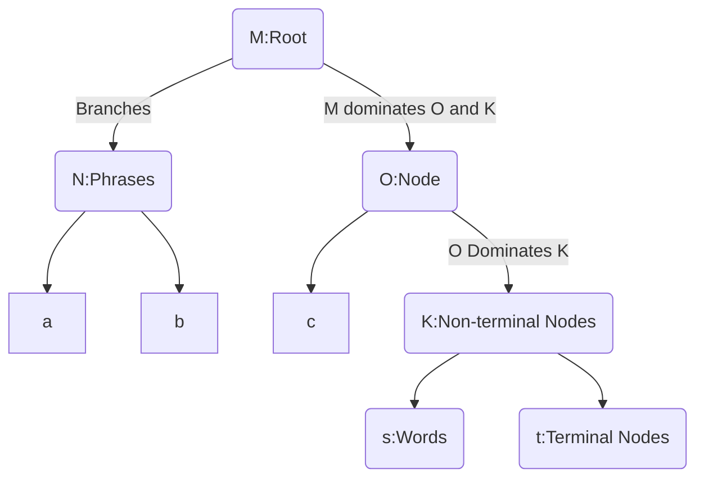
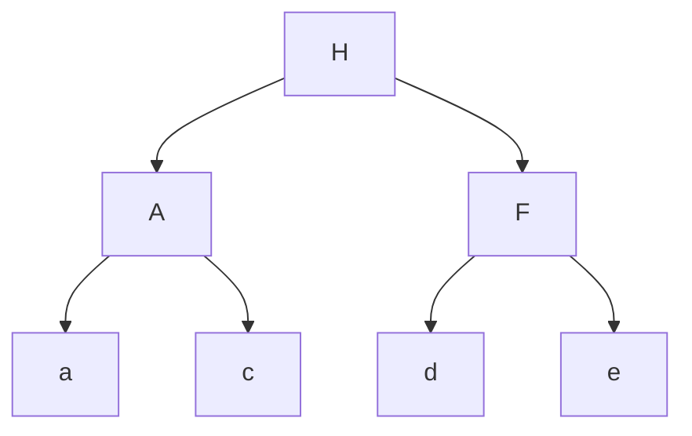
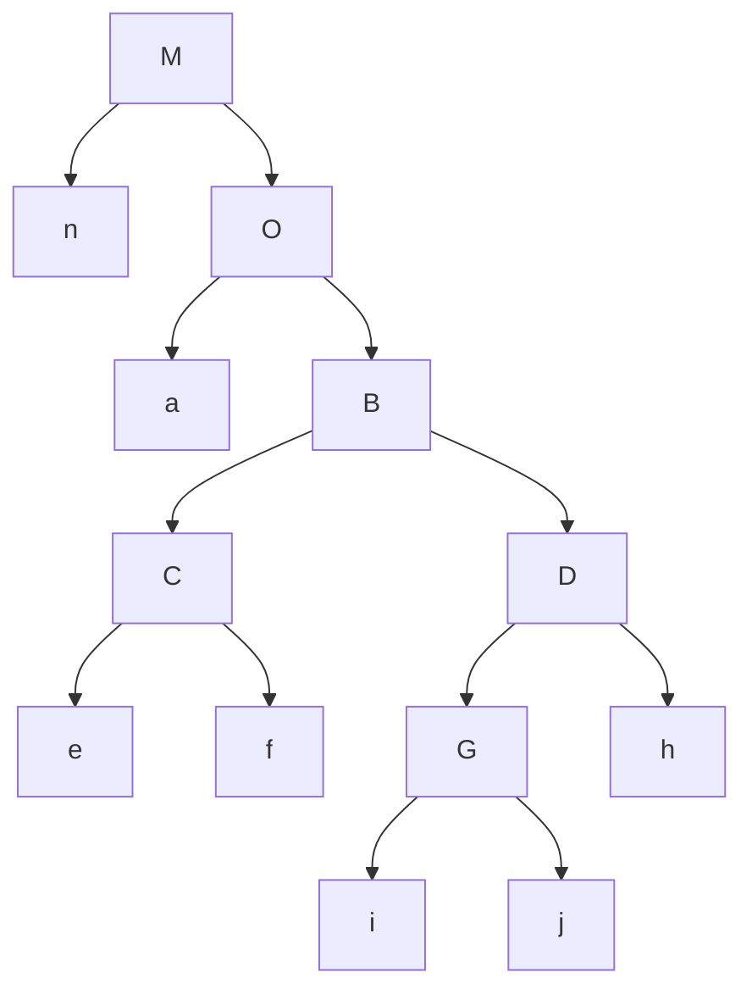
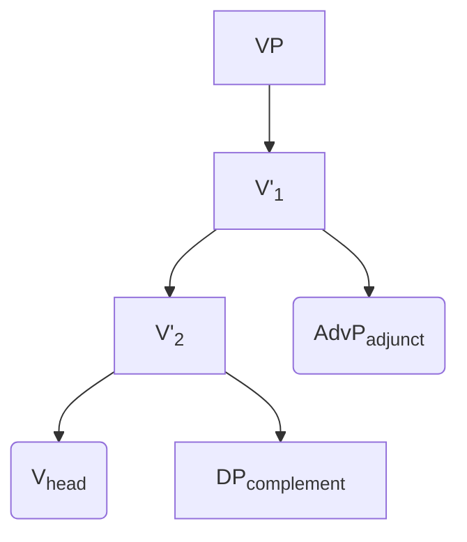
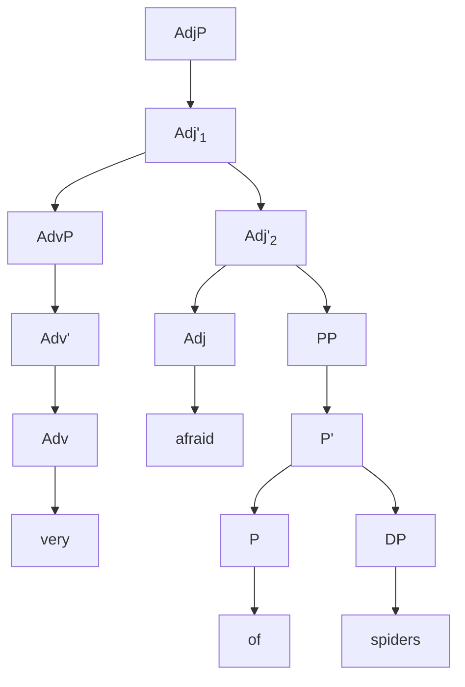
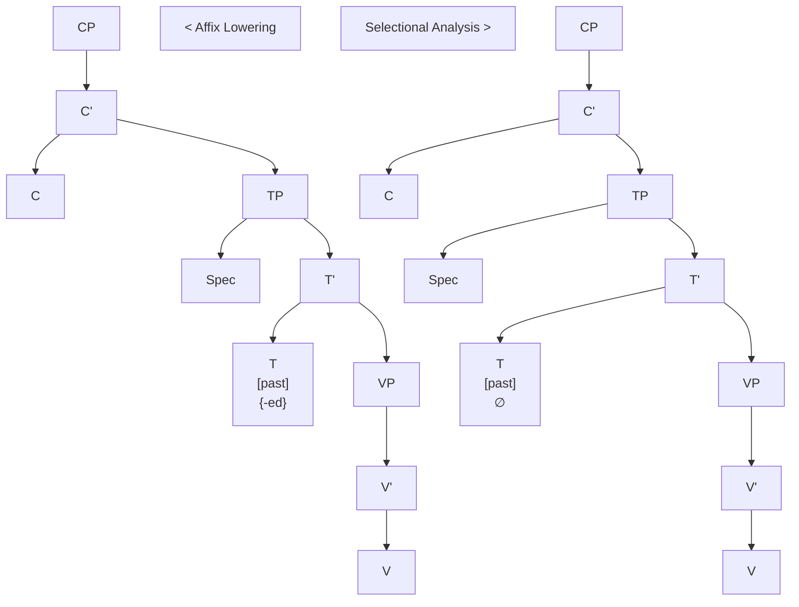

Major part of language is lexicon, and it is learned by exposure. It cannot be *innate*. Different sound inventories make up these lexicons and they are learned via exposure also. Although, languages seem to differ much, their common properties are a lot too. And those similarities are found even in isolated languages.

**UG**

- *Universal properties*: common in all languages (principles, constraints, rules, categories, etc.)
- *Parameters*: a property whose value may depend on the language (word order (head-complement order - SOV,SVO,VSO…), pro-drop parameter)

*Pro-drop Parameter; pro-drop languages*: pronoun can be dropped or not.

(a)	John has come	(a) 	Ali geldi
(b)	He has come	  (b) 	O geldi
(c)	*Has come		(c)	 Geldi

------

- Why *theory* of language?

To *explain*, and come up with *formal* theories that are well-defined and explicit concepts.

<small>FROM CLASS</small>
PSO = syntactic category = grammatical category = word class

- How to determine the category of a word?
  *Traditional way*: *semantic*, not sufficient because of derivation and abstract concepts and actions.
  *Syntactic Criteria*: position in the phrase or sentence
  *Morphological Criteria*: affixes that is attached

<small>FROM CLASS</small>
Determining the category of a word makes use of combination of:
	*Syntactic Criteria* (syntactic distribution)
	*Morphological Criteria* (morphological distribution)

- *Determiners* and *adjectives* typically occur with *nouns*

  - *Adverbs* typically occur ith *verbs* and *adjectives*

    - *Prepositions* typically take objects (complements) and typically those complements are *Noun Phrases*

      > <small>EXAMPLES</small>

  > - [He] talks [in a relaxed manner]
  >   NP         <small>This phrase has an “adverbial function”</small>
  >   		<small>but it is not an “adverb phrase”</small>
  >   - [Gençler] [engellilere] yardım ediyor
  >    		 <small>Subject</small> 	 <small>Object</small>      <small>Subjects and objects are most probably noun</small>
  >     <small> [+plural]</small> <small>Plurality applies to nouns</small> 

*Subcategories of Verbs*
Argument structure of Verbs: How many participants are involved?

> <small>EXAMPLE</small>

> ```
>   > - Mary *kissed* John. (2 arguments: Mary and John)
>   >   - Mary *cried*. (1 argument: Mary)
>   >   - Mary *gave* her heart to John (3 argument: Mary, her heart, and John)
> ```

*Transitivity*

*Intransitive*: no object | no direct object
*Transitive*: one object | one direct object
*Ditranstive*: two objects | one direct, one indirect object

Usually direct objects are those with *accusative case*.

> <small>EXAMPLE</small>
> “Laugh” does not take a complement
> “Find” takes a NP complement
> “Give” can take an NP and a PP or 2 NP complements.
> “Think” takes a PP or a CP
>
> *I found (Because “find” requires a complement)
> *I saw happy (Because “see” doesn’t take Adj complement)	

## Structural Relations



<small>GRAPH IS LABELLED AS `[<sub>M</sub>[<sub>N</sub>a b] [<sub>O</sub>c [<sub>K</sub>s t]]]</small>

### Terminology

*Structural Relations*: **Dominance** (exhaustive and immediate), **precedence**, and **c-command**.

*Exhaustive Dominance*: Node A exhaustively dominates a set of terminal nodes {b, c, …}, if (a) A dominates all the members of the set and (b) there is no terminal node **g** dominated by A that is not a member of the set.



set = {b, c} : A exhaustively dominates the set.
set = {b, c, d} : A *does not* exhaustively dominates the set.
set = {b, c, d} : H does not exhaustively dominates the set.
set = {b, c, d, e}: H exhaustively dominates the set.

*Constituent*: A set of nodes exhaustively dominated by a single node.

*Immediate Domination*: Node A immediately node B if there is no intervening node G that is dominated by A, but not dominates B.

- H immediately dominates A.

*Sister-precedence*: 

*Mother-precedence*:

*C-Command*: There are many syntactic phenomena that make explicit reference to this relation.

- *Informal*: A node c-commands its sisters and all the constituents dominated by its sisters. (= all the daughters and grand-daughters)
- *Formal*: Node A c-commands node B if every node dominating A also dominates B, and neither A nor B dominates the other.



- **D** c-commands **C**, **e**, and **f**.
- **G** c-commands **h**.
- **e** commands **f**.

*Symmetric C-Command*: A symettrically c-commands B, if A c-commands B *and* B c-commands A.
*Asymmetric C-Command*: A asymmetrically c-commands B, if A c-commands B but B does *not* c-command A.

- **a** symmetically c-commands **B**.
- **a** asymmetrically c-commands **C**.

---

Binding Theory

- Dependency relations between noun phrases.
- Distribution of different types of noun phrases.

---

> Different types of noun phrases

1. **R-Expressions**: (referential expresstions) *The **rector** did something.*  “the rector” is referentially independent.

---



“afraid of spiders” [<sub>AdjP</sub>[<sub>AdvP</sub>very] [afraid [<sub>PP</sub>of spiders]]]



---

| ***Affix Lowering***                    | ***Selectional Analysis***                                   |
| --------------------------------------- | ------------------------------------------------------------ |
| The tense morpheme is generated under T | The verb comes from the lexicon with its inflectional morphology |
|                                         |                                                              |



