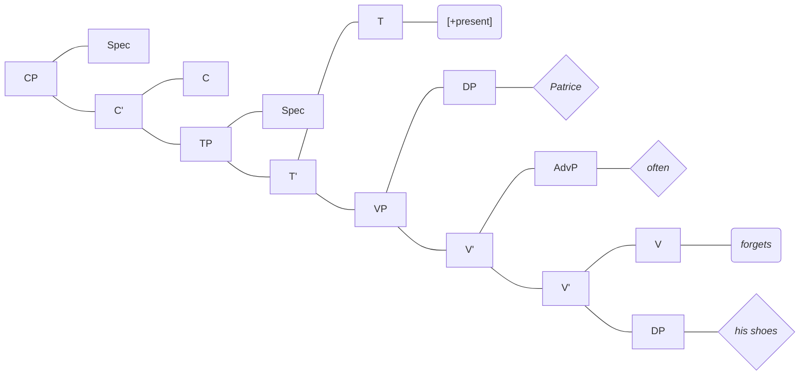
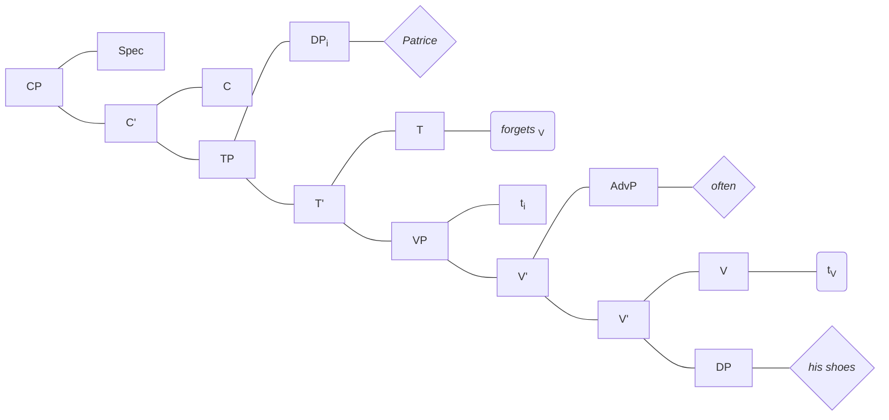

# LING 203 Final

> Patrice	oublie		  souvent	ses	chaussures.
> Patrice	forget3rd*S*	often		 his	 shoes.

##### D-Structure

Case assigners: 

1. V assignsaccusative case to its complement

2. Nominative case is assigned at the Spec TP
3. Prepositions can also assign case

> The books were returned to the library by the students
> 				PASSIVE					ADJUNCT		  ADJUNCT

