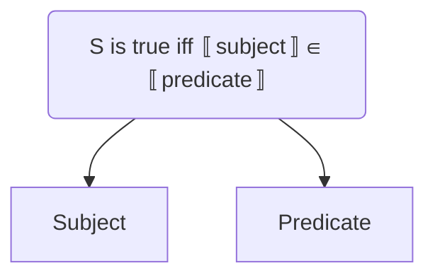
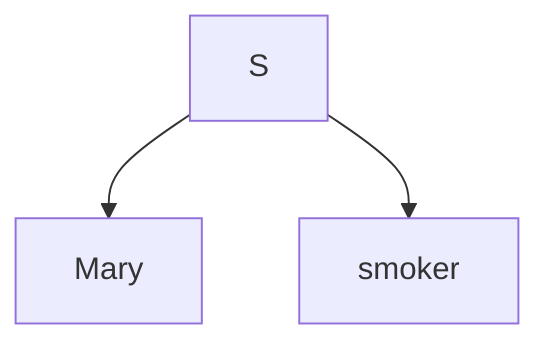
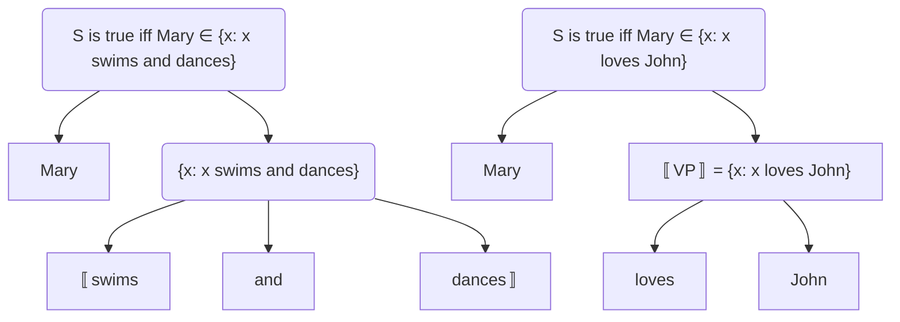
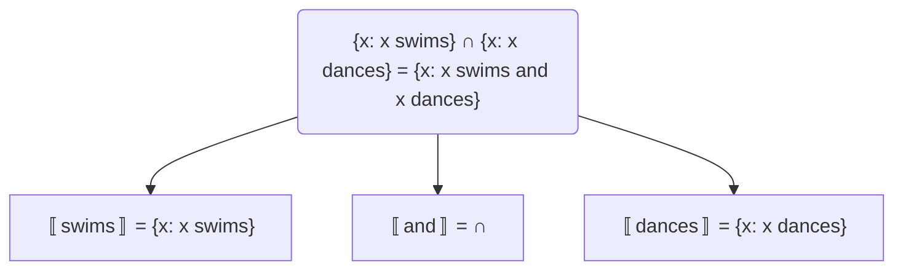
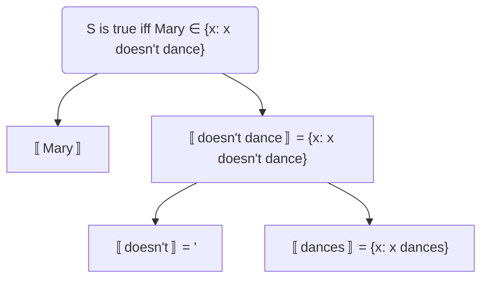

# LING 305 - Semantics - Midterm I

## Introductory Remarks: Meaning, Truth, and Truth Conditions

Instead of asking what “meaning” is, we should think about how we can characterize the ability of speakers’ understanding of the meaning of a word, a phrase, a sentence or an utterance.

### A fundamental relation between Syntax and Semantics

> 1a. Cordelia loved Xander
> 1b. Xander loved Cordelia

Output of the syntactic derivation is the input of the semantic computaional system. Thanks to our syntactic competence, we can understand that sentence *1a* conveys a different meaning than sentence *1b*.

> 2a. I saw a man with the binocular.
> 2b. I was a man that was holding a binocular.
> 2c. With my binocular, I saw a man.

Yet our syntactic competence dictates that *2a* can either convey the same meaning as *2b* or *3c*.  This is called **structural ambiguity**.

Theory of semantics is not a theory of meaning itself but a theory of what allows us to get 

- from structures generated by the syntax 
- to the meanings we attribute to them.

So, it is a theory of how the output of syntactic derivation translates to the input of semantic computational system.

### Hallmarks of “understaning the meaning of α”

> 3. Elena is wearing a green sweater.

We all know this sentence is true or false depending on the actual state of affairs, only because we know what it means. If we did not know what the sentence meant, we wouldn’t be able to judge whether it is true or false.

> 4. Elena was wearing a green sweater on January 10, 2005 at about 10:10 a.m.

But it doesn’t mean vice versa. It is still possible to know what a sentence means without knowing its truth value.

#### Truth-conditions

Understanding the “literal” meaning of a **declarative** sentence amounts to understanding its **truth-conditions**: when we understand what a declarative sentence conveys, we are capable to judge how a state of affairs should look like for the sentence to be true or false (without being trained to judge the truth of each and every sentence).

> 5. *Mary smokes*	is true iff	Mary smokes
>    	<small>Object Language</small>					  <small>Meta-language</small>

**Object Language**: The language that is the subject of our inquiry.
**Meta-language**: The language we use to formulate our theory

#### Infinite Creativity

> 6a. Mary snores.
> 6b. John knows that Mary snores.
> 6c. Bill said that John knows that Mary snores.

We can understand sentences we have never heard, essentially with the same ease with the sentences we have heard many times. Our language faculty grants us the ability to produce and understand —in principle— infinite set of sentences.

So, the meaning of complex linguistic expressions is fully determined by:

- The meaning of their immediate parts
- The way they are combined in the syntax

This is called **the compositionality of meaning** and the binding principle that we have to account for is **the principle of compositionality**.

### The Empirical Domain

Intuitions of native speakers allows us to test if a sentence is true or not by constructing hypothetical scenarios (state of affairs).

> 7a. Mary and Bill arrived yesterday.
> 7b. Mary arrived yesterday.
> 7c. Mary or Bill arrived yesterday.
> 7d. Only Mary arrived yesterday.
>
> 8a. Johan passed the test.
> 8b. Johan failed the test.
> 8c. Johan didn’t pass the test.

**Equivalence**: For any given sentences *A* and *B*, *A* is equivalent to *B* iff *B* and *A* are true in the same state of affairs (they have the same truth-conditions).

## Compositionality and Semantic Relations

### Compositionality

> 1. ```mermaid
>   graph TD;0(" ")-->Mary;0-->smokes;
>   ```
> ```
> 
> 
> ```

This is the input to the semantic computational system. Speakers knows that *Mary smokes* is true iff Mary smokes. This knowledge is the result of the knowledge of the meaning of *Mary* and *smokes* and the way these two meanings are combined with each other.

So, when we understand a sentence, we make use of:

- the meaning of *lexical items* (memorized)
- the combinatorial procedures (semantic rules)

**Compositionality**: The meaning of an expression in natural language depends on the meaning of its parts (the syntactic constituents in it) and the way they are combined.

### Syntax and Meaning

> 2. ```mermaid
>   graph TD;
>   S("S is true iff Mary smokes")-->Mary;
>   S-->smokes;
>   ```
> ```
> 
> ```

Knowing what *Mary* means amounts to know that this name *refers* to the individual *Mary*, whoever that individual turns out to be. Therefore the meaning of *Mary* is its *reference condition* while the extension of Mary is the individual the name refers to. So, *Mary* is a reference, whereas Mary is Mary in her flesh and bones.

**Notation**: for any simple or complex linguistic expression A
	〚A〛 = the denotation of A

So, 〚Mary〛 = the denotation of the name Mary
So, 〚Mary〛 = unique individual named *Mary*

> 3. *Mary smokes* iff Mary smokes

So, in sentence *3*: 〚Mary〛 = Mary and 〚smokes〛 is the class of individuals that smoke.

### Basics of Set Theory

**Set**: A collection of objects.
**Member** (Element): The objects in a set. They can be concrete or abstract entities such as *cars*, *numbers*, *equations*, *stars*, or some other *sets*. 

> 4. x ∈ A
>    x is an element of A

A set can be specified in one of the three ways:

1. Listing its elements *i.e.* {a, b, c}
2. Describing a property all the members share *i.e.* {x: x smokes}
3. By a recursive rule

There are also some special sets:

- Empty set: ∅
- Singleton: {a}
- Power set: a set whose elements are all the possible subsets of a given set A.

The relation between sets are as follows:

- ∈ is a relation between a set and its members.
- ⊆, ⊂, and = are relations between sets.
  - Subset (⊆): If every element of A is also element of B, then A ⊆ B.
  - Proper Subset (⊂): If A ⊆ B and B has at least one more element that is not in A, then A ⊂ B.
  - If  A ⊆ B and  B ⊆ A, then A  = B

The number of elements in a set is called its *cardinality*. 

The operations over sets are as follows:

- Intersection (∩): the set that contains all the members that are in both A and B.
- Union (∪): the set that contains all the the members of A and all the members of B.

## Simple Predication and Semantic Relations

### Predicates and Sets

> 1a. Mary smokes.
> 1b. Mary loves John.
> 1c. Mary introduced Susan to Bill.

Predicate is a grammatical unit that combines with the subject to form a sentence. Our working hypothesis is:

- **Proper Names** denote **individuals**.
- **Predicates** denote **sets of individuals**.

Therefore:

- In sentence *1a*, *smokes* denotes the set of individuals that smoke {x: x smokes}
- In sentence *1b*, *loves John* is {x: x loves John}
- In sentence *1c*, *introduced Susan to Bill* denotes {x: x introduced Susan to Bill}

So, to put it formally *Mary smokes* is true iff Mary ∈ {x: x smokes}

If we are to come up with a rule for predication, that would be:

> A sentence of the object language whose subject denotes an individual is true iff the **denotation of its subject** is an element of the set **denoted by its predicate**.



### Adjectival, Nominal, Prepositional Predicates

> 2a. Mary is blond.
> 2b. Mary is a smoker.
> 2c. Mary is outside.

Making use of the **predication rule**, these sentences can be denoted as follows:

- In sentence *2a*, *is blond* denotes the set of individuals that are blond {x: x is blond}
- In sentence *2b*, *is a smoker* is {x: x is a smoker}
- In sentence *2c*, *is outside* denotes {x: x is outside}

Comparing the denotation of *smokes* with the denotation of *is a smoker* we observe that *is* and *a/an* add nothing to the semantics of the sentence: they are **semantically vacuous**. So, the input of to the semantic component of the language faculty could as well be:



### Entailment

The assumptions provided along with the set theory, now, allows us to account for a very large number of natural intuitions of **entailment** (and of equivalence and contradiction).

> 3a. Elena is a professor.
> 3b. Eleba is a teacher. (*3a* entails *3b*)
>
> 3c. John jogs.
> 3d. John exercises. (*3c* entails *3d*)
>
> 3e. This is a Honda Civic.
> 3f. This is a car.    (*3e* entails *3f*)

**Entailment**: A sentence S1 **entails** a sentence S2 iff S2 is true whenever S1 is true. (not vice-versa!)

## Complex Predicates: Negation and Coordination

### Internally Complex Predicates

What if the main predicate of a sentence itself is syntactically complex? For example, it can be a combination of two or more constituents. These cases of complexity can be divided into two groups:

1. Predicate is formed by negating a predicate or combining two predicates.

   > 1a. Mary swims and/or dances.
   > 1b. Mary doesn’t dance.

2. The main verb/noun/preposition is “transitive” or “ditransitive.”

   > 1c. Mary loves John.

Before trying to adress these cases, we should firstly apply our derivation using our current predication rule which is “A sentence of the object language whose subject denotes an individual is true iff the **denotation of its subject** is an element of the set **denoted by its predicate**.”



#### Predicate and Coordination

To make things more definite, we should also address the issue of denotation of **coordinators** such as *and* and *or*. 

The set theory provides the explanations of *and* and *or* as 〚and〛 = ∩ and 〚or〛 = ∪.



The correct denotation of the complex predicate *swims and dances* can be obtained by assuming that *and* denotes the set operation of **intersection**. But in order to do so, first, we need to come up with a rule that explains this approach. Our current **predication rule** is unable to explain it, therefore the following semantic rule needs to be added to our list of rules:

> If a predicate A is the syntactic result of coordinating two other predicates B, D with the ‘coordinator’ C (*and, or,* or comma), then 〚A〛 = 〚B〛〚C〛〚D〛.

#### Negation

In order to come up with a rule for negation, we again make use of predication rule:



So, on top of the predication rule, we would again are in need of another rule called **predicate negation rule**:

> If a predicate A is the syntactic result of negating another predicate C, with the negation of B (*don’t, doesn’t*), then 〚A〛=〚B〛〚C〛.

In this case, the negation *doesn’t* can be the set operation **complement**.

#### Our Current System in Overview

| Type of Expression                    | Type of Denotation                            | Example       |
| ------------------------------------- | --------------------------------------------- | ------------- |
| Proper Names                          | Individuals                                   | Mary, John    |
| Intransitive Verbs                    | Sets of individuals                           | {x: x smokes} |
| Predication                           | Binary operation over a set and an individual | ∈             |
| Predicate conjunction and disjunction | Binary operations over sets of individuals    | ∩, ∪          |
| Predicate Negation                    | Unary operation over sets of individual       | ‘             |

## Modifiers and Context

### Modification

Prepositions and adjectives (with their respective phrases) also have a **modificational** use, that is, they can appear with a noun while modifying it and thus generating a new complex predicate.

> 1a. Mary is a blond girl.
> 1b. Mary is a girl from Milan.

Our current system is not able to interpret the meaning of these sentences because both *blond* and *girl* are sets of their own. This causes a **semantic type mismatch** that needs to be resolved.

#### Modification as intersection

It is evident that 〚blond girl〛 in sentence *1a* should denote the set {x: x is a blond girl}. Since we cannot derive this denotation using predicate rule, we can try to resolve it using conjunction.

Since 〚girl〛 is {x: x is a girl} and 〚blond〛 is {x: x is blond}  in its predicative use, then 〚blond girl〛 must be 〚blond〛 ∩ 〚girl〛 whose denotation can be derived as {x: x is blond} ∩ {x: x is a girl}. And indeed we also notice that *Mary is blond girl* is equivalent to *Mary is blond and a girl*. 

So, the **predicate modification rule** is:

> If the daughters C and D of constituent B (which is the predicate of A) denote sets of individuals, then 〚A〛 = 〚C〛∩〚D〛

Notice that in this rule, both the input and the output is a predicate, therefore rendering the rule as **recursive**. This is in line with the fact that there is no linit to how many modifiers (as adjuncts) one can add up.

> Mary is a beautiful smart blond girl from Milan fond of Joe.

#### The Problem of ‘non-intersective’ adjectives

> 1a. Sammy is a black cat.
> 1b. Sam is a young president.

Altough sentence *1a* entails both *Sammy is a black* and *Sammy is a cat*, the sentence *1b* does not entail *Sam is young* because in the context, Sam is young only as a president. A young president can be 50 years old which is not really young.

##### Context Dependent Adjectives

Focusing on the example of sentences *A*, the predicative use of *young* seems to have an interesting property, that is, it seems to mean different things in different conversational contexts. So, 〚young〛 is {x: x’s age is below the average age of the elements of the set C} where C is a set of contextually relevant individuals.

In modificational position, the mention of the modified noun can provide a value for C, and it does in most of the cases. 

〚young president〛 = 〚young〛 ∩ 〚president〛 = {x: x’s age is below the average age of the elements of the set C} ∩ {x: x is a president} = {x: x is a president and x’s age is below the average age of the elements of the set C} and C = 〚president〛
	then {x: x is a president and x’s age is below the average age of presidents}

## Quantifiers

Quantifiers typically occur in the position of NPs, therefore we can assume, for now, that they are NPs themselves.  The following examples all have quantifiers as subjects:

> 1a. **Everbody** dreams.
> 1b. **Nobody** smokes.
> 1c. **Somebody** sings.
> 1d. **Every girl** dances.
> 1e. **No student** sleeps.
> 1f. **Some dog** snores.

Expressions like *every*, *no*, *some* and so on are **quantificational determiners** (QD) and every phrase that is QD + NP are **quantifiers**. 

### The Type of the Denotation of Quantifiers

Despite the syntactic similarity, while proper names denote individuals, quantifiers don’t. It can be understood from the following examples.

> 2a. Mary smokes and drinks ↔ Mary smokes and Mary drinks
> 2b. Somebody smokes and drinks ⇹ Somebody smokes and somebody drinks
>
> 3a. Mary smokes or drinks ↔ Mary smokes or Mary drinks
> 3b. Everybody smokes or drinks ⇹ Everbody smokes or everybody drinks

So, the sentence *Mary smokes and drinks* is true
	iff Mary ∈ {x: x smokes and drinks}
	iff Mary ∈ {x: x smokes} ⋂ {x: x drinks}
	iff Mary smokes and Mary drinks are true
	iff both *Mary smokes* and *Mary drinks* are true

If quantifiers like *somebody* and *everybody* denoted individuals like *Mary* do, same patterns would have applied to them too. But, in this case, we see from the examples that, same patterns do not apply to them.

**Conclusion**: Quantifiers DO NOT refer to/denote individuals.

## Cheat Sheet

**Set Theory**

- **Relations**: subsets (⊆), proper subsets (⊂), element of (∈), power sets (p(A))

  ```
  let A = {1,2}
  let B = {2}
  ---------------
  B ⊆ A (because every elements of B is also a element of A)
  1 ∈ A
  {1} ⊆ A
  ∅ ⊆ A
  p(A) = {{1}, {2}, {1,2}, ∅}
  
  ```

- **Operations**: union (⋃), intersection (⋂), difference (–), complement of (‘)

  ```
  let A = {1,2}
  let B = {2}
  ----------------
  A ⋃ B = {1, 2}
  A ⋂ B = {2}
  A - B = {1}
  A' = U - A
  ```

- **Definitions**:

  ```
  A' = def{x: x ∉ A}
  A - B = def{x: x ∈ A and x ∉ B}
  A ⋃ B = def{x: x ∈ A or x ∈ B}
  A ⋂ B = def{x: x ∈ A and x ∈ B}
  ```

  

**Semantics**

- **Intuitions**:

- **Truth Judgements**: Knowing the meaning of a sentece is to know its truth-conditions. For instance, we may not know whether it is true or not the sentence *there is a bag of potatoes in my pantry* , but we surely know in which scenario this sentence would be true.

  - **Schema of Truth Conditions**: The sentence *moon is red* is true if and only if moon is red.

- **Semantic Relations**:

  - **Entailment & Implicature**

    > 1a. Mary used to swim a mile daily.
    > 1b. Mary no longer swims a mile daily.
    >
    > - Sentence *1a* implies sentence *1b* but does not entail it. Maybe *nowadays, Mary swims **two miles** daily*. In this case, Mary still swims a mile daily along with an extra one mile.
    >
    > 2a. After Hans painted the walls, Pete installed the cabinets.
    > 2b. Hans painted the walls. 
    >
    > - Sentence *2a* both implies and entails sentence *2b*. If we say, *after Hans painted the walls, Pete installed the cabinets* and *Hans did not paint the walls*, they would be contradictory.
    >
    > 

  - **Presupposition**:

    > 1a. The present queen of France lives in Ithaca.
    > 1b. The present queen of France doesn't live in Ithaca.
    > 1c. Does the present queen of France live in Ithaca?
    > 1d. If the present queen of France lives is Ithaca, she has probably met Nelly.
    > 1e. There is a unique present queen of France.
    >
    > - A presupposes B iff not only A but also other members of the A family imply (and assume as background) B.

  - **Equivalence**: When two sentences are true under exactly the same conditions, they are called equivalent.

  - **Contradiction**: 

    - A in contradictory if
      - A can never be true
      - there is no possible situation describable by A
    - A and B are contradictory if
      - A and B cannot both be true; whenever A is true, B is false, and whenever B is true, A is false
      - A situation describable by A cannot also be a situation describable by B

- **Infinite Creativity**: We can understand sentences we have never heard, essentially with the same ease with the sentences we have heard many times. Our language faculty grants us the ability to produce and understand —in principle— infinite set of sentences.

- **Ambiguity**:

  - **Lexical Ambiguity**: *You should’ve seen the bull we got from the pope* is ambiguous because *bull* means at least three different things.
  - **Syntactic Ambiguity**: *Competent women and men hold all the good jobs in the firm* is ambiguous because it’s not clear that *competent* modifies both *women and men* or just *women*.
  - **Both syntactic and lexical ambiguity**: *Mary claims that John saw her duck* is ambiguous because *duck* can be an animal or a verb. Meaning depends on both its lexical meaning and syntactic role.
  - **Scope Ambiguity**: *Someone loves everyone* is ambiguous because I don’t know.

- **Entailment**: Sentence S1 entails sentence S2 if and only if, whenever S1 is true in a situation, S2 is also true in that situation.

  - Keep in mind that a sentence that is always true or never true, respectively entailed by every sentence and entails every sentence.

    ```
    a Brown doors are doors. (Always true)
    b Red doors are not doors. (Always false)
    c Mary is tall
    In this case "Mary is tall" entails "Brown doors are doors" and "Red doors are not doors" entails "Mary is tall."
    ```

- **Implicature Notions and Diagonistics**:

- **The Role of Syntax**:

**Truth Conditional Approach to Meaning**:

- **Merits of Formal Approach**:
- **The role of truth in semantic theorizing**:
- **Formal Definitions of Semantic Relations**:

**The Principle of Compositionality**: The meaning of a sentence is determined by the meanings of its parts and by the ways in which those parts are assembled.

- **Applications**:
- **Rules**:
- **Recursion**:

**Predication**:

- **As set membership**:
- **Predicate coordination and negation as set operations**:
  - **Deriving intuitions of entailment, equivalence, contradiction**:

**Modification**:

- **Predicative and modificational uses of adjectives**:

- **Semantic type of adjective denotations and compositionality**:

- **Intersective and non-intersective adjectives**:

  > 1a. Obama is a black president
  > 1b. Obama is a young president
  >
  > - (1a) Obama is in both the sets denoted by *black* and *president*
  > - (1b) Obama is in the set denoted by *president* but not in the set denoted by *young*

- **Scalar adjectives as counterexample to modification as intersection**:

  > Modification rule suggests that 〚A〛=〚B〛⋂〚D〛 but in *Obama is a young president*, it is not the case that Obama ∈ 〚young〛⋂〚president〛

- **Gradable adjectives and context dependency**:

  > Since young is a gradable adjective, it is context dependent; meaning that whenever it is used it is attached to the most salient context. 
  > 〚young〛 = { x: x’s age is below the average age of the elements of the set C } where C is a set of contextually relevant individuals.

- **Deriving intuitions of entailment between sentences involving modified and non-modified predicates**

  > *John is a tall man* entails *John is a man*
  > 	iff *John is a man* is true whenever *John is a tall man* is true
  > *John is a man* is true iff John is a man
  > 	iff 〚John〛∈〚man〛			(by predication rule)
  > *John is a tall man* is true iff John is a tall man
  > 	iff 〚John〛∈〚tall man〛			(by predication rule)
  > 	iff 〚John〛∈〚tall〛⋂〚man〛 	(by predicate modification rule)
  > if 〚man〛 = {x: x is man} and 〚tall〛 = {x: x is tall}
  > 	then 〚tall〛⋂〚man〛⊆〚man〛	(by B ∩ A ⊆ A )
  > 	then the denotation of *tall man* is a subset of the denotation of *man* 
  > if the John ∈ 〚tall man〛
  > 	then John ∈ 〚man〛					(an element in a subset of set is also an element of the set)
  > Since John ∈ 〚tall man〛 is *John is a tall man* and John ∈ 〚man〛 is *John is a man*
  > 	*John is tall man* entails *John is man*

**Proving entailments**:

```
Schema of the proof
S1 entails S2 amounts to "If S1 is true then S2 must be true"
1 Start assuming that S1 is true
2 Characterize what this means in terms of the current theory
3 Show what follows from these TCs (based on set theory) focusing on the implications that are relevant to show that S2 is true, its TCs.
4 Conclude that S2 is true
```

> *John swims and runs* entails *John swims*
> 	iff *John swims* is true whenever *John swims and runs* is true
>
> *John swims* is true iff 〚John〛∈〚swims〛
> 	iff John ∈ {x: x swims}
>
> *John swims and runs* is true iff 〚John〛∈〚swims and runs〛
> 	iff 〚John〛∈〚swims〛〚and〛〚runs〛		
> 	iff 〚John〛∈〚swims〛⋂〚runs〛				(by predicate coordination rule)
> 	iff John ∈ {x: x swims} ⋂ {x: x runs}
>
> {x: swims} ⋂ {x: x runs} ⊆ {x: x swims}       ( by  (A ⋂ B) ⊆ A  bacuse A ⋂ B = def{x: x ∈ A and x ∈ B})
> 	Since the predicate of the sentence *John swims* is always true whenever the predicate of the sentence *John swims and runs* is true, and their subjects is the same individual, the sentence *John swims and runs* entails *John swims*.

**Proving lack of entailments**:

> *John swims or runs* entails *John swims*
> 	iff *John swims* is true whenever *John swims or runs* is true
>
> *John swims* is true iff John swims
> 	iff 〚John〛∈〚swims〛
> 	iff John ∈ {x: x swims}
>
> *John swims or runs* is true iff John swims or runs
> 	iff 〚John〛∈〚swims〛〚or〛〚runs〛
> 	iff 〚John〛∈〚swims〛⋃〚runs〛									(by predicate coordination rule)
> 	iff John ∈ {x: x swims} ⋃ {x: x runs}
>
> Since {x: x runs} ⊆ {x: x swims} ⋃ {x: x runs}				(by B ⊆ A ⋃ B )
> 	and {x: x doesn’t swim} ⋂ {x: x runs} = {x: x runs} – {x: x swims} 	(by A’ ⋂ B = B - A)
> 	and {x: x runs} – {x: x swims} ⊆ {x: x swims} ⋃ {x: x runs}
> 	there are cases in which an individual may not be swimming but running that still accounts for the individual being swimming **or** running
> 	therefore *John swims or runs* **does not entail** *John swims*

**Deriving TCs**:

> *Mary is a blond tall girl* is true iff Mary is blond tall girl
>
> ```mermaid
> graph TD;
> S-->Mary;
> S-->NP["NP"];
> NP-->blond;
> NP-->NP2["NP"];
> NP2-->tall;
> NP2-->girl;
> 
> ```
>
> Starting from *tall girl*, by predicate modification rule we get *tall* and *girl* derived as {x: x is tall} ⋂ {x: x is a girl}
> Then if we Let A = {x: x is tall} ⋂ {x: x is a girl}, then we again make use of predicate modification rule by  modifying the set A with *blond*, getting Let B = {x: x is blond} ⋂ A 
> Then using the predication rule, we get Mary ∈ B

