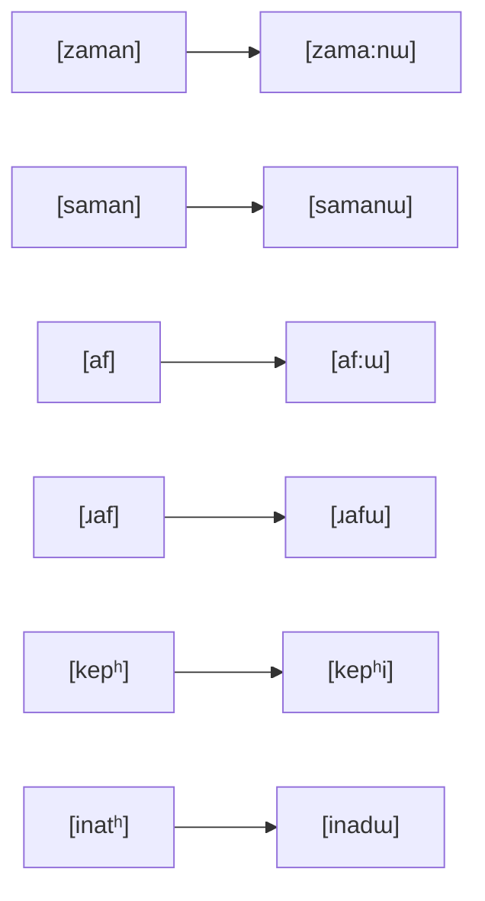
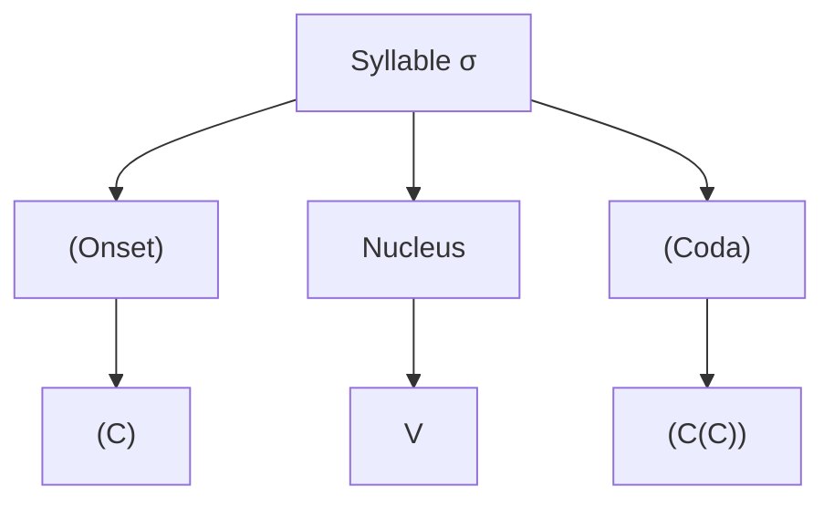
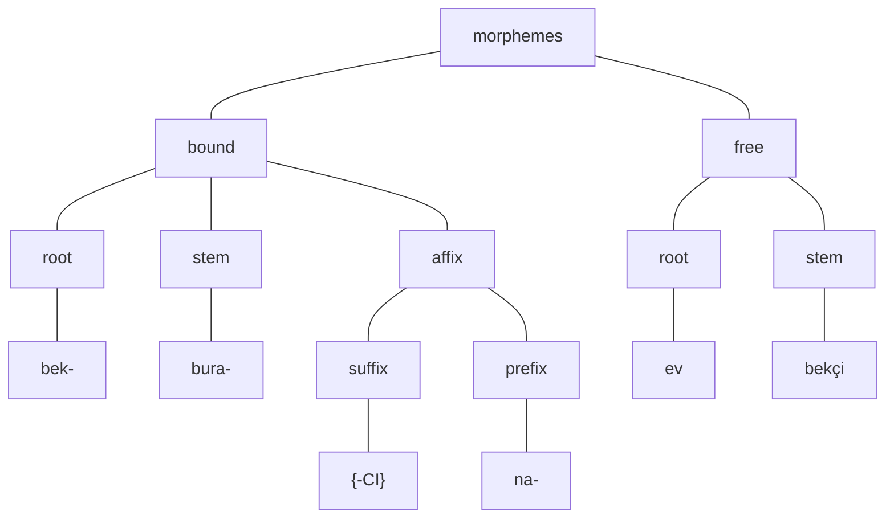

#### Phonetic Chart of Turkish Consonant

|                | Bilabial   | Labiodental | Dental     | Alveolar | Alveo-palatal | Palatal  | Velar               | Glottal |
| -------------- | ---------- | ----------- | ---------- | -------- | ------------- | -------- | ------------------- | ------- |
| Oral Stops     | p pʰ **b** |             | t tʰ **d** |          |               | cʰ **ɟ** | k kʰ  k̟ k̟ʰ  **g̟ g** | ʔ       |
| Affricates     |            |             |            |          | tʃ tʃʰ **dʒ** |          |                     |         |
| Fricatives     | ɸ **β**    | f **v**     | s **z**    | **ɾ̥**    | ʃ **ʒ**       | ç        | x                   | h       |
| Nasals         | **m**      | **ɱ**       | **n**      |          |               |          | **ŋ̟ ŋ**             |         |
| Tap            |            |             |            | **ɾ**    |               |          |                     |         |
| Approximants   |            |             |            | **ɹ**    |               |          |                     |         |
| Lateral Apprx. |            |             |            | **l**    |               | **ʎ**    | **ɫ**               |         |
| Glides (apprx) |            | **ʋ**       |            |          |               | **j**    |                     |         |

#### Phonetic Short Vowels of Turkish

|         | Front   | Back          |
| ------- | ------- | ------------- |
| High    | i **y** | ɯ **u̟** **u** |
| Mid     | e **ø** | **o̟ o**       |
| Mid-low | ɛ       |               |
| Low     |         | a̟ a           |

#### Phonemic Chart of Turkish Consonants

|                 | Bilabial | Labiodental | Dental   | Alveolar | Alveopalatal | Palatal  | Velar    | Glottal |
| --------------- | -------- | ----------- | -------- | -------- | ------------ | -------- | -------- | ------- |
| Plosives        | pʰ **b** |             | tʰ **d** |          |              | cʰ **ɟ** | kʰ **g** |         |
| Affricates      |          |             |          |          | tʃʰ **dʒ**   |          |          |         |
| Fricatives      |          | f **v**     | s **z**  |          | ʃ **ʒ**      |          | ɣ        | h       |
| Nasals          | **m**    |             | **n**    |          |              |          |          |         |
| Tap             |          |             |          | **ɾ**    |              |          |          |         |
| Lateral Apprx.  |          |             |          |          |              | **ʎ**    | **ɫ**    |         |
| Glides (apprx.) |          |             |          |          |              | **j**    |          |         |

###### Allophones of Oral Stops

```
/pʰ/ → [p]  / ___C          | /b/  → [bʰ] |  /d/ → [d]   |
       [pʰ] / elsewhere     |			  |              |
____________________________|_____________|______________|
/tʰ/ → [t]  / ___C          | /g/ → [g̟] / [V+front]___$  |
       [tʰ] / elsewhere		|			/ $___[V+front]  |
____________________________|       [g] / elsewhere      |
/kʰ/ → [k]  / [V+back]___C  |____________________________|
	   [k̟]  / [V-back]___C  | /cʰ/ → [cʰ]  |
       [k̟ʰ] / [V-back]___V  |______________|
            / ___[V-back]   |
       [kʰ] / [V+back]___V  |
            / ___[V+back]   |
____________________________|

```

###### Allophones of Fricatives

```
/f/ → [ɸ]  / ___[V+round]	| /h/ → [ç]  / $___[V+high-back] |
		   / [V+Round]___	|            / [V+high-back]___$ |
	  [f]  / elsewhere		|       [x]  / [V+back]___$      |
____________________________|       [h]  / elsewhere         |
/v/ → [β]  / ___[V+round]   |________________________________|
           / [V+Round]___   |
      [ʋ]  / V__[V+Round]   |
      	   / [V+Round]__V   |
      [v]  / elsewhere      |
```


###### Allophones of Affricates

```
/tʃʰ/ → [tʃ]  / ___C        | /dʒ/ → [dʒ] |
        [tʃʰ] / elsewhere   |			  |
____________________________|_____________|

```

### Preliminaries, phonetics: consonants and vowels

Knowing a language::

- **`PHONOLOGY`**: Sound inventory of the language and how these sounds can combine.
- **`MORPHOLOGY`**: How words are formed.
- **`SYNTAX`**: How phrasal units and sentences are constructed.
- **`SEMANTICS`**: How words, phrases or sentences are attributed an interpretation.

### Phonemics, consonant and vowel phonemes


#### Distinctive Features

|                    | `<yenge>`   | `<tavuk>`     | `<pergel>`    | `<hacı>`    |
| ------------------ | ----------- | ------------- | ------------- | ----------- |
| **Phonemic Level** | `/jenge/`   | /tʰavukʰ/     | /pʰeɾgeɫ/     | /had͡ʒɯ/     |
| `/n/-velarization` | `jeŋge`     | `n/a`         | `n/a`         | `n/a`       |
| `V-lowering`       | `jɛŋge`     | `n/a`         | `pʰɛɾgɛɫ`     | `n/a`       |
| `velar-fronting`   | `jɛŋ̟g̟e`     | `n/a`         | `pʰɛɾg̟ɛɫ`     | `n/a`       |
| `bilabialization`  | `n/a`       | `tʰaβukʰ`     | `n/a`         | `n/a`       |
| `lateral-fronting` | `n/a`       | `n/a`         | `pʰɛɾg̟ɛl`     | `n/a`       |
| **Phonetic Level** | **[jɛŋ̟g̟e]** | **[tʰaβukʰ]** | **[pʰɛɾg̟ɛl]** | **[had͡ʒɯ]** |

| Major Class Features |                                                              |
| -------------------- | ------------------------------------------------------------ |
| **`consonantal`**    | `liquids`, `nasals`, `oral stops`, `fricatives`              |
| **`syllabic`**       | `vowels`                                                     |
| **`sonorant`**       | `vowels`, `glides`, `liquids`, `nasals`                      |
| **`continuants`**    | `fricatives`, `nasals`, `glides`, `liquids`, `vowels`        |
| **`stridents`**      | `affricates`, `bilabial fricatives`, `dental fricatives`, `alveo-palatal fricatives` |
| **`anteriors`**      | `bilabials`, `labiodentals`, `dentals`, `alveolars`          |
| **`coronals`**       | `dentals`, `alveolars`, `alveo-palatals`                     |
| **`labials`**        | `bilabial` and `labiodentals`                                |
|                      |                                                              |

#### Phonotactics

##### Final CC-clusters

- `[C+sonorant][C-sonorant]#`
  - `[C+sonorant][C-continuant-sonorant]#`
    - `[C+liquid][C+plosive]#` :arrow_right: `mart`
    - `[C+nasal][C+plosive]#` :arrow_right: `tank`
    - `[C+glide][C+plosive]#` :arrow_right: `slayt`
  - `[C+sonorant][C+continuant-sonorant]#`
    - `[C+liquid][C+fricative]#` :arrow_right: `farz`
    - `[C+nasal][C+fricative]#` :arrow_right: `şans`
    - `[C+glide][C+fricative]#` :arrow_right: `şeyh`
- `[C-sonorant][C-sonorant]#`
  - `[C+fricative][C+plosive]#` :arrow_right: `şevk`
  - `[p,k][C+plosive]#` :arrow_right: `cips`

##### Initial CC-clusters

- There aren't any. `<stres>` :arrow_right: `[sitɾes]`

### Morphophonological Alterations

#### Alterations in vowel and consonant length, and root final non-nasal non-continuants



- The reason is that the words that go through phonological change actually underlyingly have long vowels and consonant or voiced consonants.

### Phonological Processes & Syllable Structure

#### Vowel Harmony

It is the passing on of a (set of) feature(s) of a vowel to a subsequent vowel in the same word.

- In Turkish, it operates (arguably) withing roots (**internal harmony**) and across affix boundaries (**external harmony**)

##### External Harmony

| Case       | Examples                                                     |
| ---------- | ------------------------------------------------------------ |
| Dative     | et**e**, süt**e**, at**a**, ot**a**, it**e**, çöp**e**, tır**a**, dut**a** |
| Accusative | et**i**, süt**ü**, at**ı**, ot**u**, it**i**, çöp**ü**, tır**ı**, dut**u** |

- **`Factor I`**
  - **`Fronting Harmony`**: Assimilation of a vowel with he vowel in the preceding syllable in terms of **frontness**.
  - **`Rounding Harmony`**: Assimilation of a vowel with the vowel in the preceding syllable in terms of **roundedness**.
- Vowel **height** and vowel **length** are features that are not passed on to the next vowel.
- **`Factor II`**
  - **`I-type suffixes`**: The vowels of these suffixes are [+high]. They get both roundedness and frontness features from the preceding vowel. `/I/ → [i], [ɯ], [u], [y]`
  - **`A-type suffixes`**: The vowels of these suffixes are [-high] and [-rounded]; they only get the frontness feature from the preceding vowel. `/A/ → [a], [e]`
- There are also non-harmonic suffixes and clitics such as `{-Iyor}, {-ken}, {-istan}, {-izm}, ki, ise, ya`

##### Internal Harmony

- The determining vowel is the first vowel of the root: the following ones agree in terms of [+frontness] with the preceding one.
- A [V+high] agrees in rounding with the preceding vowel (but there is also 'labial attraction')
- Mid rounded vowels [o] and [ø] do not occur in non-initial syllables.

#### Consonant Harmony

- Refers to the initial textitoral stops or affricates of suffixes, such as past tense `{-DI}`, locative `{-DA}`, agentive `{-CI}`, adjectival `{-GAn}`. The choice is between voiceless/voiced counterparts.

#### Other Phonological Processes

##### Assimilation

- **`Point of Articulation Assimilation`**: `<on beş> → /onbeʃ/ → [ombeʃ] `, `<on kere> → /onkʰere/ → [oŋkʰɛre] ` 
- **`Manner of Articulation Assimilation`**: `<kemanlar> → /kʰemanɫaɾ/ → [k̟ʰeman:aɾ̥] `, `<günlük> → /gynɫykʰ/ → [g̟ynːykʰ]`
- **`Voicing Assimilation`**: `<gezsin> → /gezsin/ → [g̟esːin]`, `<harçsız> → /haɾt͡ʃʰsɯz/ → [haɾd͡ʒsɯz]`
- **`Vowel Raising`**: `<saklayan> → /sakʰɫajan/ → [sakɫɯjan] `, `<gözleyecek> → /gøzɫejed͡ʒekʰ/ → [g̟øzlijed͡ʒekʰ] `
- **`/h/-deletion`**:  `<şüphe> → /ʃypʰhe/ → [ʃypʰe] `, `<tuhaf> → /tʰuhaf/ → [tʰuaf] `

#### Syllable Structure




#### Stress

It is the auditory impression as making one syllable more prominent than its neighbors. A number of factors contribute to the perception of stress. In Turkish, these factors are *higher pitch* and *greater loudness*.

- In Turkish, **regular roots** often have stress on their final syllable. *Taht**a***, *ce**viz***, *a**çık***, *bek**le***…
- There are many **irregular roots** in which the stress is not on the ultimate position as well. These are:
  - Numerous adverbs: *ş**i**mdi*, *g**a**liba*, *d**e**rhal*…
  - Many kinship terms: *t**e**yze*, *h**a**la*, _**a**nne_…
  - *Wh-words*: *h**a**ngi, n**a**sıl, n**e**reye*…
  - Many borrowed nouns but not all: *usk**u**mru, coğr**a**fya, d**o**ping, ıhlam**u**r, örn**e**k*
  - Place names, but not all (those with suffixes): _**İ**zmir, Afr**i**ka, Mal**a**zgirt, Moğolist**a**n_

#### Stress Assignment in complex words

- Most suffixes fall into this category. The stress moves to the final syllable if the suffixes added to the stem are all stressable: _şark**ı** :arrow_right: şarkıl**a**r :arrow_right: şarkılarım**ı**z_ 
- Fina lstress is overridden in complex words if:
  - There are prefixes: _s**a**psarı, m**a**smavi, y**a**payalnız_
  - A stressable suffix is added to an irregular root: _ş**i**mdilerde, **a**nnelik, n**a**sıldı?_
  - There are polysyllabic suffixes that are always stressed on the initial syllable: _çalış**ı**yor, bekley**i**ver, beğen**e**rek_
  - There are unstressable suffixes of clitics.They do not cause stress shift. This means words stress remains as if the unstressable suffix was never attached: _kals**a**ymış, gitt**i**ydi, Avr**u**pa'ydı, kal**ı**rım, hak**i**katen, k**ı**sacık, bilmiyor**u**m ki_
  - If a stressable suffix follows an unstressable one, the position of the stress remains the same: _beğ**e**nmedi_

#### Sezer stress (Sezer 1981)

```
V, CV = weak/light						| 		  ka      -      sa     - ba
VC, CV:, VCC, CVC, CVCC = strong/heavy  | antepenultimate - penultimate - ultimate
```

- Is the NFS word strong?

  - `YES`: Is the penult strong?
- `YES`: Stress the penult.
    - `NO`: Stress the ante-penult.
  - `NO`: Stress the penult.

### Preliminaries

#### Preamble

> ``efsala-` Samim kendini iyi geliştirdi ve şampiyon bir **efsalayıcı** oldu.
> `paint for painting ants` **Karınca boyası**
> `nerç-` **nerç-iş-tir-il-me-yeceğ-iz**

**`Morphology`**: The sub discipline of linguistics that studies word formation, including what words are made up of, how these parts are ordered; how new words are coined in a language, and the way forms of words vary depending on how they are used in sentences.

> Sen en son bu _geniş_ yoldan geçtiğinde, yolun sağındaki _geniş_ dükkandan sana yumurta atmışlardı.
> `Word Tokens` **`14`** | `Words Types` **`13`** | `Lexemes` **`11`**

We each have a **mental lexicon**, a sort of internalized dictionary containing an enormous number words, and a set of **word formation rules** which allows us to create new words.

**`Morpheme`**: The smallest unit of language that has its own meaning. 

- A morpheme can be **`free`** or **`bound`** (*i.e. a **`base`** for itself, to occur in a linguistic expression*) 
  *Kedi* is a **`free`** morpheme, wheras **`{-lAr}`** is a **`bound`** morpheme. 
- *Kedi* is the **`base`** for **`{-lAr}`**: *kediler*, *kediler* is the **`base`** for **`{-(I)m}`**: *kedilerim*. 
- So, words can be **`monomorphemic (simplex)`**: *kedi, bak, tüp* or **`polymorphemic (complex)`**: *kedi-siz, bak-ıyor, kum-lar*. 
- Words are further classified into *content* and *function* words: 
  - **`Content Words`** *kedi, bak-, uzun*
  - **`Function Words`** *ben, bu, yukarı*

##### Morphological Categories

**`Morpheme`** The smallest unit of language that has its own meaning. One may correspond to a word form alone (*tüp*), or combinations of morphemes make up a word (*gel-me-yeceğ-iz*).

**`Word`**  A sequence of one or more morphemes that can stand alone in a given language. (*tüp, tüpçü, piknik tüpü*)

**`Affix`** A bound morpheme (hence a morpheme cannot stand alone as a linguistic expression):

- Some affixes change syntactic category or add substantial meaning or both. These are called **`derivational`** affixes because they take part in the process of **`derivation`**: **`{-GI}: sev-gi (V → N)`**
- Some affixes express a grammatical distinction. These are called **`inflectional`** affixes because they take part in the process of **`inflection`** **`{-(I)m}: kalem-im (possession of the base)`** Affixes can attach to the end of the base, in which case they are called **`suffixes`**, or they can attach to the beginning of the base, in which case they are called **`prefixes`**. Turkish derivation and inflection is to a very large extent based on *suffixation*. 

**`Root`**  Part of  word that is left after all affixes have been removed. Roots may be **`free`** morphemes or **`bound`** morphemes. **`Free roots:`** *`iyi, bu, tam`* **`Bound roots`** *`bek-, kop`*

**`Stem`** Part of a word that is left after all inflectional endings are removed. Stems may be **`free`** or **`bound`** morphemes. **`Free stems`** *`bekçi, bu, tam`* **`Bound stems`** *`bekle-, kop-, bura-, nere-`*. In Turkish lexicon, to a very large extent, there is no distinction between *roots* and *stems*. For instance *`kop-`* is both a root and a stem. Similarly, *`iyi`* is both root and a stem, and also a (simplex) word. However, *`bek-`* is a root, whereas *`bekle-`* is a stem. Similarly, *`bura-`* is a stem, including the root *`bu`*. *`Bura-`* becomes a word as *`burası`* or *`burada`*.

> morpheme = root <= stem <= simplex word



**`Allomorphs`** Different surface realizations of a morpheme.

- **`Phonologically conditioned allomorphy`** (the vast majority of suffixes) **`{-lAr}`**
- **`Morphologically conditioned allomorphy`** **`{-(I)r / -Ar}`**

### Word formation processes

Creating a new word from an existing base is done in Turkish in one of the following ways.

#### Affixation

- Word formation is predominantly done by affixation, in particular *suffixation* in Turkish.

- There are no *infixes* in Turkish; but there is one productive word-formation process by *prefixation*; emphatic reduplication

- Recall tat in Turkish the majority of affixes are of two types with respect to **`V-harmony`**: **`I-type`** and **`A-type`** affixes.

- There are, however, suffixes whose initial V (1) or C(2) is deleted in suitable environments:

  1. **`{-(I)msI}`** *`sarı-msı`* *`yeşil-imsi`*
  2. **`{-(ş)Ar}`** *`üç-er` `altı-şar`*

  Not every suffix drops its initial segment. It is exceptionlessly applies to all **`V-initial`** suffixes. 

  There are suffixes with a **`fixed-V`** *e.g.* **`{-istan}` {-ane}`**

- There are **`derivational`** and **`inflectional`** affixes. 

  ```
  suç -lu -luk-tan-dır | karşı -la -ş  -tır -ıl -ma -dı -k
  BASE DER DER INF INF | BASE   DER DER DER  DER INF INF INF 
  ```

- **`Phrasal affixation`** Not every affix selects a root/stem/affix as a base: There are some suffixes that take a whole phrase as a base (and they attach to the head of the phrase) in Turkish. These are called **`phrasal suffixes`**. They are almost exclusively mostly inflectional but there are a few derivational ones.

  ```
  bil -gi  | *[kendini bil] -gi = not phrasal | [kendini bil] -en  = phrasal
  BASE DER |   BASE          DER              |  BASE          DER
  
  [koskocaman, sarı yapraklı bir defter] -den | [iki yahut üç çocuk] -lu
   BASE                                   DER |  BASE                 DER
  ```

- **`Suspended Affixation`** The optional elision of a suffix in all conjucts but the last one in a coordination structure. Only phrasal affixes allow this:

  ```
  [kitap(-ta) ve defter]-de | [kitap(-lar-da) ve defter]-ler-de
  [söz dinle-yip kendini bil]-en ({-(y)Ip} is the coordinating conjunction for verb stems)
  ```

- **`Clitic`** Small functional morphemes that cannot occur independently and therefore cannot really be called free morphemes. However, they are not exactly like affixes either. They do not bear stress, ad they form a single phonological word with a neighboring word, their *host*. Unlike inflectional affixes, they are not as closely bound to their host as inflectional affixes are; frequently they are not very selective about the category of their hosts.

  ```
  Ali arabayı aldı mı? | Ali mi arabayı aldı? | Ali arabayı mı aldı?
  
  “ki” as a phrasal affix       |  “ki” as a clitic
  duvar-da-ki(-ler)             |  Bi güzel ki sorma
  üç-te-ki(-ler)                |  Anladım ki gelmeyecek
  duvar-da(-ki) ve yer-de(-ki)  |  Bimiyorum ki!
  ```

  They tend to occur in a word after (phrasal) inflectional suffixes.
  
  ```
  karşı -la -ş  -tır -ıl -ma -dı -k   mı?
  BASE   DER DER DER  DER ING INF INF CL
  ```

##### Derivation by suffixation

**`Deverbal nominals`** **`V → N`** **`{-GAC, -It}`**  `[[süz]-geç] [[geç]-it]`
**`Denominal nominals`** **`N → N`** **`{-lIk, -lI}`** `[[tuz]-luk] [[köy]-lü]`
**`Denominal verbs`** **`N → V`** **`{-lA, -dA(n)}`** `[[baş]-la] [[çatır]-da]`
**`Deverbal verbs`** **`V → V`** **`{-(l/A)klA, -(I)ş}`** `[[uyu]-kla] [[kaç]-ış]`

##### Derivation by prefixation

Apart from the one used in reduplication, all Turkish prefixes are of foreign origin: *`anti-Cecelist` `post-kolonyal`*

###### Reduplication with quasi-fixed segmentism

**`unmodified reduplication`** *`yavaş yavaş` `şırıl şırıl`*
**`pre-specified modified reduplication`** *`hapır hupur` `kalem malem`*
**`pre-specified partial modified reduplication`** *`kıp-kırmızı` `ser-sefil`*

Last one is also called **`quasi-fixed segmentism`** because there’s not one pre-specified **`C`** but four: **`{p, s, m, r}`**

- A portion of the base is prefixed to the base together with a **`C`** which is not identical to the **`C`** of the base in corresponding order.

  ```mermaid
  graph TD;
  B["Base"]--C-Initial-->C["Copy of the initial C and the V is followed by {p, s, m, r}"];
  B--V-initial-->V["Only the first V is copied and it is followed by {p}"];
  C-->first["The reduplicative C cannot be identical to the initial C of the base. e.g. pep-pembe"];
  C-->third["The reduplicative C cannot be identical to the second C of the base. e.g. has-hasta"]
  
  
  ```

#### Compounding

- Word formation is predominantly done by affixation, in particular *suffixation* in Turkish. **`Compounding`**, however, is also a very productive word-formation process.
- **`Compound`** A lexical unit made up of two or more elements, each of which can function as a lexeme independent of the other(s) in other contexts. 

##### Basic morphological units of compounding in Turkish

1. **`Word + word`** `sarı + kanat` `deniz + ana-sı` `kuş + kon-ma-z` `buz + dolab-ı`

2. **`Bound Stem + Bound Stem`** `harıl + harıl` `apar + topar`

3. **`Bound stem + word`** `şıp + sev-di` `fır + dön-dü`

4. **`Word + bound stem`** `tek + tük`

5. ```
   yap -ay + solu -num | öl  -ü + sev +ici | kuş + kon -ma -z   | Kırk -lar + el  -i
   BASE DER  BASE  DER | BASE DER BASE DER | BASE  BASE INF INF | BASE  INF   BASE INF
   ```

##### Types of compounds based on lexical categories

###### **`Nominal + Nominal`**

**`N + N → N`** `kahve reng-i` `ev kedi-si` `fırın sütlaç` `demirbaş`
**`N + N → Adv`** `gece gündüz` `sabah sabah`
**`A + N → N`** `demirbaş` `aç göz-lü`
**`A + A → A`** `kara kuru` `doğru düzgün`
**`N + A → A`** `boncuk mavi` `süt beyaz`

###### **`Verbal + Verbal`**

**`V + V → N`** `tutkal` `kap-tı kaç-tı`
**`N + V → N`** `kül bas-tı` `hacı yat-ma-z`
**`N + V → A`** `kül yut-ma-z` `şıpsev-di`

##### Classification of compounds based on the relationship between constituents

- The two constituents are linked by a grammatical relation which is not overly expressed: by this criterion, compounds can be **`subordinative` `attributive`** or **`coordinative`**.
  - **`Subordinative`** (complementative)
    - **`Semantically endocentric`** `yaz yağmur-u` `aç-ı ölç-er`
    - **`Semantically exocentric`** `kuş baş-ı` `hacı yat-ma-z`
    - **`Categorially endocentric`** `yaz yağmur-u` `resim ders-i`
    - **`Categorially exocentric`** ?
  - **`Attributive`** (modification)
    - **`Semantically endocentric`** `kara böcek` `kadın doktor`
    - **`Semantically exocentric`** `kara dul` `kabadayı`
    - **`Categorially endocentric`**  `kara böcek (A+N→N)` `kadın doktor`
    - **`Categorially exocentric`** `kaba taslak (A+N→Adv)`
  - **`Coordinative`**
    - **`Semantically endocentric`** `araştırmacı yazar` `profesör doktor`
    - **`Semantically exocentric`** `çekyat` `ana kız`
    - **`Categorially endocentric`** `araştırmacı yazar (N+N→N)`
    - **`Categorially exocentric`** `çekyat (V+V→N)` `tutkal (V+V→N)`

##### Possessive Compounds

The formal resemblance of **`{-(s)I(n)}`** in compounds to third singular possessive marker but not semantic similarity: `kuş üzüm-ü` `Denizli-nin üzüm-ü` `hava gaz-ı`. **`{-(s)I(n)}`** in compounds is called **`linker`** or **`compound marker`**. But it still does behave as the possessive: `güneş gözlüğ-ü` `*güneş gözlüğ-ü-süz` `güneş gözlük-süz`. Possessive compounds show resemblance to genitive-possessive constructions to certain extent: `portakal-ın çekirdeğ-i ve kabuğ-u → portakal çekirdeğ-i ve kabuğ-u` `hanım-ın minik el-i → *hanım minik el-i`

**`Recursivity and phrasal compounds`** `[[arabesk roman] kahraman]-ı` `[İstanbul [[deniz otobüs]-ü]]` `Kamu Emekli-si Daire-si Başkanlığ-ı Bina-sı` `[Can bizimle gelmeyecek mi?] soru-su` `Hasan salağ-ı`

#### Suppletion

- A case where one or more of the inflected forms of a lexeme are built on a base that bears no relationship to the base of other members of the paradigm. `Bende para var → Bende para olacak`

#### Conversion

- Two formally (nearly) identical lexemes which nevertheless belong to distinct lexical classes (as much as lexical classes can be differentiated) are linked to each other. *`acı, ekşi, kuru, boya, göç, eski`*

#### Base modification

- The shape of the base is changed without adding segmentable material
- Allomorphs of the first singular pronoun in the environment of dative: `ben-i → ban-a`
- Vocative stress shift: `Ser'pil kediye su atmış.` (nominative) → `‘Serpil! Yapma!`

#### Minor word-formation processes

**`Acronyms`** The first letters of words that make up a name or a phrase are used to create a new word. In Turkish, the new word behaves like a non-finally-stressed stem: `TÜ'BİTAK` `U'NESCO` `‘ODTÜ`

**`Aphabetism`** Combination of the first letters of words, pronounced with the phonetic value of these letters in the alphabet. In Turkish, the new word behaves like a regular stem in terms of stress: `TRT [tʰeɾe'tʰe]`

**`Blends`** Parts of lexemes are combined to form a new lexeme: `akbil < akıllı bilet`

**`Lexical copying`** Also called borrowing: `harap et-/ol-` `hack-le`

### Word classes

**`Word classes`** categories to which non-derived lexemes can be assigned based on their language-specific criteria.

- **`Semantic criteria`** semantic notions?
- **`Formal criteria`** `morpho-syntactic` morphological and syntactic properties of words
- **`Functional criteria`** functions of words (modifier, adjunct, etc.)

#### Major Lexical Categories

**`Verbs`** Lexemes that take the negative morpheme **`{-mA}`**, or tense/aspect/modality markers **`{-DI, -(I)yor, -mAlI}`**: `gel-me` `yaşa-dı` `ol-ma-malı` `*kitap-ma` `*ben-iyor` `*belki-me-meli`. They typically convey an action, occurence, or a state of being.

**`Nominals`** They do not take the negative morpheme but do take the plural **`{-lAr}`** or possessive suffixes such as **`{-(I)m}`**: `araba-lar` `güzel-im` `*bile-m` `*gel-ler` 

​	**`Nouns`** Any lexical item that follows by the indefinite *`bir`* in Turkish qualifies as a noun: `güzel bir kız` `yaşadığım bir olay`. In a compound, they trigger the compound marker when in the left position: `yaz yağmur-u` `gemi halat-ı` `deniz mavi-si` `erkek güzel-i`. It is only prototypical nouns that admit the relational **`{-lI}`** and the privative **`{-sIz}`** suffixes: `hava-lı` `para-sız` `*genç-li` `*bile-siz`

​	**`Adjectives`** Any lexical item that typically precedes the indefinite *`bir`*: `güzel bir kız` `yaşadığım bir olay`. Comparative and superlative forms are formed typically on adjectives: `daha hava-lı` `en çapkın` `*daha zaten` `*en ayakkabı`. Emphatic partial reduplication is typically formed on adjectives: `mas-mavi` `ip-ince` `*ap-ayakkabı` `*fap-fakat`.

​	**`Adverbs`** Only functional criterion is that they modify verbs or adjectives: `kız güzel güldü`. Similar to adjectives, adverbs follow comparative and superlative markers, or can be input to reduplication: `En yavaş sen yürüyorsun` `araba hıp-hızlı geçti`. There are, however, prototypical adverbs: `akşamleyin erken gelin` `o kapı kapı dolaşıyor`

#### Braun & Haig (2000)

Nouns and adjectives do not form distinct lexical categories in Turkish. Rather, there is a whole set of nominals, the members of which stand on a continuum ranging from nouny to adjective-like, depending on the number of adjective or noun characteristics they are associated with. Between the two ends, there are no-preference items, which constitute points on this continuum.

#### Other parts of speech

**`Postpositions`** are words that are used to express spatial or temporal relations or certain semantic roles of goal, beneficiary, instrument etc. They typically assign case to the nominal they follow. 
	**`-dative {-(y)A}`** `göre` `karşı` `rağmen`
	**`-ablative {-Dan}`** `başka` `beri` `ötürü` `önce`
	**`-genitive {-Im -In}`** `gibi` `kadar` `için`

**`Pronouns`** Forms that substitute a noun or a noun phrase
	**`Personal pronouns`** `ben` `sen` `o` `biz` `siz` `onlar` `kendi` `birbiri` `biri`
	**`Demostrative pronouns`** `bu` `şu` `o` `bura` `şura` `ora`

**`Determiners`** `bu çay sıcak değil` `bazı çaylar soğuk değil`. Most determiners with a genitive express ‘collective’ or ‘partitive’; hence genitive in this case functions as a derivational element: `dörd-ümüz bu işi yaparız` `bazı-lar-ımız gelmedi`

**`Particles`** 
	**`Conjunctions`**  `ama` `çünkü` `diye` `sanki` `hem … hem`
	**`Adverbial particles`** `ama` `zaten` `bile` `henüz`
	**`Discourse particles`** `hani` `yani` `ulan`

#### Nominal inflection

The suffixes that attach to nominals are those marking number, possession, and case.

#### Number

The only number suffix in Turkish is the plural suffix **`{-lAr}`**: `adam-lar` `biz-ler` `bun-lar` `nere-ler`

#### Person (possessive) markers

|              | Suffix                    | Examples                     |
| ------------ | ------------------------- | ---------------------------- |
| 1st singular | **`{-(I)m}`**             | *`ev-im`* *`araba-m`*        |
| 2nd singular | **`{-(I)n}`**             | *`ev-in`* *`araba-n`*        |
| 3rd singular | **`{-(s)I(n)}`**          | *`ev-i`* *`araba-sı`*        |
| 1st plural   | **`{-(I)mIz}`**           | *`ev-imiz`* *`araba-mız`*    |
| 2nd plural   | **`{-(I)nIz}`**           | *`ev-iniz`* *`araba-nız`*    |
| 3rd plural   | **`{-lAr} + {-(s)I(n)}`** | *`ev-ler-i`* *`araba-lar-ı`* |

- Ambiguity of **`{-lAr} + {-(s)I(n)}`** sequence: `kedi-ler-in-i gördüm` (*I saw his cats, I saw their cat, I saw their cats*)
- The same markers as person agreement markers: `geldiğ-im-i görmüş` `yaptığ-ı kek çok lezzetli`

#### Case

Case in Turkish is assigned by verbs and postpositions. The following are the cases in Turkish:

| Name                            | Case Morpheme  | Allomorphs                          | Examples                |
| ------------------------------- | -------------- | ----------------------------------- | ----------------------- |
| **`Nominative`**                | —              | —                                   | *`araba`* `süt`         |
| **`Accusative`**                | **`{-(y)I}`**  | `-(y)ı` `-(y)i` `-(y)u` `-(y)ü`     | *`araba-yı` `süt-ü`*    |
| **`Dative`**                    | **`{-(y)A}`**  | `-(y)a` `-(y)e`                     | *`araba-ya` `süt-e`*    |
| **`Locative`**                  | **`{-DA}`**    | `-da` `-de` `-ta` `-te`             | *`araba-da` `süt-te`*   |
| **`Ablative`**                  | **`{-DAn}`**   | `-dan` `-den` `-tan` `-ten`         | *`araba-dan` `süt-ten`* |
| **`Genitive`**                  | **`{-(n)In}`** | `-(n)ın` `-(n)in` `-(n)un` `-(n)ün` | *`araba-nın` `süt-ün`*  |
| **`Comitative / Instrumental`** | **`{-(y)lA}`** | `-(y)la` `-(y)le`                   | *`araba-yla` `süt-le`*  |

##### Accusative

It is assigned by the verb to the direct object, which has the semantic role `THEME/PATIENT`; however, this is not always the case.

- Interaction between **`definiteness`** and **`specifity`**: `Kitap arıyorum` `Kitabı arıyorum` `Ben bir kitap arıyorum` `Ben bir kitabı arıyorum`

- Accusative is also required in complement clauses: `Canan-ın gel-diğ-in-i bil-iyor-um`

  ```
  Canan -ın  gel  -diğ -in       -i   bil  -iyor -um
        -GEN come -NOM -POSS.3SG -ACC know -IPFV -1SG
  ```

##### Dative

- The dative case typically expresses the semantic role of `GOAL/DIRECTION`: `para-yı adam-a verdim` `İzmir-e gidiyorum`
- It also expresses the `BENEFICIARY` : `san-a kek yaptım` or `LOCATION` with certain verbs, such as `koy-` `otur-` `bırak-` `Çay-ı masa-ya bıraktım`
- Certain verbs require their complement to be in the dative, such as `inan-`: `Ban-a niçin inanmıyorsun?` `[Para-yı Lidyalılar-ın bul-duğ-un]-a inanıyoruz`
- Certain postpositions assign dative case to their complements: `Akşam-a kadar dışarıdaydı`

##### Locative

- `LOCATION` in time or space: `ev-de kaldım` `saat dört-te çıkalım`

##### Ablative

- It typically expresses `SOURCE`, but this sense is further extended to `ORIGIN` or `CAUSE`: `Bursa-dan otobüsle geldik` `Plastik-ten yapılan oyuncaklar zararlı` `Rüzgar-dan saçlarım dağıldı`
- Certain verbs require their complements in the ablative case, such as `şüphe et-` `kork-`: `Köpek-ten çok korktum`
- Certain postpositions require their complements in the ablative case, such as `önce` `beri` `sonra`: `Ders-ten sonra Kadıköy’e gideceğim`

##### Genitive

- It is not assigned by verbs; it is required on the possessor as an agreement marker in a genitive-possessive construction

  | `POSSESSOR`        | `POSSESSEE`        |
  | ------------------ | ------------------ |
  | `Sokrates-in`      | `savunma-sı`       |
  | `Socrates-GEN.3SG` | `defense-POSS.3SG` |

- The possessor can be omitted if understood in the context: `(biz-im) araba-mız`
- In casual speech, the possessive can be dropped: `biz-im araba`
- Certain postpositions require their pronominal (*ben, sen, o, bu, şu*) complement to be in the genitive, such as `için` `gibi`: `Bun-un için mi geldik?`

- It is also required on specific subjects in complement clauses: `[Kuş-un ofise gir-diğ-in]-i gördüm` `[Ofise kuş gir-diğ-in]-i gördüm`

##### Comitative / Instrumental

- It expresses accompaniment or indicates that a noun is an instrument or means: `Yarın Canan-la buluşacağım` `Ekmeği bıçak-la kes` `Araba-yla gidin`

#### The `-ki(n)` suffixes

- It follows **`{-DA}`** and the complex word acts as a modifier: `Duvar-da-ki güzel` `duvar-da-ki resim` `duvar-da-ki-ni getir`

- It follows the genitive **`{-(n)In}`** but the complex word cannot act as a modifier: `bu lokanta-nın-ki güzel` `*bu lokan-ta-nın-ki lahmacun` `bu lokanta-nın-kin-den getir`

- Prenominal **`{-ki(n)}`** can co-occur with the modifier **`{-ki(n)}`**: `oda-da-ki-ler-in-ki`

  ```
  oda -da -ki-ler-in -ki
  room-LOC-ki(n)-PL -GEN-ki(n)
  ```

##### Order of nominal inflectional suffixes

- `BASE - PL - POSS - CASE -ki(n)`

  ```
  ev   -ler-imiz    -de -ki     | çocuk-lar-ınız    -ın     -ki
  house-PL -POSS.1PL-LOC-kin(n) | child-PL -POSS.2PL-GEN.3PL-ki(n) 
  ```

- Since `-ki(n)` derive nominals, the entire complex can be a base for further nominal inflection

  ```
  ev   -ler-imiz    -de -ki   -ler-den
  house-PL -POSS.1pl-LOC-ki(n)-PL -ABL
  ```

  **`Inter-linear morpheme-by-morpheme glossing`** Providing the meaning of each morpheme seperated by dashes (-) between the original line and the translation

### Verbal Inflection

#### Introduction

- **`Finite`** vs. **`Non-finite`** verbs

  - A finite verb is the verb of an independent clause which can stand alone as a complete sentence.

    ```
    bit   -ir   -e   -me -miş-ti -k
    finish-CAUSE-ABIL-NEG-TAM-COP-1Pl
    ```

  - Clauses with non-finite verb, however, cannot function as independent clauses, participles, complement clauses, etc.

    ```
    bit   -ir  -e   -me -diğ-imiz
    finish-CAUS-ABIL-NEG-NOM-1Pl
    ```

- Finite verbs in Turkish can bear:

  - Voice Suffixes
  - The negation marker
  - Tense, aspect, modality (TAM) markers
  - Copular markers
  - Person agreement markers

#### Voice

**`Voice`** A category of inflection that allows different arguments to be linked to different grammatical functions.

- The set of voice markers in Turkish involve *`passive`, `causative`, `reflexive`,* and *`reciprocal`* markers.

##### Passive

- **`{-lI}`** becomes **`{-n}`** before `V-final` and `l-final` stems

###### Functions of the passive

- **`De-transitivizing`** a transitive verb with an accusative object: `Ahmet patatesler-i doğradı` becomes `Patatesler (Ahmet tarafından) doğra-n-dı`
- Impersonal reading of intransitive verbs of verbs with oblique object: `Burada yüzmeyiz` becomes `Burada (*biz tarafından) yüz-ül-mez`, `Polis müdürden şüpheleniyor` becomes `Müdürden (*polis tarafından) şüphelen-il-iyor`

##### Causative

- **`{-DIr}`**: `beğen-dir` becomes **`{-t}`** after all polysyllabic `V-final` stems: `anla-t`, **`{-Ir}`** after some monosyllabic stems: `bit-ir`, **`{-Ar(t)}`** after a few monosyllabic stems: `çök-ert`

###### Functions of the causative

- **`Transitivizing`** and intransitive verb (by introducing an `AGENT`): `karınca öldü` becomes `kuş karınca-yı öl-dür-dü`
- Introducing a new `AGENT` to an already transitive verb: `Can saçlarını kesti` becomes `Can, (berbere) şaçları-nı kes-tir-di`
- Double causative: `katil adam-o öl-dür-dü` becomes `kadın katil-e adam-ı öl-dür-t-tü`

##### Reflexive

- **`{-In}`**: `giy-in` becomes **`{-n}`** on `V-final` stems: `yıka-n`

###### Functions of the causative

- Attaches to transitive verbs and derive intransitive verbs, denoting an action that one can perform on or on oneself (this is not so productive, however): `Kadın süsle-n-di`

##### Reciprocal

- **`{-Iş}`**: `gül-üş` becomes **`{-ş}`** on `V-final` stems: `selamla-ş`

###### Functions of the causative

- Attaches to transitive or intransitive verbs to denote a reciprocal or mutual activity: `Kedi-ler bak-ış-tı-lar`