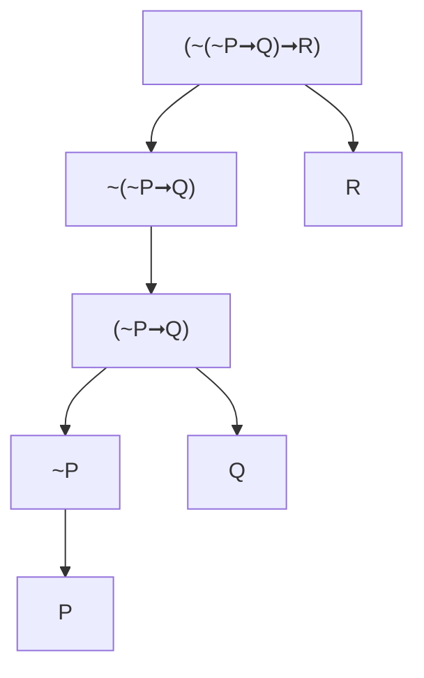

- ***`CN Language`*** is an artificial language. Artificial languages does not have vagueness or ambiguity. It consists of vocabulary, grammar, syntax, and semantics. Natural language, on the other hand, has pragmatics in addition.
- ***`Inference Rules`*** are the validities. For instance, if *(a) All men are mortal*, and if *(b) Socrates is a man*, therefore *(c) Socrates is mortal*. If all the premises are true, than the conclusion must be true. In order for conclusion to be false, one of the premises must be false.
- ***`Truth-functional connectives`*** if … then, not *(~)*… 

- 

### Chapter 1 - The Logic of CN

- Rational arguments
  - Legitimate conclusions from given information
  - Inference-Arguments
- This is common to
  - Law, Science, Social sciences.
- We don’t have intuitive proofs.
  - `~` is negation, `P` is representation of a sentence.
  - `Deductively Valid Arguments` if the given premises are true then the conclusion is necessarily true.

#### Arguments

- Possess truth values either true or false,
  
  - The book is a difficult one.
- Unlike Questions or orders.

- Do not confuse

  - Having a truth value
  - Knowing that true value

  > I have even number of hairs on my head.

  

  - The flying pig argument

  ```
  1. If pigs fly, the moon is made up of green cheese.
  2. Pigs fly.
  3. ∴ The moon is made up of green cheese.
  ```

  - Two features of good arguments

    - **Validity**: The condition should follow from the premises.

      - It is impossible for the premises to be true and the conclusion to be false.
      - Logic is concerned with validity, not with the truth of the premises.
      - `P ∴ P` (P therefore P)

      ```
      1. If it is raining the streets are wet.
      2. It is raining.
      3. ∴ The streets are wet.
      ```

      

    - **Soundness**: VALID + TRUE premises

#### Vocabulary

- Sentence letters: `P-Z`
- Connectives: `~` ➞
- Punctuations: `( )`

#### Grammar Rules for SS

- Any sentence letter by itself is a SS. E.g. `P`
- If  `a` is a SS, so is `~a`
- If `a` and `b` are SS, so is `(a ➞ b)`

---

# PHIL 131 - LOGIC

## ‘NOT’ and ‘IF’

### Symbolic Sentences

> (1) Sentence letters, that is, capital letters ***`P`*** through ***`Z`*** with or without numerical subscripts, are symbolic sentences.

> (2) The result of prefixing the negation sign ***`~`*** to a symbolic sentence is a symbolic sentence.

> (3) The result of flanking the conditional sign ➞ by symbolic sentences and enclosing the result in a pair of parentheses is a symbolic sentence.




Each node of the grammatical tree is generated in accordance with one of the clauses in the characterization of the class of symbolic sentences. Therefore, any expression that can be generated as the top node of a grammatical tree is a symbolic sentence.

| *Symbol* | *Sentence*                                                   |
| -------- | ------------------------------------------------------------ |
| ~P➞Q     | (**If** *Alfred* **does not** *concentrate*, **then** *Alfred will pass*.) |
| ~(P➞Q)   | **It is not the case that** (**if** *Alfred concentrates* **then** *Alfred will pass*.) |
| (P➞Q)➞R  | **If (if** *alfred concentrates* **then** *Alfred will pass*), **then** *logic is enjoyable*. |
| P➞(Q➞R)  | **If** *Alfred concentrates* **then** (*Alfred will pass*, **then** *logic is enjoyable*). |

### From symbols to English and back

*Scheme of Abbreviation*: is a collection of abbreviations such that no two abbreviations in the collection have the same first member. For example, the collections

> Q: the lectures are dull
> T: the text is readable
> P: Alfred will pass

and

> S: the lectures are dull
> Q: the lectures are dull
> T: the text is readable
> P: Alfred will pass

are schemes of abbreviations; but the collection

> Q: the lectures are dull
> Q: the text is readable (**mind that Q is used twice**)
> P: Alfred will pass

is not.

The process of *literal translation into English on the basis of a given scheme of abbreviation* begins with a symbolic sentence and if successful, ends with sentence of English. The process consists of the following steps:

> (1) Restore any parentheses that may have disappeared as a result of applying informal conventions of the last section.

> (2) Replace sentence letters by English sentences in accordance with the given scheme of abbreviation; that is, each sentence letter is to be replaced by the English sentence with which it is paired in the scheme.

> (3) Replace all occurences of ***~P*** by ***it is not the case that P***.

> (4) Replace all occurences of ***(P➞Q)*** by ***(if P, then Q)***.

For example, under the scheme of abbreviation, the sentence 

> Q ➞ (~T ➞ ~P)

becomes in step (i)

> (Q ➞ (~T ➞ ~P))

in step (ii)

> (The lectures are dull ➞ (~ the text is readable ➞ ~ Alfred will pass))

in step (iii)

> The lectures are dull ➞ ( it is not the case that the text is readable ➞ it is not the case that Alfred will pass))

and in step (iv)

> (If the lecture are dull, then (if it is not the case that the text is readable, then it is not the case that Alfred will pass))

Since we wish to be more liberal in translating from symbols to English. We can say

> Assuming that the lectures are dull, if the text is not readable, then Alfred will not pass.

So, the list of *stylistic variance* of

> (if P, then Q)

is as follows

> ```
> if P, then Q					|	Q if P
> provided that P, Q				|	Q provided that P
> given that P, Q					|	Q given that P
> in case P, Q					|	Q in case P
> assuming that P, Q				|	Q assuming that P
> on the condition that P, Q		|	Q on the condition that P
> P only if Q
> ```

***…page 14…***

> <small>FROM CLASS</small>
> *Modus Ponens* (MP)	 P ➞ Q, P then Q
> *Modus Tollens* (MT)    P ➞ Q, Not Q then not P, ~Q ➞ ~P
> *Double Negation* (DN)  ~~P is P and P is ~~P
> *Repetition* (R)		???
>
> *DIRECT DERIVATION*
>
> 1.If (pigs fly), (the moon is made up of green cheese).
> 2.Pigs fly (P)
> 3.The moon is made up of green cheese (Q)
> *P ➞ Q / Q*
>
> PR 1. ~~S ➞ T
> PR 2. S
> 	∴ T
>
> 1 Show T
> 2 ~~S ➞ T
> 3 S 			WTF is this? Ask someone!
>
> <small>QUESTION</small>
> 1- T ➞ (P ➞ (~R ➞ S))
> 2- ~T ➞ Z				
> 3- ~Z					
> 4- P
> 5- ~S
> 6- R
>
> > <small>SOLUTION</small>
> > 1 Show R
> > 2 ~T ➞ Z `pr2`
> > 3 ~Z `pr3`
> > 4 ~~T `2,3 MT`
> > 5 T `DN`
> > 6 P ➞ (~R ➞ S) (pr1)
> > 7 P (pr.4)
> > 8 ~R ➞ S (6,7 MP)
> > 9 ~S (pr5)
> > *10 R (8,9 MT then DN)*
>
> *CONDITIONAL DERIVATION*
>
> 1- Show P ➞ Q
> 2- 	 P
> 3- 	 Q 		`1,2 MP`

***VALIDITY OF ARGUMENTS***

(Logical) Connection between the arguments and the conclusion

*Valid Arguments*: If an argument is valid, then if its premises are all true then the conclusion must also be true.

> <small>*VALID* ARGUMENT</small>
> 1 If *you like logic*, *you will study mathematical logic*
> 2 *You like logic*
> ∴ You will study mathematical logic.
>
> <small>*INVALID* ARGUMENT</small>
> 1 If *you like logic*, *you will study mathematical logic*.
> 2 *You will **not** study mathematical logic*
> ∴ You like logic.
>
> ```mermaid
> graph TD;
> Arguments-->Valid;Arguments-->Invalid;
> Valid-->Sound;Valid-->Unsound;
> ```
>
> *Soundness*: If all premises are true, the conclusion is true.
>
> <small>INVALID ARGUMENT</small>
> 1 2+2=4
> ∴ 2.2=4
>
> <small>VALID ARGUMENT</small>
> 1 if 2+2=4, then 2.2=4
> 2 2+2=4
> ∴ 2.2=4
>
> ---
>
> 1 Show P
> 2 …
> 3 …
> x P		`direct derivation (DD)`
>
> ---
>
> 1 Show Q
> 2 	~Q   `Assumption of indirect derivation (AID)` 
> 3 	 …
> x	  P
> y	 ~P<sub>x,y ID</sub>
>
> ---
>
> 1 Show P ➙ Q
> 2	  P	  `Assumption of Conditional Derivation (ACD)`
> 3	  Show Q
> 4		   …
> x		   Q<sub>x DD</sub>
> y	  	  <sub>2,3 CD</sub>
>
> ---
>
> 1 If √2 is rational, then 2√2 is rational (P ➙ Q)
> 2 Assume √2 is rational (P)
> 3 2√2 is rational (Q)
>
> ---
>
> ~Q ∴ (P ➙ Q) ➙ ~P
>
> 1 Show (P ➙ Q) ➙ ~P
> 2	  P ➙ Q			`ACD`
> 3	  Show ~P
> 4		   ~Q		  `pr1`
> 5		   ~P<sub>5 DD</sub>       `2,4 MT`
>
> 1 Show (P ➙ Q) ➙ ~P
> 2	  P ➙ Q			`ACD`
> 3	  Show ~P
> 4		  ~~P		  `AID`
> 5			P		  `4 DN`
> 6			Q		  `2,5 MP`
> 7		   ~Q<sub>6,7 ID</sub>      `pr1`
> 8			 <sub>2,3 CD</sub>

---

`Midterm I Topics => Translations, derivations, symbolic sentences`

# PHIL 131 - Midterm I

## Translations

## Derivations

## Symbolic Sentences

---

```

```

