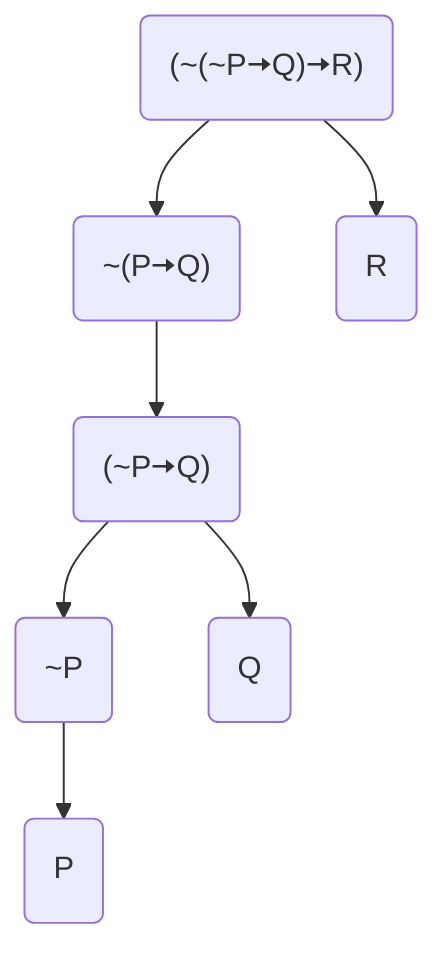

# PHIL 131 - LOGIC

## ‘NOT’ and ‘IF’

### Symbols and Sentences

**`~` Negation**: “Socrates is bald.” 🠦 “*It’s not the case that* Socrates is bald.”

**`🠦` Conditional**: “*If* Diogenes is a canine, *then* Diogenes is carvivorous.”

- **Antecedent**: “*Diogenes is a canine*”

- **Consequent**: “*Diogenes is carnivorous*”

**Scheme of Abbreviations**: The ascriptioning of sentences via capital letters ‘P’ through ‘Z’.

**Symbolic Language**: `P-Z` Sentence letters, `~` the negation sign, `🠦` the conditional sign, and `()` parentheses. 

1. Sentence letters, that is, capital letter ‘P’ through ‘Z’ with or without numerical subscripts, are symbolic sentences.

2. The result of prefixing the negation sign ‘~’ to a symbolic sentence is a symbolic sentence.
3. The result of flanking the conditional sign ‘🠦’ by symbolic sentences and enclosing the result in a pair of parentheses is a symbolic sentence.

**Grammatical Tree**: Each node of the grammatical tree is generated in accordance with one of the clauses in the characterization of the class of symbolic sentences. Therefore, any expression that can be generated as the top node of a grammatical tree is a symbolic sentence.

###### Exercises

1. (~P🠦(Q🠦P)) :heavy_check_mark:
2. (P🠦Q🠦R) :heavy_multiplication_x: `This sentence lacks parentheses.`
3. ((~(~P🠦Q)🠦Q)🠦R) :heavy_check_mark:
4. (~(~P)🠦Q) :heavy_multiplication_x: `This sentence has reduntant parentheses.`
5. ((P🠦Q)🠦~G) :heavy_multiplication_x: `This sentence has a symbol not between P-Z`
6. (~((P🠦Q)🠦R)if P, then Q  (P🠦~Q)) :heavy_check_mark:

### From symbols to English and Back

#### Translation (Symbol to English)

1. ##### Restore any parentheses that may have disappeared as a result of applying the informal conventions of the last section.

2. Replace sentence letters by English in accordance with the given scheme of abbreviation; that is, each sentence letter is to be replaced by the English sentence with which it is paired in the scheme.

3. Replace all occurences of `~P`, where `P` is a sentence, by `it is not the case that P`.

4. Replace all occurences of `(P🠦Q)`, where `P` and `Q` are sentences, by `(if P, then Q)`.

**Stylistic Variances**: They are as follows:

|         *if P, then Q*         |        *if P, then Q*         |
| :----------------------------: | :---------------------------: |
|          **if** P, Q           |          Q **if** P           |
|     **provided that** P, Q     |     Q **provided that** P     |
|      **given that** P, Q       |      Q **given that** P       |
|        **in case** P, Q        |        Q **in case** P        |
|     **assuming that** P, Q     |     Q **assuming that** P     |
| **on the condition that** P, Q | Q **on the condition that** P |
|        P **only if** Q         |                               |

#### Symbolization (English to Symbols)

1. Introduce `it is not the case that` and `(if …, then)` in place of their respective stylistic variants.
2. Reverse the steps leading from a symbolic sentence to a literal English translation; that is,
   - replace all parts of the form `(if P, then Q)`, where `P` and `Q` are sentences, by `(P🠦Q)`;
   - replace all parts of the form `it is not the case that P`, where `P` is a sentence, by `~P`;
   - replace English components by sentence letters in accordance with the scheme of abbreviation; that is replace each English component by a sentence letter with which it is paired in the scheme of abbreviaation;
   - omit peripheral parentheses and replace parentheses by brackets in accordance with the informal conventions of the preceding section.

###### Exercises

On the basis of the scheme of abbreviations
	**P: logic is enjoyable**
	**Q: Alfred will pass**
	**R: Alfred concentrates**
	**S: the text is readable**
	**T: Alfred will secure employment**
	**U: Alfred will marry**
	**V: the lectures are exciting**
translate the following symbolic sentences into idiomatic English.

7. P🠦(Q🠦R)

   > If logic is enjoyable, then Alfred concentrates in case he’ll pass.

8. (R🠦Q)🠦P

   > If Alfred will pass provided that he concentrates, then logic is enjoyable.

9. S🠦(P🠦(~Q🠦~R))

   > Provided that the text is readable; if logic is enjoyable, then Alfred doesn’t concentrate unless Alfred will pass.

10. Only if Alfred concentrates will he pass, provided that the lectures are exciting.

    > Q only if R, provided that V `(V🠦(Q🠦R))`

11. If Alfred will pass if he concentrates, then logic is enjoyable.

    > If Q if R, then P `((R🠦Q)🠦P)`

12. Alfred will pass on the condition that if he will pass only if he concentrates, then he will pass.

    > Q on the condition that (if (Q only if R), then Q) `(((Q🠦R)🠦Q)🠦Q)`

13. If Alfred will pass only on the condition that he concentrates, then logic is enjoyable provided that the lectures are exciting.

    > If (Q only on the condition that R), then (P provided that V) `((Q🠦R)🠦(V🠦P))`

14. It is not the case that if Alfred will secure employment provided that logic is enjoyable, then he will marry only if he concentrates.

    > It is not the case that if (T provided that P), then (U only if R)
    > `(~((P🠦T)🠦(U🠦R)))`

15. Alfred will pass only if he concentrates provided that the text is not readable.

    > Q only if R provided that ~S `Ambiguous (~S🠦(Q🠦R)) or (Q🠦(~S🠦R))`

16. It is not the case that Alfred concentrates if the lectures are not exciting.

    > It is not the case that R if ~V `Ambiguous (~V🠦~R) or (~(~V🠦R))`

17. It is not the case that Alfred will secure employment if he fails to concentrate onthe condition that the lectures are not exciting.

    > It is not the case that T if ~R on the condition that ~V.
    > `Ambiguous ((~V🠦~R)🠦~T) or (~((~V🠦~R)🠦T)) and so on…`

### Derivability and Validity of Symbolic Arguments

**Argument**: A group of sentences that consists of premises and a conclusion.

**Derivation**: A sequence of steps that leads from the premises to the conclusion of a symbolic argument. This process makes use of *inference rules* such as:

- Modus Ponens (MP): `(P🠦Q)· P ∴ Q` 
- Modus Tollens (MT): `(P🠦Q) · ~Q ∴ ~P`
- Double Negation (DN): `~~P ∴ P` or `P ∴ ~~P`
- Repetition (R): `P ∴ P`

**Direct Derivation**: Directly deriving `P` from premises.

|      |                             |        |
| ---- | --------------------------- | ------ |
| 1    | ~P🠦Q                        | prI    |
| 2    | ~Q                          | prII   |
| 3    | <s>Show</s> P               | ∴      |
| 4    | \| ~P🠦Q                     | 1 R    |
| 5    | \| ~Q                       | 2 R    |
| 6    | \| ~~P                      | 4,5 MT |
| 7    | \| P    (Direct Derivation) | 6 DN   |

**Conditional Derivation**: Establishing a conditional by assuming its antecedent and deriving its consequent.

|      |                     |        |
| ---- | ------------------- | ------ |
| 1    | P                   | prI    |
| 2    | <s>Show</s> (P🠦Q)🠦Q | ∴      |
| 3    | \| P🠦Q              | ACD    |
| 4    | \| P                | 1 R    |
| 5    | \| Q    (3,5 CD)    | 3,4 MP |

**Indirect Derivation**: Establishing a sentence indirectly by assuming its negation and with this assumption deriving a contradiction.

|      |                   |        |
| ---- | ----------------- | ------ |
| 1    | ~P🠦Q              | prI    |
| 2    | ~P🠦~Q             | prII   |
| 3    | <s>Show</s> P     | ∴      |
| 4    | \| ~P             | AID    |
| 5    | \| Q              | 1,4 MP |
| 6    | \| ~Q    (5,6 ID) | 2,4 MP |
|      |                   |        |

An example:

|      |                         |           |
| ---- | ----------------------- | --------- |
| 1    | P🠦Q                     | prI       |
| 2    | <s>Show</s> P🠦((Q🠦R)🠦R) | `3, 4 CD` |
| 3    | \| P                    | ACD       |
| 4    | \| <s>Show</s> (Q🠦R)🠦R  | `5,8 CD`  |
| 5    | \| \| Q🠦R               | ACD       |
| 6    | \| \| P🠦Q               | 1 R       |
| 7    | \| \| Q                 | 3,6 MP    |
| 8    | \| \| R                 | 5,7 MP    |

The explicit set of directions for constructing a *derivation* from given symbolic premises:

1. If `P` is any symbolic sentence, then `Show P` may occur as a line.

2. Any one of the premises may occur as a line.

3. If `P`, `Q` are symbolic sentences such that `Show (P🠦Q)` occurs as a line, then `P` may occur as the next line.

4. If `P` is a symbolic sentence such that `Show P` occurs as a line, then `~P` may occur as the next line; if `P` is a symbolic sentence such that `Show ~P` occurs as a line, then `P` may occur as the next line.

5. A symbolic sentence may occur as a line if it follows by an inference rule from antecedent lines, that is, preceding lines which neither are boxed nor contain uncancelled ‘Show’.

6. When the following arrangement of lines has appeared:
   	Show P
   	| X1
   	| .
   	| .
   	| .
   	| Xn

   where none of X1 through Xn contains uncancelled ‘Show’ and either

   - `P` occurs unboxed among X1 through Xn,
   - `P` is of the form (Q1🠦Q2) and Q2 occurs unboxed among X1 through Xn, or
   - for some sentence X·, both X and its negation occur unboxed among X1 through Xn, then one may simultaneously cancelthe displayed occurence of ‘Show’ and box all subsequent lines.

###### Exercises

18. ~Q ∴ (P🠦Q)🠦~P

    |      |                      |          |
    | ---- | -------------------- | -------- |
    | 1    | ~Q                   | prI      |
    | 2    | <s>Show</s> (P🠦Q)🠦~P | `3,4 CD` |
    | 3    | \| P🠦Q               | ACD      |
    | 4    | \| ~P                | 1,3 MT   |

    ---

19. P🠦(Q🠦R) · P🠦(R🠦S) ∴ P🠦(Q🠦S)

    |      |                     |           |
    | ---- | ------------------- | --------- |
    | 1    | P🠦(Q🠦R)             | prI       |
    | 2    | P🠦(R🠦S)             | prII      |
    | 3    | <s>Show</s> P🠦(Q🠦S) | `4,5 CD`  |
    | 4    | \| P                | ACD       |
    | 5    | \| <s>Show</s> Q🠦S  | `6,7 CD`  |
    | 6    | \| \| Q             | ACD       |
    | 7    | \| \| <s>Show</s> S | `8,12 ID` |
    | 8    | \| \| \| ~S         | AID       |
    | 9    | \| \| \| Q🠦R        | 1,4 MP    |
    | 10   | \| \| \| R🠦S        | 2,4 MP    |
    | 11   | \| \| \| R          | 6,9 MP    |
    | 12   | \| \| \| S          | 10,11 MP  |

    ---

20. ~P🠦Q · P🠦Q ∴ Q

    |      |               |          |
    | ---- | ------------- | -------- |
    | 1    | ~P🠦Q          | prI      |
    | 2    | P🠦Q           | prII     |
    | 3    | <s>Show</s> Q | `5,6 ID` |
    | 4    | \| ~Q         | AID      |
    | 5    | \| ~P         | 2,4 MT   |
    | 6    | \| ~~P        | 1,4 MT   |

    ---

21. Q🠦~R · ~P🠦R ∴ ~P🠦~Q

    |      |                   |          |
    | ---- | ----------------- | -------- |
    | 1    | Q🠦~R              | prI      |
    | 2    | ~P🠦R              | prII     |
    | 3    | <s>Show</s> ~P🠦~Q | `4,5 CD` |
    | 4    | \| ~P             | ACD      |
    | 5    | \| <s>Show</s> ~Q | `7,8 ID` |
    | 6    | \| \| Q           | AID      |
    | 7    | \| \| ~R          | 1,6 MP   |
    | 8    | \| \| R           | 2,4 MP   |

    ---

22. (P🠦Q)🠦R · ~R ∴ ~Q

    |      |                    |          |
    | ---- | ------------------ | -------- |
    | 1    | (P🠦Q)🠦R            | prI      |
    | 2    | ~R                 | prII     |
    | 3    | <s>Show</s> ~Q     | `8,9 ID` |
    | 4    | \| Q               | AID      |
    | 5    | \| <s>Show</s> P🠦Q | `6,7 CD` |
    | 6    | \| \| P            | ACD      |
    | 7    | \| \| Q            | 4 R      |
    | 8    | \| R               | 1,5 MP   |
    | 9    | \| ~R              | 2 R      |

    ---

23. (R🠦S)🠦P · ~S🠦Q ∴ ~P🠦Q

    |      |                        |            |
    | ---- | ---------------------- | ---------- |
    | 1    | (R🠦S)🠦P                | prI        |
    | 2    | ~S🠦Q                   | prII       |
    | 3    | <s>Show</s> ~P🠦Q       | `4,5 CD`   |
    | 4    | \| ~P                  | ACD        |
    | 5    | \| <s>Show</s> Q       | `7,8 ID`   |
    | 6    | \| \| ~Q               | AID        |
    | 7    | \| \| ~(R🠦S)           | 1,4 MT     |
    | 8    | \| \| <s>Show</s> R🠦S  | `9,10 CD`  |
    | 9    | \| \| \| R             | ACD        |
    | 10   | \| \| \| <s>Show</s> S | `12,13 ID` |
    | 11   | \| \| \| \| ~S         | AID        |
    | 12   | \| \| \| \| Q          | 2,11 MP    |
    | 13   | \| \| \| \| ~Q         | 6 R        |

    ---

24. (Q🠦~~S)🠦(~R🠦~S) ∴ S🠦R

|      |                         |            |
| ---- | ----------------------- | ---------- |
| 1    | (Q🠦~~S)🠦(~R🠦~S)         | prI        |
| 2    | <s>Show</s> S🠦R         | `3,4 CD`   |
| 3    | \| S                    | ACD        |
| 4    | \| <s>Show</s> R        | `10,11 ID` |
| 5    | \| \| ~R                | AID        |
| 6    | \| \| <s>Show</s> Q🠦~~S | `7,8 CD`   |
| 7    | \| \| \| Q              | ACD        |
| 8    | \| \| \| ~~S            | 3 DN       |
| 9    | \| \| ~R🠦~S             | 1,6 MP     |
| 10   | \| \| ~S                | 5,9 MP     |
| 11   | \| \| S                 | 3 R        |

---

25. (S🠦P)🠦R · ~R · (P🠦Q)🠦(T🠦R) ∴ ~T

    |      |                          |            |
    | ---- | ------------------------ | ---------- |
    | 1    | (S🠦P)🠦R                  | prI        |
    | 2    | ~R                       | prII       |
    | 3    | (P🠦Q)🠦(T🠦R)              | prIII      |
    | 4    | <s>Show</s> ~T           | `15,16 ID` |
    | 5    | \| T                     | AID        |
    | 6    | \| <s>Show</s> P🠦Q       | `7,8 CD`   |
    | 7    | \| \| P                  | ACD        |
    | 8    | \| \| <s>Show</s> Q      | `10,11 ID` |
    | 9    | \| \| \| ~Q              | AID        |
    | 10   | \| \| \| ~(S🠦P)          | 1,2 MT     |
    | 11   | \| \| \| <s>Show</s> S🠦P | `12,13 CD` |
    | 12   | \| \| \| \| S            | ACD        |
    | 13   | \| \| \| \| P            | 7 R        |
    | 14   | \| T🠦R                   | 3,6 MP     |
    | 15   | \| R                     | 5,14 MP    |
    | 16   | \| ~R                    | 2 R        |

    ---

26. (P🠦Q)🠦(T🠦R) · U🠦~R · ~(S🠦P) ∴ U🠦~T

    |      |                             |            |
    | ---- | --------------------------- | ---------- |
    | 1    | (P🠦Q)🠦(T🠦R)                 | prI        |
    | 2    | U🠦~R                        | prII       |
    | 3    | ~(S🠦P)                      | prIII      |
    | 4    | <s>Show</s> U🠦~T            | `5,6 CD`   |
    | 5    | \| U                        | ACD        |
    | 6    | \| <s>Show</s> ~T           | `8, 18 ID` |
    | 7    | \| \| T                     | AID        |
    | 8    | \| \| ~R                    | 2,5 MP     |
    | 9    | \| \| <s>Show</s> P🠦Q       | `10,11 CD` |
    | 10   | \| \| \| P                  | ACD        |
    | 11   | \| \| \| <s>Show</s> Q      | `13,16 ID` |
    | 12   | \| \| \| \| ~Q              | AID        |
    | 13   | \| \| \| \| <s>Show</s> S🠦P | `14,15 CD` |
    | 14   | \| \| \| \| \| S            | ACD        |
    | 15   | \| \| \| \| \| P            | 10 R       |
    | 16   | \| \| \| \| ~(S🠦P)          | 3 R        |
    | 17   | \| \| T🠦R                   | 1,9 MP     |
    | 18   | \| \| R                     | 7,17 MP    |

    ---

Hints for constructing derivations:

1. To derive a conditional, use conditional derivation.
2. To derive anything else, use indirect derivation unless another procedure is immediately obvious.
3. Enter all premises as lines, but not until one or another form of derivation has been commenced.
4. Whenever a sentence follows from antecedent lines by MP or MT, enter that sentence as a line.
5. When using indirect derivation, determine whether any of the antecedent lines is the negation of a conditional; if so, attempt to derive the conditional
6. When a conditional occurs as an antecedent line and neither MP nor MT is applicable, attempt to derive the antecedent of the conditional.

---

27. ~(P🠦Q)🠦Q ∴ P🠦Q

    |      |                 |        |
    | ---- | --------------- | ------ |
    | 1    | <s>Show</s> P🠦Q | `4 CD` |
    | 2    | \| ~(P🠦Q)       | AID    |
    | 3    | \| ~(P🠦Q)🠦Q     | prI    |
    | 4    | \| Q            | 2,3 MP |

    ---

28. ~(R🠦Q) · Q ∴ P

|      |                    |          |
| ---- | ------------------ | -------- |
| 1    | <s>Show</s> P      | `2,3 ID` |
| 2    | \| ~(R🠦Q)          | prI      |
| 3    | \| <s>Show</s> R🠦Q | `4 CD`   |
| 4    | \| \| Q            | prII     |

---

### Validity of English Arguments

An English argument is valid if and only if it has a symbolization that is valid, that is, whose conclusion is derivable from its premises.

> Free love is justified only if the sex drive is primary. Freud’s theory is correct provided that the sex drive is primary. It is not the case that if psychoanalysis is therapeutic, Freud’s theory is correct. ∴ Free love is not justified.
>
> ​	P: free love is justified
> ​	Q: the sex drive is primary
> ​	R: Freud’s theory is correct
> ​	S: psychoanalysis is therapeutic
>
> P only if Q. R provided that Q. It is not the case that if S, R. ∴ ~P
>
> P🠦Q · Q🠦R · ~(S🠦R) ∴ ~P
>
> |      |                    |            |
> | ---- | ------------------ | ---------- |
> | 1    | P🠦Q                | prI        |
> | 2    | Q🠦R                | prII       |
> | 3    | ~(S🠦R)             | prIII      |
> | 4    | <s>Show</s> ~P     | `8,9 ID`   |
> | 5    | \| P               | AID        |
> | 6    | \| Q               | 1,5 MP     |
> | 7    | \| R               | 2,6 MP     |
> | 8    | \| ~(S🠦R)          | 3 R        |
> | 9    | \| <s>Show</s> S🠦R | `10,11 CD` |
> | 10   | \| \| S            | ACD        |
> | 11   | \| \| R            | 7 R        |
>
> ---

###### Exercises

29. If Alfred studies, then he receives good grades. If he does not study, then he enjoys college. If he does not receive good grades, then he does not enjoy college. ∴ Alfred receives good grades.

    > P: Alfred studies
    > Q: Alfred receives good grades
    > R: Alfred enjoys college
    >
    > If P, then Q. If ~P, then R. If ~Q, then ~R. ∴ Q
    > P🠦Q · ~P🠦R · ~Q🠦~R ∴ Q
    >
    > |      |               |          |
    > | ---- | ------------- | -------- |
    > | 1    | P🠦Q           | prI      |
    > | 2    | ~P🠦R          | prII     |
    > | 3    | ~Q🠦~R         | prIII    |
    > | 4    | <s>Show</s> Q | `5,9 ID` |
    > | 5    | \| ~Q         | AID      |
    > | 6    | \| ~R         | 3,5 MP   |
    > | 7    | \| ~~P        | 2,6 MT   |
    > | 8    | \| P          | 7 DN     |
    > | 9    | \| Q          | 1,8 MP   |
    >
    > ---

30. If Herbert can take the apartment only if he divorces his wife, then he should think twice. If Herbert keeps Fido, then he cannot take the apartment. Herbert’s wife insists on keeping Fido. If Herbert does not keep Fido, then he will divorce his wife provided that she insists on keeping Fido. ∴ Herbert should think twice.

> P: Herbert can take the apartment
> Q: Herbert divorces his wife
> R: Herbert should think twice
> S: Herbert keeps Fido
> T: Herbert’s wife insists on keeping Fido
>
> If P only if Q, then R. If S, then ~P. T. If ~S, then Q provided that T. ∴ R
> (P🠦Q)🠦R · S🠦~P · T · ~S🠦(T🠦Q) ∴ R
>
> 
>
> |      |                     |            |
> | ---- | ------------------- | ---------- |
> | 1    | <s>Show</s> R       | `4,5 ID`   |
> | 2    | \| ~R               | AID        |
> | 3    | \| (P🠦Q)🠦R          | prI        |
> | 4    | \| ~(P🠦Q)           | 2,3 MT     |
> | 5    | \| <s>Show</s> P🠦Q  | `6,7 CD`   |
> | 6    | \| \| P             | ACD        |
> | 7    | \| \| <s>Show</s> Q | `14,15 ID` |
> | 8    | \| \| \| ~Q         | ACD        |
> | 9    | \| \| \| ~~P        | 6 DN       |
> | 10   | \| \| \| S🠦~P       | prII       |
> | 11   | \| \| \| ~S         | 9,10 MT    |
> | 12   | \| \| \| ~S🠦(T🠦Q)   | prIV       |
> | 13   | \| \| \| T🠦Q        | 11,12 MP   |
> | 14   | \| \| \| ~T         | 8,13 MT    |
> | 15   | \| \| \| T          | prIII      |
>
> ---

31. …

32. …

33. …

34. If Descartes can doubt that he is thinking, then he thinks. If Descartes cannot doubt that he is thinking, then he thinks. If Descartes does not exist, then he does not think. ∴ Descartes exists.

    > P: Descartes can doubt that he is thinking
    > Q: Descartes thinks
    > R: Descartes exists
    >
    > If P, then Q. If ~P, then Q. If ~R, then ~Q. ∴ R
    >
    > |      |               |          |
    > | ---- | ------------- | -------- |
    > | 1    | P🠦Q           | prI      |
    > | 2    | ~P🠦Q          | prII     |
    > | 3    | ~R🠦~Q         | prIII    |
    > | 4    | <s>Show</s> R | `6,9 ID` |
    > | 5    | \| ~R         | AID      |
    > | 6    | \| ~Q         | 3,5 MP   |
    > | 7    | \| ~~P        | 2,6 MT   |
    > | 8    | \| P          | 7 DN     |
    > | 9    | \| Q          | 1,8 MP   |
    >
    > ---

35. …

---

### Fallacies

**Begging the question**: When, in deriving something, one uses the assertion that is to be derived, one is said to be guilty of begging the question.

**Unwarranted assumption**: The use of assumptions illegaly.

### Theorems

**Theorem**: It is possible for an argument to have an empty sequence of premises. If such an argument is valid and is furthermore symbolic, its conclusion is called a theorem.

**Proof**: Derivation of a theorem.

###### Exercises

36. Prove T4, T7, T15, T18

    - T4: (P🠦Q)🠦((Q🠦R)🠦(P🠦R))

      > |      |                                 |          |
      > | ---- | ------------------------------- | -------- |
      > | 1    | <s>Show</s> (P🠦Q)🠦((Q🠦R)🠦(P🠦R)) | `2,3 CD` |
      > | 2    | \| P🠦Q                          | ACD      |
      > | 3    | \| <s>Show</s> (Q🠦R)🠦(P🠦R)      | `4,5 CD` |
      > | 4    | \| \| Q🠦R                       | ACD      |
      > | 5    | \| \| <s>Show</s> P🠦R           | `6,8 CD` |
      > | 6    | \| \| \| P                      | ACD      |
      > | 7    | \| \| \| Q                      | 2,6 MP   |
      > | 8    | \| \| \| R                      | 4,7 MP   |

    - T7: ((P🠦Q)🠦(P🠦R))🠦(P🠦(Q🠦R))

      |      |                                     |           |
      | ---- | ----------------------------------- | --------- |
      | 1    | <s>Show</s> ((P🠦Q)🠦(P🠦R))🠦(P🠦(Q🠦R)) | `2,3 CD`  |
      | 2    | \| (P🠦Q)🠦(P🠦R)                      | ACD       |
      | 3    | \| <s>Show</s> P🠦(Q🠦R)              | `4,5 CD`  |
      | 4    | \| \| P                             | ACD       |
      | 5    | \| \| <s>Show</s> Q🠦R               | `6,7 CD`  |
      | 6    | \| \| \| Q                          | ACD       |
      | 7    | \| \| \| <s>Show</s> R              | `8,12 ID` |
      | 8    | \| \| \| \| ~R                      | AID       |
      | 9    | \| \| \| \| <s>Show</s> P🠦Q         | `10 CD`   |
      | 10   | \| \| \| \| \| Q                    | 6 R       |
      | 11   | \| \| \| \| P🠦R                     | 2,9 MP    |
      | 12   | \| \| \| \| R                       | 4,11 MP   |

      - T15: (~P🠦Q)🠦(~Q🠦P)

        |      |                           |          |
        | ---- | ------------------------- | -------- |
        | 1    | <s>Show</s> (~P🠦Q)🠦(~Q🠦P) | `2,3 CD` |
        | 2    | \| ~P🠦Q                   | ACD      |
        | 3    | \| <s>Show</s> ~Q🠦P       | `4,6 CD` |
        | 4    | \| \| ~Q                  | ACD      |
        | 5    | \| \| ~~P                 | 2,4 MT   |
        | 6    | \| \| P                   | 5 DN     |

        - T18: ~P🠦(P🠦Q)

          |      |                      |          |
          | ---- | -------------------- | -------- |
          | 1    | <s>Show</s> ~P🠦(P🠦Q) | `2,3 CD` |
          | 2    | \| ~P                | ACD      |
          | 3    | \| <s>Show</s> P🠦Q   | `4,5 ID` |
          | 4    | \| \| P              | ACD      |
          | 5    | \| \| ~P             | 2 R      |

    ---

37. Prove T20-T23

    - T20: (P🠦~P)🠦~P

      |      |                       |          |
      | ---- | --------------------- | -------- |
      | 1    | <s>Show</s> (P🠦~P)🠦~P | `2,3 CD` |
      | 2    | \| P🠦~P               | ACD      |
      | 3    | \| <s>Show</s> ~P     | `4,5 ID` |
      | 4    | \| \| P               | AID      |
      | 5    | \| \| ~P              | 2,4 MP   |

      ---

    - T21: ~(P🠦Q)🠦P

      |      |                       |          |
      | ---- | --------------------- | -------- |
      | 1    | <s>Show</s> ~(P🠦Q)🠦P  | `2,3 CD` |
      | 2    | \| ~(P🠦Q)             | ACD      |
      | 3    | \| <s>Show</s> P      | `5,8 ID` |
      | 4    | \| \| ~P              | AID      |
      | 5    | \| \| <s>Show</s> P🠦Q | `6,7 ID` |
      | 6    | \| \| \| P            | ACD      |
      | 7    | \| \| \| ~P           | 4 R      |
      | 8    | \| \| ~(P🠦Q)          | 2 R      |

      ---

    - T22: ~(P🠦Q)🠦~Q

      | 1    | <s>Show</s> ~(P🠦Q)🠦~Q | `2,3 CD` |
      | ---- | --------------------- | -------- |
      | 2    | \| ~(P🠦Q)             | ACD      |
      | 3    | \| <s>Show</s> ~Q     | `5,6 ID` |
      | 4    | \| \| Q               | AID      |
      | 5    | \| \| ~(P🠦Q)          | 2 R      |
      | 6    | \| \| <s>Show</s> P🠦Q | `7 CD`   |
      | 7    | \| \| \| Q            | 4 R      |

      ---

- T23: ((P🠦Q)🠦P)🠦P

  |      |                         |          |
  | ---- | ----------------------- | -------- |
  | 1    | <s>Show</s> ((P🠦Q)🠦P)🠦P | `2,3 CD` |
  | 2    | \| (P🠦Q)🠦P              | ACD      |
  | 3    | \| <s>Show</s> P        | `4,7 ID` |
  | 4    | \| \| ~P                | AID      |
  | 5    | \| \| <s>Show</s> P🠦Q   | `6 ID`   |
  | 6    | \| \| \| ~P             | 4 R      |
  | 7    | \| \| P                 | 2,5 MP   |

  ---

  38. Construct proofs of T11, T12, and T13 in which the only rule of inference employed is MP.

      - T11: ~~P🠦P

        |      |                             |          |
        | ---- | --------------------------- | -------- |
        | 1    | <s>Show</s> ~~P🠦P           | `2,3 CD` |
        | 2    | \| ~~P                      | ACD      |
        | 3    | \| <s>Show</s> P            | `4,7 ID` |
        | 4    | \| \| ~P                    | AID      |
        | 5    | \| \| <s>Show</s> ~~P 🠦 ~~P | `6 CD`   |
        | 6    | \| \| \| ~~P                | ACD      |
        | 7    | \| \| ~~P                   | 2,5 MP   |

  ---

- T12: P🠦~~P

  |      |                       |          |
  | ---- | --------------------- | -------- |
  | 1    | <s>Show</s> P🠦~~P     | `2,3 CD` |
  | 2    | \| P                  | ACD      |
  | 3    | \| <s>Show</s> ~~P    | `4,7 ID` |
  | 4    | \| \| ~P              | AID      |
  | 5    | \| \| <s>Show</s> P🠦P | `6 CD`   |
  | 6    | \| \| \| P            | ACD      |
  | 7    | \| \| P               | 2,5 MP   |

  ---

- T13: (P🠦Q)🠦(~Q🠦~P)

|      |                            |           |
| ---- | -------------------------- | --------- |
| 1    | <s>Show</s> (P🠦Q)🠦(~Q🠦~P)  | `2,3 CD`  |
| 2    | \| P🠦Q                     | ACD       |
| 3    | \| <s>Show</s> ~Q🠦~P       | `4,5 CD`  |
| 4    | \| \| ~Q                   | ACD       |
| 5    | \| \| <s>Show</s> ~P       | `7,10 ID` |
| 6    | \| \| \| P                 | AID       |
| 7    | \| \| \| Q                 | 2,6 MP    |
| 8    | \| \| \| <s>Show</s> ~Q🠦~Q | `9 CD`    |
| 9    | \| \| \| \| ~Q             | ACD       |
| 10   | \| \| \| ~Q                | 4,8 MP    |

---

39. Construct proofs with MT* `(~P🠦~Q) · Q ∴ P`

    - T11 with MP and MT*

      |      |                                |           |
      | ---- | ------------------------------ | --------- |
      | 1    | <s>Show</s> ~~P🠦P              | `2,10 CD` |
      | 2    | \| ~~P                         | ACD       |
      | 3    | \| <s>Show</s> ~P🠦~~~P         | `4,9 CD`  |
      | 4    | \| \| ~P                       | ACD       |
      | 5    | \| \| <s>Show</s> ~~~~P 🠦 ~~P  | `8 CD`    |
      | 6    | \| \| \| <s>Show</s> ~~P 🠦 ~~P | `7 CD`    |
      | 7    | \| \| \| \| ~~P                | ACD       |
      | 8    | \| \| \| ~~P                   | 2,6 MP    |
      | 9    | \| \| ~~~P                     | 4,5 MT*   |
      | 10   | \| P                           | 2,3 MT*   |

---

- T12 with MP and MT*, and DN

|      |                                    |           |
| :--- | :--------------------------------- | --------- |
| 1    | <s>Show</s> P🠦~~P                  | `2,10 CD` |
| 2    | \| P                               | ACD       |
| 3    | \| <s>Show</s> ~~~P🠦~P             | `4,9 CD`  |
| 4    | \| \| ~~~P                         |           |
| 5    | \| \| <s>Show</s> ~~ P 🠦 ~~~~P     | `8 ID`    |
| 6    | \| \| \| <s>Show</s> ~ ~~P 🠦 ~ ~~P | `7 CD`    |
| 7    | \| \| \| \| ~~~P                   |           |
| 8    | \| \| \| ~~~P                      | 4,6 MP    |
| 9    | \| \| ~P                           | 4,5 MT*   |
| 10   | \| ~~P                             | 2,3 MT*   |

---

- T13 with MP and MT*

  |      |                                     |      |
  | ---- | ----------------------------------- | ---- |
  | 1    | Show (P🠦Q)🠦(~Q🠦~P)                  |      |
  | 2    | \| P🠦Q                              | ACD  |
  | 3    | \| Show ~Q🠦~P                       |      |
  | 4    | \| \| ~Q                            |      |
  | 5    | \| \| Show ~(~Q🠦~P)🠦~(P🠦Q)          |      |
  | 6    | \| \| \| ~(~Q🠦~P)                   | ACD  |
  | 7    | \| \| \| Show ~~(P🠦Q) 🠦 ~~ ~(~Q🠦~P) |      |

  